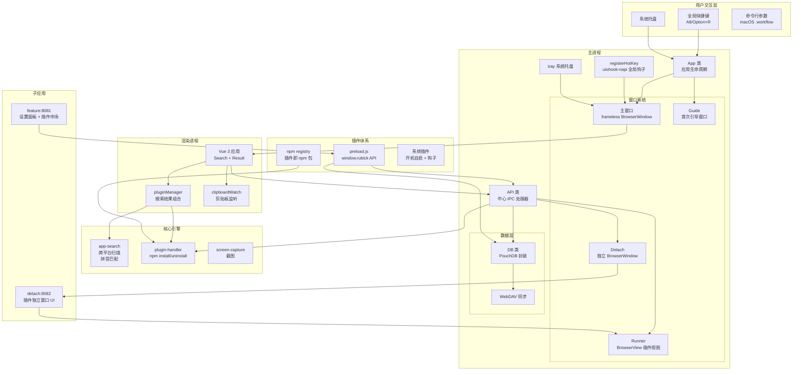
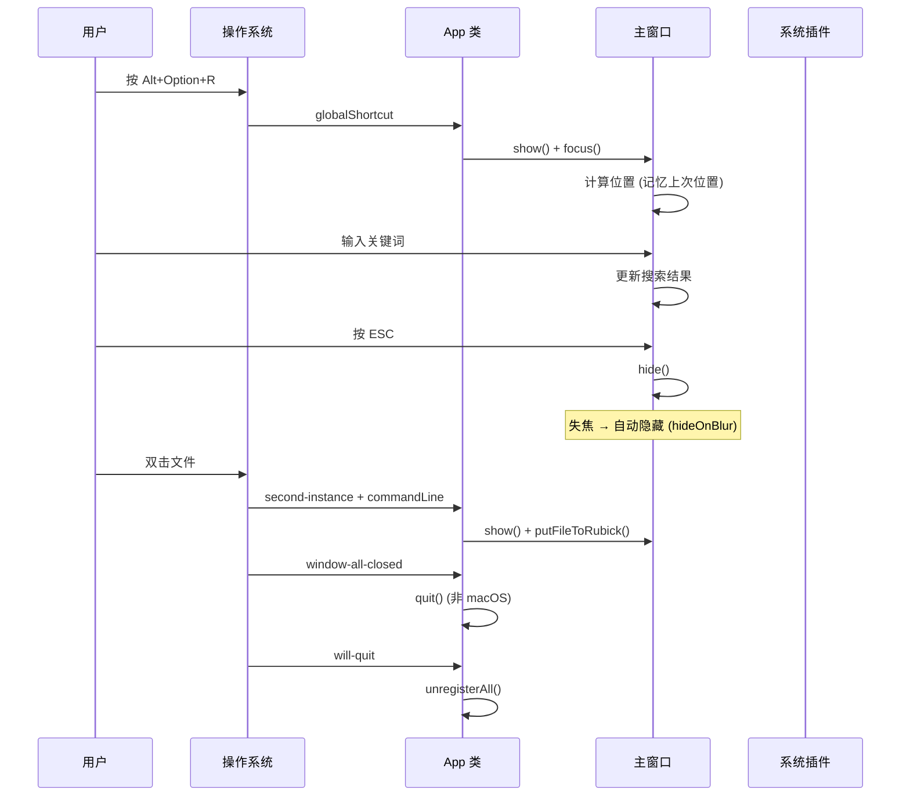

# Rubick 架构深度分析

> **项目**: rubickCenter/rubick v4.3.8 — 开源插件化桌面效率工具箱
> **分析日期**: 2026-05-30
> **技术栈**: Electron 26 + Vue 3 + TypeScript + PouchDB
> **有效代码行**: ~8,500 行核心源码 + ~3,200 行子应用

---

## 一、场景与定位：为什么需要另一个启动器？

2019-2023 年间，中国桌面效率工具市场经历了一场有趣的演变。uTools 凭借 "插件化启动器" 的概念迅速崛起——按下快捷键呼出搜索框，输入关键词可以搜应用、搜文件、调用插件。它取代了用户桌面上的 Alfred、Wox、Listary 等工具，成为国内效率工具的事实标准。

但 uTools 从 3.0 版本开始推行会员制——核心功能逐渐被锁定在付费墙后，云同步成为会员专属，插件市场中出现广告位。对于开发者来说，最致命的不是收费，而是闭源——你无法审计代码，无法确认插件数据是否安全，更无法在 uTools 停止维护时自行接管。

**Rubick 选择了和 uTools 完全不同的技术路线：让 npm 包直接成为插件。**

这个决策看似疯狂——npm 是 JavaScript 包管理工具，和桌面应用插件有什么关系？但仔细想想，npm 恰好解决了桌面启动器插件的所有基础问题：版本管理、依赖解析、发布和安装流程、全球 CDN 分发。rubick 不需要自建插件市场后端，不需要设计插件打包格式，不需要实现依赖解析——npm 全都管了。

当然，这个决策也有代价。后文会详细分析。

---

## 二、项目全景

### 2.1 技术栈

| 层级 | 技术 | 版本 | 说明 |
|------|------|------|------|
| 桌面框架 | Electron | 26.0.0 | 2023 年版本，不算新但稳定 |
| 前端框架 | Vue 3 + TypeScript | 4.1.5 | 组合式 API |
| 状态管理 | Vuex 4 | — | Options API 风格 |
| 路由 | Vue Router 4 | — | Hash 模式 |
| UI 组件库 | Ant Design Vue | 3.2.14 | 设置面板使用 |
| 本地数据库 | PouchDB | 7.2.2 | CouchDB 兼容的文档数据库 |
| 数据同步 | WebDAV | 4.11.3 | 多端同步 |
| 全局快捷键 | uiohook-napi | 1.5.4 | 低层键盘钩子 |
| 拼音搜索 | pinyin-match | 1.2.4 | 中文模糊搜索 |
| 构建 | Vue CLI 4 + electron-builder | 22.13.1 | 传统 webpack 体系 |
| 包管理器 | yarn + npm | — | npm 用于插件安装 |

### 2.2 目录结构

```
rubick/
├── src/                          # 核心应用代码 (~5,700 行)
│   ├── main/                     # 主进程
│   │   ├── index.ts              # 应用入口 (App class)
│   │   ├── browsers/             # 四窗口系统
│   │   │   ├── main.ts           # 主搜索窗口
│   │   │   ├── runner.ts         # 插件 BrowserView
│   │   │   ├── detach.ts         # 分离窗口
│   │   │   └── guide.ts          # 首次引导窗口
│   │   └── common/               # 主进程通用模块
│   │       ├── api.ts            # 中心 IPC 处理器
│   │       ├── db.ts             # 数据库初始化
│   │       ├── registerHotKey.ts # 全局快捷键
│   │       ├── tray.ts           # 系统托盘
│   │       ├── windowsClipboard.ts # Windows 剪贴板
│   │       └── ...
│   ├── core/                     # 核心引擎
│   │   ├── app-search/           # 跨平台应用搜索
│   │   │   ├── win.ts            # Windows (.lnk)
│   │   │   ├── darwin.ts         # macOS (.app)
│   │   │   ├── linux.ts          # Linux (.desktop)
│   │   │   └── translate.ts      # 47KB 拼音转换表
│   │   ├── plugin-handler/       # npm 插件管理器
│   │   ├── db/                   # PouchDB 封装
│   │   └── screen-capture/       # 截图模块
│   ├── renderer/                 # 渲染进程 (Vue 3)
│   │   ├── App.vue               # 根组件
│   │   ├── components/           # Search + Result
│   │   └── plugins-manager/      # 插件管理逻辑
│   └── common/                   # 常量与工具函数
│       ├── constans/
│       └── utils/
├── feature/                      # 设置面板子应用 (~13,000 行)
├── detach/                       # 分离窗口子应用 (~21,000 行)
├── guide/                        # 引导子应用 (~9,000 行)
├── public/
│   ├── preload.js                # 插件 API 桥接
│   └── ScreenCapture.exe         # Windows 截图工具
└── tpl/                          # 插件模板项目
```

### 2.3 架构总览



### 2.4 与其他启动器的核心差异

| 维度 | uTools | Rubick | ZTools |
|------|--------|--------|--------|
| 插件分发 | 自建市场 (闭源) | **npm registry** | 自建市场 + npm |
| 插件隔离 | Webview (沙箱) | BrowserView (无沙箱) | WebContentsView + preload |
| 插件类型 | UI + 系统 | UI + 系统 | UI + 系统 + 内部 |
| 本地存储 | SQLite | **PouchDB (CouchDB 兼容)** | LMDB |
| 搜索索引 | 内置索引 | 拼音映射表 + pinyin-match | Fuse.js + 自定义 |
| 窗口技术 | BrowserView | BrowserView | WebContentsView |
| 快捷键 | 系统 API | uiohook-napi (低层钩子) | system/globalShortcut |
| 自定义协议 | 无 | 无 | ztools-icon:// 等 |
| 超级面板 | ✅ | ❌ | ✅ |
| 剪贴板管理 | ✅ | 基础 | ✅ (完整) |
| 最新 Electron | 未公开 | **26.0 (2023)** | **38.5 (2026)** |

---

## 三、主进程：隐身衣模式

### 3.1 App 类设计

`src/main/index.ts:27-147` — 仅 147 行的主进程入口。

Rubick 的 App 类遵循一种可称为"隐身衣"的设计哲学：应用应该尽可能不打扰用户，启动时无窗口，退出时无残留。

```typescript
class App {
  constructor() {
    protocol.registerSchemesAsPrivileged([...])  // app:// 协议
    this.windowCreator = main()                   // 窗口工厂（闭包，非类）
    const gotTheLock = app.requestSingleInstanceLock()
    if (!gotTheLock) app.quit()                   // 单例锁
    this.beforeReady()                            // macOS 移到 /Applications
    this.onReady()                                // 启动后的生命周期
    this.onRunning()                              // second-instance + activate
    this.onQuit()                                 // cleanup
  }
}
```

**为什么是闭包而不是类？** 和其他所有窗口管理器（`main()`, `runner()`, `detach()`, `guide()`）一样，rubick 用的是**闭包工厂模式**而不是类实例。在每个工厂函数内部维护闭包变量（如 `let win: any`），返回 `{ init, getWindow }` 对象。这种风格更接近函数式，避免 `this` 绑定问题，但代价是难以测试和继承——每个工厂函数自包含，无法扩展。

### 3.2 macOS 特有处理

`beforeReady()` 方法处理了 macOS 特有的行为：
- 自动将应用移到 `/Applications` 目录（如果尚未在）
- 隐藏 Dock 图标（`app.dock.hide()`），因为启动器不需要常驻 Dock
- 而在 Windows/Linux 上，做的是**禁用硬件加速**（`app.disableHardwareAcceleration()`）——这是一个务实的决策：启动器本质上是一个搜索框 + 列表，不需要 GPU 渲染，禁用加速可以减少 100MB+ 的 GPU 进程内存占用

这个"隐身衣"设计贯穿始终：任务栏不显示图标（`skipTaskbar: true`），窗口默认隐藏（`show: false`），失焦自动隐藏（`hideOnBlur`）。

### 3.3 生命周期与事件



---

## 四、IPC：一条 msg-trigger 走到黑

这是 rubick 最"简单粗暴"的架构决策。

### 4.1 中心化 IPC 通道

在 `src/main/common/api.ts:58-66`，只注册了一个 IPC 通道：

```typescript
ipcMain.on('msg-trigger', async (event, arg) => {
  const window = arg.winId ? BrowserWindow.fromId(arg.winId) : mainWindow
  const data = await this[arg.type](arg, window, event)
  event.returnValue = data
})
```

**所有 IPC 调用都通过 `msg-trigger` 通道**，参数中的 `arg.type` 决定了调用哪个方法。`event.returnValue` 是同步返回值（`sendSync`）。

### 4.2 API 类继承 DB

更有意思的是 `API` 类直接继承自 `DB` 类：

```typescript
class API extends DBInstance {
  // DBInstance 来自 db.ts，初始化后就是 PouchDB 实例
}
```

这意味着 API 类自身就是一个数据库实例，所有 IPC handler 方法都能直接 `this.put()`, `this.get()`。这是一个**有争议的设计**——继承表达了 "API 是一种 DB" 的 IS-A 关系，但 API 实际上不是数据库，是 IPC 处理器。组合（Composition）会更合适。但考虑到 rubick 的代码规模很小（441 行 API 类），这种"省事"的继承并没有造成实际问题。

### 4.3 同步 IPC 的选择

Rubick 几乎全部使用 `ipcRenderer.sendSync`（同步 IPC），而不是 `ipcRenderer.invoke`（异步 IPC）。这意味着：

- **优点**：渲染进程代码极其简单——调用函数直接返回值，不需要 `await`
- **缺点**：同步 IPC 会阻塞渲染进程的消息循环。如果数据库操作耗时超过几毫秒，用户能感受到输入卡顿

PouchDB 的操作确实很快（内存中的文档数据库），所以这个决策在实践中问题不大。但如果换成 LMDB 或 SQLite 的复杂查询，同步 IPC 的代价就会暴露出来。

### 4.4 preload 桥接

`public/preload.js:250` 行定义了插件可用的 API 表面。每个方法都是 `ipcRenderer.sendSync('msg-trigger', ...)` 的简单封装：

```javascript
window.rubick = {
  // 插件生命周期钩子
  onPluginEnter(cb) { ... },
  onPluginReady(cb) { ... },
  onPluginOut(cb) { ... },
  onShow(cb) { ... },
  onHide(cb) { ... },
  
  // 窗口控制
  hideMainWindow() { ... },
  showMainWindow() { ... },
  setExpendHeight(height) { ... },
  
  // 数据库
  db: {
    put(data) { ... },
    get(id) { ... },
    remove(doc) { ... },
    bulkDocs(docs) { ... },
    allDocs(key) { ... },
  },
  
  // 剪贴板
  copyText(text) { ... },
  copyImage(img) { ... },
  copyFile(file) { ... },
  
  // 输入
  setSubInput(onChange, placeholder) { ... },
  removeSubInput() { ... },
  setSubInputValue(text) { ... },
  
  // 系统
  shellOpenExternal(url) { ... },
  shellOpenPath(path) { ... },
  getFileIcon(path) { ... },
  simulateKeyboardTap(key, ...modifier) { ... },
  
  // 插件窗口创建（使用 @electron/remote）
  createBrowserWindow(url, options, callback) { ... },
}
```

**关键安全问题**：`contextIsolation: false` + `nodeIntegration: true`。这意味着插件可以访问所有 Node.js API，包括 `require('child_process')`。rubick 依赖于插件开发者的自律来保证安全——这在社区插件生态中是明显的安全隐患。

`createBrowserWindow` 方法使用 `@electron/remote` 直接从渲染进程创建新的 BrowserWindow。`@electron/remote` 在 Electron 14+ 中已被标记为不安全，但在 rubick 中仍然使用。这是一种**历史包袱**——早期 Electron 版本允许这种模式，项目发展到今天已经难以迁移。

---

## 五、插件即 npm 包：架构核心创新

### 5.1 设计哲学

Rubick 最独特的设计决策是：**插件 = npm 包**。插件的安装就是 `npm install`，卸载就是 `npm uninstall`，更新就是 `npm update`。插件元数据存放在 `plugin.json` 中，发布到 npm registry 即可被所有人安装。

```typescript
// src/core/plugin-handler/index.ts:165-206
private async execCommand(cmd: string, modules: string[]): Promise<string> {
  const npm = spawn('npm', args, {
    cwd: this.baseDir,  // ~/rubick-plugins/node_modules/
  })
  // 监听到 close 事件后 resolve
}
```

插件安装目录结构：
```
~/Library/Application Support/rubick/rubick-plugins/
├── package.json          # {"dependencies": {"my-plugin": "^1.0.0"}}
├── node_modules/
│   ├── my-plugin/
│   │   ├── plugin.json   # 插件元数据
│   │   ├── index.html    # UI 插件入口
│   │   └── preload.js    # 插件预加载脚本
│   └── ...
```

### 5.2 plugin.json 规范

```json
{
  "pluginName": "my-plugin",
  "version": "1.0.0",
  "description": "我的插件",
  "main": "index.html",
  "preload": "preload.js",
  "logo": "https://example.com/logo.png",
  "pluginType": "ui",
  "features": [
    {
      "code": "my-feature",
      "explain": "功能说明",
      "icon": "icon.png",
      "cmds": [
        { "type": "text", "label": "搜索文本", "match": { ... } },
        { "type": "img", "label": "处理图片", "match": { ... } },
        { "type": "file", "label": "处理文件", "match": ".png" }
      ]
    }
  ]
}
```

**`features` 是插件的核心概念**——一个插件可以有多个 feature，每个 feature 可以有多个 cmd（命令类型）。插件注册时将所有 feature 注册到 `LOCAL_PLUGINS` 全局变量中，搜索时通过这些 feature 的 `cmds` 匹配规则来决定是否显示。

### 5.3 两种插件类型

| 类型 | 生命周期 | 需要搜索呼起 | 示例 |
|------|---------|-------------|------|
| **UI 插件** | 按需加载，用完即走 | ✅ | 翻译、二维码、颜色提取 |
| **系统插件** | 随 rubick 启动，常驻运行 | ❌ | 上滑面板、全局快捷键 |

系统插件通过 `registerSystemPlugin.ts` 注册：

```typescript
// src/main/common/registerSystemPlugin.ts
class SystemPluginManager {
  plugins: Map<string, SystemPlugin> = new Map()
  
  register(plugin) {
    this.plugins.set(plugin.name, plugin)
  }
  
  triggerReadyHooks(electronAPI) {
    this.plugins.forEach(plugin => {
      if (plugin.onReady) plugin.onReady(electronAPI)
    })
  }
}
```

系统插件比 UI 插件更强大——它们可以直接访问 Electron API 的完整能力，而不是仅限于 `window.rubick.*` 的有限暴露。这也意味着系统插件有更高的安全要求。

### 5.4 npm 即插件的代价

这个设计在带来便利的同时也付出了代价：

1. **安装速度**：`npm install` 比传统插件系统慢得多。即使只装一个几 KB 的插件，npm 也要解析整个依赖树。用户安装插件时能看到几秒的等待。

2. **node_modules 膨胀**：每个插件安装都会在 `package.json` 中添加依赖。即使插件没有任何 npm 依赖，node_modules 目录也会出现数百个文件（npm 自身的元数据）。

3. **Node.js 版本锁死**：`package.json` 中指定了 `volta.node = "16.19.1"`。如果用户系统安装了更高版本的 Node.js，npm 安装可能失败。

4. **插件发现**：npm registry 不是为桌面插件设计的，没有分类、截图、评价等功能。rubick 需要自建插件市场数据库（`rubick-database` 仓库）来弥补这个缺陷。

5. **无法约束 API 版本**：插件作者无法声明自己的 rubick API 版本依赖，这导致插件版本不兼容问题需要靠维护者沟通解决。

---

## 六、中文搜索引擎：47KB 的硬编码智慧

### 6.1 三层搜索架构

```
app-search/
├── index.ts      → 平台分发
├── win.ts        → Windows 开始菜单 .lnk 扫描
├── darwin.ts     → macOS /Applications .app 扫描
├── linux.ts      → Linux .desktop 文件解析
└── translate.ts  → 中文字符转拼音首字母 (47KB!)
```

### 6.2 平台扫描器

**Windows** (`win.ts:3,809` 行): 扫描 `%APPDATA%\Microsoft\Windows\Start Menu` 目录下的 `.lnk` 文件，使用 `fs.readlinkSync` 读取快捷方式目标路径。通过文件扩展名 `.exe` 过滤出可执行文件。

**macOS** (`darwin.ts:3,774` 行): 使用 `mdfind`（Spotlight 命令行）搜索 `.app` 目录。从 `Info.plist` 中读取 `CFBundleDisplayName`。支持 `get-mac-app` 子模块提取应用图标（`app2png.ts` 通过 `iconutil` 或 `sips` 命令转换 `.icns` 为 PNG）。

**Linux** (`linux.ts:5,319` 行): 解析 `/usr/share/applications/` 和 `~/.local/share/applications/` 目录下的 `.desktop` 文件。处理 `Exec` 字段中的参数占位符，解析 `Name[zh_CN]` 等本地化名称。

### 6.3 拼音转换引擎

`translate.ts:47,465` 行是整个项目中最大的文件——它本质上是一个**硬编码的 Unicode 到拼音映射表**。

```typescript
const PinYin = {
  a: '\u554a\u963f\u9515',          // 啊阿锕
  ai: '\u57c3\u6328...',             // 埃挨...
  ...
  zun: '\u5c0a\u9075'
}
// 共 ~400 个拼音条目，覆盖 20,000+ 汉字
```

搜索流程：
```mermaid
flowchart LR
    A[用户输入: "微信"] --> B{包含中文?}
    B -->|是| C[逐字查 PinYin 表]
    C --> D[取拼音首字母: "wx"]
    D --> E[拼音匹配应用名<br/>pinyin-match 库]
    B -->|否| F[直接英文匹配]
    E --> G[返回匹配列表]
    F --> G
```

这种**硬编码拼音表的方案**在 2026 年看来非常"复古"。现代项目通常会使用：
- **pinyin-pro**（npm 包，支持多音字、声调、分词）
- 服务端分词引擎
- 向量数据库语义搜索

但 rubick 选择了最直接的方案：一个静态映射表 + 首字母匹配。精妙之处在于：

1. **零依赖**：不需要加载额外的 WASM 或 WASM 模型
2. **极速**：内存哈希表查询，O(1) 时间复杂度
3. **离线可用**：完全本地运行

代价是：不支持多音字（"重"在"重要"和"重新"中都是 'z'），不支持下笔模糊匹配（"日"和"曰"无法区分），且中文应用名需要精确拼音匹配。但考虑到桌面启动器的用户输入习惯——用户通常只输入 2-3 个字母来匹配应用——这个方案"够用了"。

---

## 七、PouchDB + WebDAV：文档数据库的巧妙应用

### 7.1 为什么是 PouchDB？

PouchDB 是一个 CouchDB 兼容的 JavaScript 数据库，可以在浏览器和 Node.js 中运行。Rubick 选择 PouchDB 而非 SQLite 或 LMDB，有几个有趣的原因：

1. **零配置**：PouchDB 不需要 schema 定义、不需要迁移脚本、不需要创建表。调用 `new PouchDB(path)` 即用。
2. **内置复制**：PouchDB 的 replication 协议和 CouchDB 天然兼容，这是 WebDAV 同步的基础。
3. **附件存储**：PouchDB 支持在文档中嵌入二进制附件，适合存储插件配置和小型文件。
4. **JS 原生**：在 Electron 中运行时不需要 native addon 编译。

### 7.2 核心操作

`src/core/db/index.ts:241` 行提供了命名空间级别的数据隔离：

```typescript
// 每个插件的文档前缀: pluginName/docId
getDocId(name: string, id: string): string {
  return name + '/' + id
}
```

所有文档按插件名组织在同一个 PouchDB 实例中。`allDocs` 的 key 范围查询按前缀过滤：

```typescript
async allDocs(name: string, key: string | string[]) {
  // key 为字符串: 精确前缀查询
  config.startkey = this.getDocId(name, key)
  config.endkey = config.startkey + '￰'  // 高码位字符作为结束符
  // key 为数组: keys 查询
  config.keys = key.map(k => this.getDocId(name, k))
  // ...
}
```

这个 `'￰'`（U+FFF0，Unicode 专用区字符）作为结束符的技巧很巧妙——它确保了 startkey + "任何字符" 都小于 endkey。

### 7.3 WebDAV 同步

`src/core/db/webdav.ts` 封装了 WebDAV 协议的读写操作。同步流程使用 `pouchdb-replication-stream` 插件：

```typescript
public async dumpDb(config): Promise<void> {
  const webdavClient = new WebDavOP(config)
  webdavClient.createWriteStream(this.pouchDB)  // PouchDB → WebDAV 流
}

public async importDb(config): Promise<void> {
  await this.pouchDB.destroy()
  const syncDb = new DB(this.dbpath)
  syncDb.init()
  this.pouchDB = syncDb.pouchDB
  await webdavClient.createReadStream(this.pouchDB)  // WebDAV → PouchDB 流
}
```

这种**全量导入导出的同步方式**有取舍：
- **优点**：实现简单（几十行代码），不需要冲突解决策略
- **缺点**：全量导出意味着同步时间随数据增长线性增加；不支持增量同步；不适用于多设备同时修改的场景

对于个人使用的桌面工具来说，这种"单向全量导出"的同步方式是可以接受的。但如果考虑企业级部署或多设备同时使用，就需要更成熟的同步方案了。

---

## 八、四窗口矩阵

### 8.1 窗口类型

| 窗口 | 文件 | 创建时机 | 生命周期 | 特殊行为 |
|------|------|---------|----------|---------|
| **Main** | `main.ts` (92 行) | 应用启动 | 持久（隐藏/显示） | Frameless, skipTaskbar, 失焦隐藏 |
| **Runner** | `runner.ts` (224 行) | 插件打开时 | 插件生命周期 | BrowserView 嵌入 Main |
| **Detach** | `detach.ts` (182 行) | 插件分离时 | 独立窗口 | BrowserView 移到新窗口 |
| **Guide** | `guide.ts` (<100 行) | 首次启动 | 仅展示一次 | 居中, alwaysOnTop |

### 8.2 Main：极简搜索窗口

`src/main/browsers/main.ts:23-44` — 主窗口的设计体现了"启动器"的本质：它不应该是应用，而是系统功能的一部分。

```typescript
win = new BrowserWindow({
  height: WINDOW_HEIGHT,    // 搜索框高度
  frame: false,              // 无框
  show: false,               // 默认隐藏
  skipTaskbar: true,         // 不在任务栏显示
  backgroundColor: '#fff',
  webPreferences: {
    contextIsolation: false, // 安全妥协
    nodeIntegration: true,   // Node.js 集成
    preload: 'preload.js',
  },
})
```

**失焦自动隐藏** (`main.ts:78-83`) 是启动器窗口的关键交互模式——弹出 → 输入 → 回车 → 自动隐藏。这个模式从 Spotlight 开始，到 Alfred，到 uTools 一脉相承。

```typescript
win.on('blur', async () => {
  const config = await localConfig.getConfig()
  if (config.perf.common.hideOnBlur) win.hide()
})
```

### 8.3 Runner：BrowserView 插件容器

`src/main/browsers/runner.ts` 使用 Electron 的 `BrowserView` 在搜索窗口内部显示插件内容。这和 ZTools 使用的 `WebContentsView`（Electron 28+）不同，后者是 BrowserView 的继任者，提供了更好的性能和控制力。

**视图池管理** (`runner.ts:36-56`)：

```typescript
const viewPoolManager = () => {
  const viewPool = { views: [] }
  const maxLen = 4
  return {
    getView(pluginName) { ... },
    addView(pluginName, view) {
      if (viewPool.views.length > maxLen) viewPool.views.shift()
      viewPool.views.push({ pluginName, view })
    },
  }
}
```

最多缓存 4 个 BrowserView 实例，超出时回收最早创建的。代码中被注释掉的部分说明这个视图池功能并未完全启用——大部分时候 `view` 被直接覆盖而不是复用。

**CORS 修复** (`runner.ts:156-173`) 是最务实的部分：

```typescript
view.webContents.session.webRequest.onBeforeSendHeaders(
  (details, callback) => {
    callback({ requestHeaders: { referer: '*', ...details.requestHeaders } })
  }
)
view.webContents.session.webRequest.onHeadersReceived(
  (details, callback) => {
    callback({ responseHeaders: {
      'Access-Control-Allow-Origin': ['*'],
      ...details.responseHeaders,
    }})
  }
)
```

由于插件内容通过 `file://` 协议加载，浏览器默认会限制跨域请求。这些处理强制开放了跨域限制，使插件能够自由请求外部 API。

### 8.4 Detach：插件独立窗口

当用户需要插件独立显示时（比如要固定一个翻译面板），调用 `detachPlugin` 将 BrowserView 从主窗口移动到新的 BrowserWindow：

```typescript
public detachPlugin(e, window) {
  const view = window.getBrowserView()
  window.setBrowserView(null)
  detachInstance.init({ ...currentPlugin }, window.getBounds(), view)
}
```

Detach 窗口 (`detach.ts`) 本身是独立的 BrowserWindow，使用子应用 `detach/` 作为 UI chrome（标题栏、最大化/最小化/关闭按钮），将 BrowserView 嵌入内容区域。BrowserView 的尺寸在窗口最大化/最小化/全屏时会动态调整。

### 8.5 Guide：一次性引导

`guide.ts` 是最简单的窗口——只在首次启动时展示，使用子应用 `guide/`（简单的 4 步截图引导）。完成后将配置标记 `perf.common.guide = true`，不再触发。

---

## 九、子应用体系：微前端实践

### 9.1 架构概览

Rubick 采用了一种"准微前端"架构：三个独立的 Vue 应用各自运行在不同的端口上，通过主进程的 loadURL 嵌入窗口：

| 子应用 | 端口 | 框架 | 状态管理 | 路由 | i18n |
|--------|------|------|---------|------|------|
| **feature** (设置 + 插件市场) | 8081 | Vue 3 | Vuex 4 | Vue Router 4 | ✅ (zh-CN, en-US) |
| **detach** (插件独立窗口 UI) | 8082 | Vue 3 | 无 | 无 | ❌ |
| **guide** (首次引导) | 8084 | Vue 3 (JS) | 无 | 无 | ❌ |

三个子应用共享同一个 `public/preload.js`，通过 `window.rubick.*` 与主进程通信。

### 9.2 Feature：最完整的子应用

feature 是三个子应用中最复杂的，包含 13 个延迟加载的路由视图：

```
src/views/
├── account/           # 账户设置
├── dev/               # 开发者工具
├── installed/         # 已安装插件管理
├── market/            # 插件市场（8 个子组件）
│   ├── PluginDetail.vue    # 插件详情（含 Markdown 渲染）
│   ├── PluginList.vue      # 可复用的插件列表组件
│   └── category/           # 按分类浏览
└── settings/          # 设置（8 个子视图）
    ├── database.vue        # 数据管理 + WebDAV 同步
    ├── localhost.vue       # 本地服务配置
    ├── super-panel.vue     # 超级面板（预留）
    └── user.vue            # 用户偏好
```

`src/views/market/` 中的插件市场是 feature 最复杂的部分，它通过 `got` 库从远程数据库（`rubick-database` 仓库）获取插件列表，支持按分类筛选、关键字搜索、详情查看、一键安装。

**关键发现**：插件市场的数据源并非 npm registry，而是一个独立的插件数据库（`gitcode.net/rubickcenter/rubick-database`）。这意味着插件开发者需要先提交插件到该数据库，然后才能在 rubick 中被搜索到——**npm 只负责存储和分发，不负责发现**。

### 9.3 Detach：极简窗口 chrome

detach 子应用只有 4 个源文件、约 257 行有效代码。`App.vue` 提供：
- 自定义标题栏（macOS 隐藏原生标题栏，Windows 使用无框窗口 + 自定义按钮）
- 最大化/最小化/关闭按钮
- 全屏/退出全屏监听
- 插件 sub-input 嵌入

它的核心交互是窗口拖拽和尺寸调整，真正的内容区域由主进程注入的 BrowserView 填充。

### 9.4 子应用间的通信模式

```
子应用 → 主进程:
  window.rubick.db.put/get/remove     → msg-trigger → DB API
  window.rubick.hideMainWindow()      → msg-trigger → hideMainWindow()
  window.rubick.shellOpenExternal()   → Electron shell.openExternal()
  window.rubick.openPlugin()          → msg-trigger → loadPlugin()

主进程 → 子应用:
  window.webContents.executeJavaScript(
    `window.rubick.hooks.onShow()`
  )
  window.webContents.executeJavaScript(
    `window.initDetach(${JSON.stringify(info)})`
  )

子应用间通信:
  不支持直接通信，需要通过主进程中转
```

---

## 十、剪贴板与工具链

### 10.1 剪贴板监控

Rubick 没有像 ZTools 那样实现剪贴板历史功能，而是采用了一种**被动检测**的方式：

当用户按下 `Ctrl/Cmd+V` 时（通过 `before-input-event`），渲染进程检测剪贴板内容：

```typescript
// src/renderer/plugins-manager/clipboardWatch.ts:125-132
const clipboardType = clipboard.availableFormats()
if ('text/plain' === clipboardType[0]) {
  const contentText = clipboard.readText()
  if (contentText.trim()) {
    window.setSubInputValue({ value: contentText })
  }
  clipboard.clear()
}
```

这里有一个令人困惑的行为：`clipboard.clear()`——每次检测到内容后立即清除剪贴板。注释中解释为"触发 ctrl + v 主动粘贴时"，但实际效果是**阻止了正常的粘贴操作**。如果用户在 rubick 之外粘贴，会发现剪贴板内容被清空。这是一个明显的设计缺陷，可能是因为 rubick 的设计者认为"用户只在 rubick 中输入"。

Windows 平台的文件复制操作使用了 `electron-clipboard-ex` 可选依赖和原生 `CF_HDROP` 格式写入（`windowsClipboard.ts:133` 行）。这段代码展示了 Windows 剪贴板底层格式的正确处理方式——`DROPFILES` 头部结构 + UTF-16LE 文件路径列表 + `Preferred DropEffect` 标记。复制到 ZTools 实现中可以直接复用。

### 10.2 屏幕截图

`src/core/screen-capture/index.ts` 调用外部 `ScreenCapture.exe`（一个 1.8MB 的预编译 Windows 二进制文件）来完成截图。截图完成后通过回调将图片数据传递给插件的 `onScreenCapture` 钩子。

这种方式简单但不可靠——依赖于一个版本的 exe 文件在不同 Windows 版本上正常工作。macOS 上不支持截图功能。

### 10.3 应用搜索

当用户输入关键词时，渲染进程的搜索组合器（`src/renderer/plugins-manager/options.ts`）会混合以下来源：
- 已安装的插件列表（`LOCAL_PLUGINS`）
- 系统应用列表（`appSearch(nativeImage)`）
- 插件历史（`PLUGIN_HISTORY`）
- 剪贴板内容（按文件扩展名匹配插件 cmd）
- 本地启动应用（`rubick-local-start-app`）

搜索结果按 `pinyin-match` 打分排序，匹配的插件和应用混合显示在列表中。

---

## 十一、全局快捷键系统

`registerHotKey.ts:180` 行展示了一个混合的快捷键处理方案：

1. **普通快捷键**（如 `Ctrl+Space`、`F8`）：使用 Electron 的 `globalShortcut.register()`
2. **双击快捷键**（如 `Ctrl+Ctrl`）：使用 `uiohook-napi` 的低层键盘钩子

```typescript
function uIOhookRegister(callback: () => void) {
  let lastModifierPress = Date.now()
  uIOhook.on('keydown', async (uio_event) => {
    if (currentTime - lastModifierPress < 300) {
      callback()  // 300ms 内再次按 Ctrl → 触发
    }
    lastModifierPress = currentTime
  })
  uIOhook.start()
}
```

选择 uiohook-napi 而非 Electron 内置 API，是因为 `globalShortcut` 不支持 `Ctrl+Ctrl` 这种双击修饰键的模式。uiohook-napi 是一个 C++ Node-API 模块，直接注入系统层级的键盘钩子，可以捕获所有按键事件。

作为代价，uiohook-napi 在一些 Windows 系统上可能被安全软件拦截，且增加了应用体积（~2MB 的 native addon）。

---

## 十二、评价与启发

### 12.1 做对了什么

**1. npm 即插件 —— 天才的切入点**

将 npm 作为插件分发机制，是 rubick 最聪明的决策。它绕过了自建插件生态最大的两个难题：CDN 分发和版本管理。任何 Node.js 开发者都知道如何发布 npm 包，这让 rubick 的插件开发门槛极低。uTools 的插件需要学习特定的 API 和打包流程，而 rubick 的插件就是一个简单的静态网页。

**2. 极简的主进程设计**

App 类 147 行、Main 窗口 92 行、IPC 处理器 441 行——这些数字说明了 rubick 的代码质量：简洁、聚焦、不做过早抽象。项目没有使用依赖注入框架、事件总线、或任何"企业级"设计模式。每个文件承担明确职责，代码即文档。

**3. 拼音搜索的离线方案**

在中国桌面效率工具市场中，中文搜索是不可或缺的能力。Rubick 选择了离线拼音映射表而非云服务或大模型——这保证了搜索的即时性和隐私性。47KB 的映射表虽然不是最精确的方案，但在用户体验和实现复杂度之间找到了合理的平衡点。

### 12.2 有什么遗憾

**1. 安全性设计是最大软肋**

`contextIsolation: false` + `nodeIntegration: true` + `@electron/remote`——这三个组合使得任何安装的插件都能完全访问用户系统。对于个人用户来说这可能不是大问题，但企业部署场景下这不可接受。如果一个恶意插件通过 npm 发布，它可以直接读取用户文件、执行任意命令、甚至安装恶意软件。

相比之下，ZTools 使用 WebContentsView + preload 隔离 + 权限声明系统来做安全控制，虽然增加了插件开发的复杂度，但安全性高了一个数量级。

**2. 技术栈相对落后**

Electron 26（2023）vs Electron 38（2026）、Vue CLI 4（基于 webpack）vs Vite、TypeScript 4.1（2021）vs TypeScript 5.x——rubick 的技术栈已经落后了 2-3 年。这意味着：
- 构建速度慢（webpack dev server 启动需要 10-20 秒）
- 新语言特性受限（TypeScript 4.1 不支持 template literal types、satisfies 等）
- Electron 26 的安全补丁已经停止更新

**3. 剪贴板清空问题**

`clipboardWatch.ts` 中的 `clipboard.clear()` 是一个明显的 bug。它导致用户在 rubick 启动后无法正常使用系统的复制/粘贴功能。这可能在日常使用中造成大量困惑。

**4. 同步引擎过于简单**

全量导入导出的同步方式在插件数据增长后性能会显著下降。缺少增量同步、冲突检测、选择性同步等企业级功能。

**5. 插件发现依赖第三方数据库**

npm 仓库不提供插件发现能力，rubick 需要自建插件数据库。这创建了一个新的维护负担——插件开发者需要额外提交到 rubick-database。随着插件数量增长，审核和同步工作会越来越繁重。

### 12.3 从 rubick 中可以学到什么？

**架构简单不等于能力有限**。Rubick 证明了在桌面效率工具领域，5000 行核心代码就能支撑一个完整的插件系统。问题的关键不在于选用了什么框架，而在于设计决策是否精准。

npm 作为插件分发机制的组合创新（而非技术突破）展示了"把基础问题交给经过验证的解决方案"的工程设计原则——rubick 不需要自己解决插件分发、版本管理、CDN 等问题，因为 npm 已经解决得很好了。

但安全是不可妥协的底线。Rubick 的安全性设计反映了个人开源项目的局限性：作者可能更关注功能实现而非安全防护。对于要迁移到 Corelia 的我们来说，安全必须从一开始就纳入架构设计。
