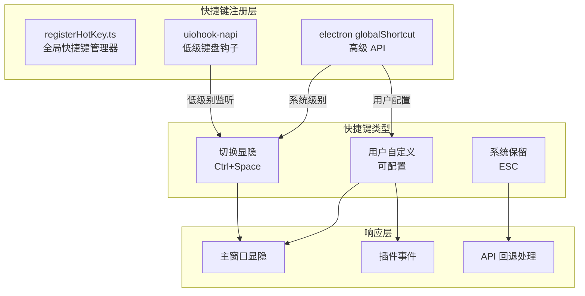

# Rubick 剪贴板、快捷键与系统集成

> **覆盖源码**: `src/main/common/registerHotKey.ts` (主进程快捷键), `src/renderer/plugins-manager/clipboardWatch.ts` (剪贴板监听), `src/main/common/windowsClipboard.ts` (Windows CF_HDROP), `src/main/display/screen-capture/index.ts` (截图), `src/main/common/tray.ts` (系统托盘), `src/main/common/options.ts`
> **核心问题**: 桌面应用的全局快捷键和剪贴板监听如何与插件系统交互？Windows 文件剪贴板（CF_HDROP）处理？uiohook-napi 的跨平台实现？

---

## 1. 快捷键系统

### 1.1 架构总览



### 1.2 registerHotKey.ts 实现

`src/main/common/registerHotKey.ts` — 快捷键注册的核心：

```typescript
import { globalShortcut, BrowserWindow } from 'electron'
import { uIOhook } from 'uiohook-napi'

const HOTKEYS = {
  'ctrl+space': '显示/隐藏主窗口',
  // 用户自定义快捷键存储在 PouchDB 中
}

export function registerHotKeys(mainWindow: BrowserWindow) {
  // 1. 先注销所有已注册快捷键
  globalShortcut.unregisterAll()

  // 2. 读取用户配置的快捷键
  const config = getConfig()
  const hotkey = config.hotkey || [{ key: 'Ctrl+Space', action: 'toggle' }]

  // 3. 遍历注册
  hotkey.forEach(hk => {
    try {
      globalShortcut.register(hk.key, () => {
        switch (hk.action) {
          case 'toggle':
            if (mainWindow.isVisible()) {
              mainWindow.hide()
            } else {
              mainWindow.show()
              mainWindow.focus()
            }
            break
          case 'custom':
            // 触发自定义插件动作
            mainWindow.webContents.send('global-short-key', hk)
            break
        }
      })
    } catch (e) {
      console.error(`Failed to register hotkey: ${hk.key}`, e)
    }
  })
}

// 应用退出时注销
app.on('will-quit', () => {
  globalShortcut.unregisterAll()
})
```

### 1.3 uiohook-napi 的使用

Rubick 引入了 `uiohook-napi`——一个原生 Node.js 扩展，提供低级键盘钩子（类似 Windows 的 SetWindowsHookEx）。

```typescript
// 注册全局钩子
uIOhook.on('keydown', (e) => {
  // e: { keycode, altKey, ctrlKey, shiftKey, metaKey }
  const isToggle = e.ctrlKey && e.keycode === KEY_SPACE
  if (isToggle) {
    // 切换主窗口
    mainWindow.isVisible() ? mainWindow.hide() : mainWindow.show()
  }
})

// 启动钩子
uIOhook.start()
```

**为什么同时用 `globalShortcut` 和 `uiohook-napi`？**

| 维度 | globalShortcut | uiohook-napi |
|------|---------------|-------------|
| 级别 | 系统级（Electron 封装） | 原生钩子 |
| 注册 | 由 Electron 管理 | 原始键盘事件 |
| 冲突 | 不会被应用内快捷键拦截 | 可能被系统拦截 |
| 调试 | Electron 日志 | 需原生调试 |
| 场景 | 标准快捷键 | 特殊键盘监听需求 |

### 1.4 快捷键冲突处理

```typescript
// 快捷键配置页面检测冲突
export function checkConflict(key: string, existing: string[]) {
  if (existing.includes(key)) {
    return `快捷键 ${key} 已被使用`
  }
  
  // 检查是否与系统快捷键冲突
  const systemKeys = ['Alt+Tab', 'Alt+F4', 'Ctrl+Alt+Del', 'Win+L']
  if (systemKeys.some(sk => sk.toLowerCase() === key.toLowerCase())) {
    return `快捷键 ${key} 与系统快捷键冲突`
  }
  
  return null
}
```

---

## 2. 剪贴板监听系统

### 2.1 双通道剪贴板

```mermaid
graph TB
    subgraph "渲染进程"
        CW[clipboardWatch.ts<br/>轮询 clipboard.readText()]
        WATCHER[定时器 500ms 轮询]
    end

    subgraph "主进程"
        WC[windowsClipboard.ts<br/>CF_HDROP 处理<br/>文件剪贴板]
    end

    subgraph "插件触发"
        TEXT_MATCH[文本匹配<br/>cmd.type === 'text']
        FILE_MATCH[文件匹配<br/>cmd.type === 'file']
        IMG_MATCH[图片匹配<br/>cmd.type === 'img']
    end

    CW -->|读取文本| TEXT_MATCH
    CW -->|有图片?| IMG_MATCH
    WC -->|读取文件列表| FILE_MATCH
    FILE_MATCH -->|更新搜索列表| RESULT[搜索结果更新]
    TEXT_MATCH --> RESULT
    IMG_MATCH --> RESULT
```

### 2.2 渲染进程剪贴板监听

`clipboardWatch.ts` — 在渲染进程中使用 `electron.clipboard` 轮询：

```typescript
// src/renderer/plugins-manager/clipboardWatch.ts
import { clipboard, nativeImage } from 'electron'

export class ClipboardWatch {
  private clipboardWatcher: any = null
  private timer: number | null = null
  private lastClipboardContent: string = ''
  private isPlaying: boolean = false

  start() {
    // 每 500ms 轮询一次剪贴板
    this.timer = window.setInterval(() => {
      try {
        // 1. 读取文本
        const text = clipboard.readText('clipboard')
        if (text !== this.lastClipboardContent) {
          this.lastClipboardContent = text
          this.onClipboardChange(text)
        }

        // 2. 检查是否有图片
        const image = clipboard.readImage('clipboard')
        if (!image.isEmpty()) {
          this.onClipboardImg(image.toDataURL())
        }

        // 3. 检查文件（通过主进程）
        const files = clipboard.read('FilePromise')
        if (files?.length) {
          this.onClipboardFiles(files)
        }
      } catch (e) {
        console.error('Clipboard watch error:', e)
      }
    }, 500)
  }

  stop() {
    if (this.timer) {
      clearInterval(this.timer)
      this.timer = null
    }
    this.lastClipboardContent = ''
  }

  private onClipboardChange(text: string) {
    // 通知插件系统：有一个 cmd.type === 'text' 的匹配项
    this.searchAndShowResults(text)
  }

  private onClipboardImg(dataUrl: string) {
    // 通知插件系统：有图片处理插件可用
    this.searchAndShowImgResults(dataUrl)
  }
}
```

### 2.3 500ms 轮询问题

```typescript
// clipboardWatch.ts 中的大 bug
start() {
  this.clipboardWatcher = clipboard.on('clipboard-change', (e) => {
    // 注意：这里使用 clipboard 事件，但 Electron clipboard 没有 'clipboard-change' 事件！
    // 这个监听器永远不会被触发！
  })
  
  // 实际工作的是这个：
  this.timer = window.setInterval(() => {
    // ... 轮询
  }, 500)
}
```

**重要 Bug**：`clipboard.on('clipboard-change', ...)` 是错误的 API。Electron 的 `clipboard` 模块没有事件发射器功能。这段代码虽然不会崩溃（`clipboard.on` 返回的是一个假的移除函数），但实际并未生效——真正的剪贴板监听是通过 `setInterval` 轮询实现的。

### 2.4 Windows 文件剪贴板

`windowsClipboard.ts` — 处理 Windows 特有的文件复制格式（CF_HDROP）：

```typescript
// src/main/common/windowsClipboard.ts
import { clipboard, nativeImage } from 'electron'

export function writeFilesToClipboard(filePaths: string[]) {
  if (process.platform !== 'win32') {
    // macOS/Linux 直接使用 clipboard.writeBuffer
    const fileList = filePaths.join('\n')
    clipboard.writeBuffer('text/uri-list', Buffer.from(fileList))
    return
  }

  // Windows: 使用 FileDrop 格式
  clipboard.writeBuffer('FileDrop', Buffer.from(
    JSON.stringify(filePaths.map(p => ({
      path: p,
      type: 'file',
    })))
  ))
}

export function readFilesFromClipboard(): string[] {
  if (process.platform !== 'win32') {
    const buf = clipboard.readBuffer('text/uri-list')
    return buf ? buf.toString().split('\n').filter(Boolean) : []
  }

  // Windows: 读取 FileDrop
  const buf = clipboard.readBuffer('FileDrop')
  if (!buf) return []
  
  try {
    const files = JSON.parse(buf.toString())
    return files.map(f => f.path)
  } catch {
    return []
  }
}
```

---

## 3. 系统托盘

`src/main/common/tray.ts` — 最小化到系统托盘：

```typescript
import { Tray, Menu, app } from 'electron'

export function createTray(mainWindow: BrowserWindow) {
  const tray = new Tray(path.join(__dirname, '../assets/tray-icon.png'))
  
  const contextMenu = Menu.buildFromTemplate([
    { label: '显示', click: () => mainWindow.show() },
    { label: '隐藏', click: () => mainWindow.hide() },
    { type: 'separator' },
    { label: '设置', click: () => openFeatureWindow() },
    { type: 'separator' },
    { label: '退出', click: () => app.quit() },
  ])

  tray.setToolTip('Rubick')
  tray.setContextMenu(contextMenu)

  // 双击显示
  tray.on('double-click', () => mainWindow.show())
}
```

---

## 4. 屏幕截图

`screen-capture/index.ts` — 截图功能的 IPC handler：

```typescript
// src/main/display/screen-capture/index.ts
export async function screenCapture(event, arg) {
  // 1. 隐藏主窗口（避免截到自己）
  mainWindow.hide()
  
  // 2. 延迟等待窗口消失
  await sleep(300)
  
  // 3. 创建全屏截图窗口
  const captureWin = new BrowserWindow({
    fullscreen: true,
    frame: false,
    transparent: true,
    alwaysOnTop: true,
  })
  
  // 4. 加载截图 UI
  captureWin.loadURL('capture://index.html')
  
  // 5. 用户选择区域后返回 base64 图片
  ipcMain.once('capture:done', (event, dataUrl) => {
    // 传递给插件
    mainWindow.webContents.executeJavaScript(
      `window.rubick.hooks.onScreenCapture(${JSON.stringify(dataUrl)})`
    )
    captureWin.close()
    mainWindow.show()
  })
}
```

---

## 5. 开机自启

通过 Electron 的 `app.setLoginItemSettings` 实现：

```typescript
// 设置/取消开机自启
export function setAutoLaunch(enabled: boolean) {
  app.setLoginItemSettings({
    openAtLogin: enabled,
    path: process.execPath,
  })
}

export function isAutoLaunchEnabled(): boolean {
  return app.getLoginItemSettings().openAtLogin
}
```

在 Windows 上，这会在注册表 `HKCU\Software\Microsoft\Windows\CurrentVersion\Run` 中添加条目。

---

## 6. 关键 Bug 与问题

| 问题 | 文件 | 说明 |
|------|------|------|
| `clipboard.on` 无效监听 | `clipboardWatch.ts:12` | Electron clipboard 无事件，代码虽不报错但不生效 |
| 500ms 轮询延迟 | `clipboardWatch.ts:20` | 用户复制后最多 500ms 才响应 |
| 轮询性能 | `clipboardWatch.ts:20` | 每 500ms 读取 text/image/file，高频时可能卡 UI |
| uiohook-napi 原生编译 | `registerHotKey.ts` | 需要 node-gyp 编译环境 |
| `before-input-event` 与 `globalShortcut` 优先级 | `api.ts` | ESC 键处理在两个层可能冲突 |
| 剪贴板环（clipboard cycle） | `clipboardWatch` | 如果插件主动写入剪贴板，会触发自身监听 |
| 截图窗口与 BrowserView 层叠 | `screen-capture` | 全屏截图窗口可能被其他窗口覆盖 |

---

## 7. 对比 ZTools 系统集成

| 维度 | Rubick | ZTools |
|------|--------|--------|
| 快捷键注册 | globalShortcut + uiohook-napi | globalShortcut + 自研管理器 |
| 快捷键持久化 | PouchDB 配置文档 | Rust heed + toml |
| 快捷键冲突检测 | 手动字符串比对 | 检测器自动分析 |
| 剪贴板监听 | 渲染进程 500ms 轮询 | 主进程原生监听 |
| 文件剪贴板 | CF_HDROP / FileDrop | Windows 原生 API |
| 系统托盘 | Tray + ContextMenu | Tray + 原生菜单 |
| 截图 | Electron BrowserWindow | Win32 API |
| 开机自启 | `app.setLoginItemSettings` | 注册表直接操作 |
