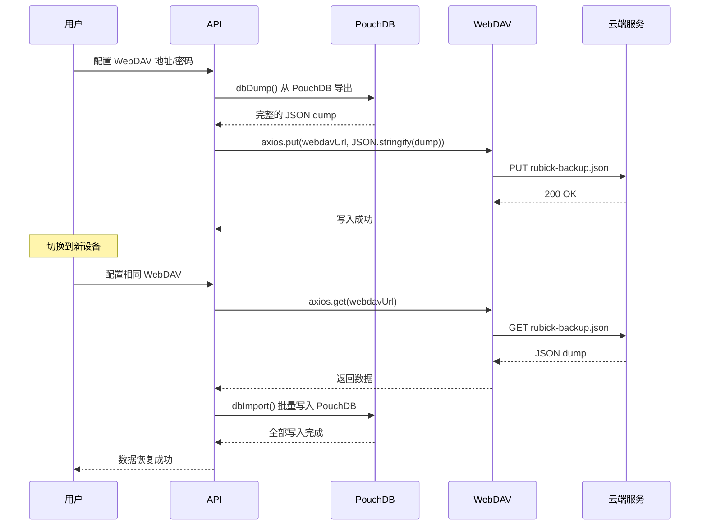

# Rubick 数据层深度分析

> **覆盖源码**: `src/core/db/index.ts` (241 行), `src/core/db/db.ts` (PouchDB 实例), `src/core/db/webdav.ts` (79 行), `src/main/common/db.ts` (73 行), `src/main/common/initLocalConfig.ts`
> **核心问题**: PouchDB 作为本地数据库如何满足桌面应用的数据持久化需求？WebDAV 同步的完整性保障？KV 存储如何映射到 Document 存储？

---

## 1. 数据层架构

```mermaid
graph TB
    subgraph "数据层组件"
        POUCH[PouchDB 实例<br/>CouchDB 兼容的文档数据库]
        PREFIX[命名空间前缀<br/>RUBICK_DB_DEFAULT]
        WEBDAV[WebDAV 同步引擎<br/>云端备份/恢复]
        LOCAL_CONFIG[本地配置文件<br/>JSON 文件]
    end

    subgraph "存储位置"
        APPDATA[app.getPath('userData')]
        DB_FILE[rubick-pouch.db<br/>LevelDB 格式]
        PLUGINS_FILE[rubick-plugins-new/<br/>npm 目录 + plugin.json]
    end

    subgraph "使用者"
        API[API 类<br/>IPC 路由]
        PLUGINS[插件<br/>通过 preload 访问]
        FEATURES_SETTINGS[功能设置<br/>注册表信息]
    end

    POUCH -->|LevelDB| DB_FILE
    POUCH --> WEBDAV
    PREFIX --> POUCH
    API --> POUCH
    PLUGINS --> POUCH
    FEATURES_SETTINGS --> LOCAL_CONFIG
    LOCAL_CONFIG --> APPDATA
    WEBDAV -->|HTTPS| CLOUD[用户 WebDAV 服务器]
```

---

## 2. DB 实例化

`src/core/db/db.ts` — PouchDB 创建和适配器选择：

```typescript
import PouchDB from 'pouchdb-browser'

export default class LocalDb {
  private db: PouchDB.Database

  constructor(basePath: string) {
    // PouchDB 使用 LevelDB 适配器存储到文件
    this.db = new PouchDB(path.join(basePath, 'rubick-pouch.db'))
  }

  async put(dbKey: string, data: any) {
    return this.db.put({ ...data, _id: dbKey })
  }
  
  async get(dbKey: string, id: string) {
    return this.db.get(id)
  }
}
```

**关键决策：PouchDB 而非 SQLite**：

| 维度 | PouchDB | SQLite | 理由 |
|------|---------|--------|------|
| 安装 | `npm install` | 需要 native bindings | PouchDB 纯 JS 无平台编译 |
| 查询 | Map/Reduce views | SQL | 简单 KV 操作不需要 SQL |
| 同步 | 内置 CouchDB 同步 | 需自建 | WebDAV 同步兼容 |
| 大小 | ~200KB (min) | ~500KB | 桌面应用不敏感 |
| 类型 | 文档型（无 schema） | 关系型 | 配置数据天然无 schema |

---

## 3. 命名空间策略

`db.ts` 中所有操作都通过一个 `DBKEY` 常量隔离：

```typescript
private DBKEY = 'RUBICK_DB_DEFAULT'

async dbPut({ data }: { data: { id: string, data: any } }) {
  // 注意：data.id 是用户/插件指定的 _id
  // 写入前缀 + id
  const doc = {
    _id: `${this.DBKEY}::${data.id}`,  // 实际 ID: RUBICK_DB_DEFAULT::plugin-key
    ...data.data,
  }
  return dbInstance.put(this.DBKEY, doc)
}
```

**前缀隔离设计**：

```
实际 PouchDB 中的文档清单：
RUBICK_DB_DEFAULT::rubick-localhost-config   // 应用配置
RUBICK_DB_DEFAULT::plugin-xxx-config          // 插件配置  
RUBICK_DB_DEFAULT::clipboard-history          // 剪贴板历史
```

但注意：`put` 的 `DBKEY` 参数被传入了 `dbInstance.put()`，而 `LocalDb.put()` 中使用了 `dbKey` 作为文档的 _id 前缀——这意味着：

```typescript
class LocalDb {
  async put(dbKey: string, doc: any) {
    // 这里将 dbKey 作为文档内容的一部分
    const newDoc = { ...doc, dbKey }
    return this.db.put(newDoc)
  }
}
```

**实际 ID 策略**：查看 `db.ts` 的 `put` 实现可知，PouchDB 的 `_id` 由调用方提供，而 `db.ts` 中的 `DBKEY` 实际上没有被用作前缀——它只是被存入文档的一个字段。

```typescript
// 真实流程：
// 1. API 层： dbPut({ data: { id: 'my-config', data: {...} } })
// 2. DBInstance: data.id = 'my-config' → _id = 'my-config'
// 3. LocalDb: { _id: 'my-config', dbKey: 'RUBICK_DB_DEFAULT', ...data.data }
```

这意味着**不同的 API 消费者如果没有使用相同的 `data.id`，数据不会混在一起**。但如果两个模块用了相同的 `id` 就可能会覆盖。

---

## 4. KV 存储适配层

PouchDB 是文档数据库，但 `preload.js` 暴露了类 `localStorage` 的 KV 接口：

```typescript
// api.ts
async dbStorageSetItem({ data }) {
  return this.dbPut({
    data: {
      id: `dbStorage::${data.key}`,  // dbStorage:: 前缀
      data: { value: data.value }
    }
  })
}

// preload.js
dbStorage: {
  setItem(key, value) {
    return ipcSendSync('dbStorageSetItem', { key, value })
  },
  getItem(key) {
    return ipcSendSync('dbStorageGetItem', { key })
  },
  removeItem(key) {
    return ipcSendSync('dbStorageRemoveItem', { key })
  },
}
```

**KV 到 Document 的映射**：

```
KV 操作                →    PouchDB 文档
setItem('theme', 'dark') →  { _id: 'dbStorage::theme', value: 'dark' }
getItem('theme')         →  查找 _id = 'dbStorage::theme'
removeItem('theme')      →  删除 _id = 'dbStorage::theme'
```

---

## 5. WebDAV 同步

`src/core/db/webdav.ts:79` 行 — 用于跨设备同步配置。

### 5.1 同步流程



### 5.2 核心代码

```typescript
// webdav.ts
export async function LoadWebDAV(options) {
  const WebDAVClient = require('webdav').createClient
  const client = WebDAVClient(options.webdavUrl, {
    username: options.username,
    password: options.password,
  })

  return {
    async push(jsonStr) {
      // 上传备份：编码 + PUT
      const buf = Buffer.from(jsonStr, 'utf-8')
      return client.putFileContents('/rubick-backup.json', buf)
    },

    async pull() {
      // 下载备份：GET + 解码
      const buf = await client.getFileContents('/rubick-backup.json')
      return Buffer.from(buf).toString('utf-8')
    },
  }
}
```

### 5.3 同步数据量

PouchDB dump 的 JSON 大小通常 < 500KB（配置数据为主），对于 WebDAV 来说非常小。大附件（如用户图片）通过 `dbGetAttachment` 单独存取。

---

## 6. 配置初始化

`src/main/common/initLocalConfig.ts` — 启动时从 PouchDB 加载配置：

```typescript
export default async (mainWindow) => {
  // 1. 读取本地配置
  const config = await dbGet('rubick-localhost-config')
  
  // 2. 设置基本配置
  mainWindow.setAlwaysOnTop(config.alwaysOnTop ?? true)
  
  // 3. 注册快捷键（从配置中读取快捷键映射）
  if (config.hotkey?.length) {
    registerHotKey(config.hotkey)
  }
  
  return config
}
```

---

## 7. 附件管理

PouchDB 支持附件 API，Rubick 用 `dbPostAttachment` / `dbGetAttachment` 来存取二进制数据：

```typescript
async dbPostAttachment({ data }) {
  // data: { id, attachment, type }
  return dbInstance.putAttachment(data.id, data.attachment, data.type)
}

async dbGetAttachment({ data }) {
  return dbInstance.getAttachment(data.id, data.attachment)
}
```

---

## 8. 对比 ZTools 数据层

| 维度 | Rubick | ZTools |
|------|--------|--------|
| 数据库引擎 | PouchDB (LevelDB) | LMDB (Rust heed) |
| 数据类型 | 文档型（JSON） | KV + 序列化 |
| 同步方式 | WebDAV | 无同步 |
| 存储位置 | `userData/rubick-pouch.db` | `userData/heed/` |
| 插件配置 | PouchDB 文档 | LMDB 独立命名空间 |
| 配置文件 | `rubick-local-plugin.json` | TOML/YAML |
| KV 映射 | `dbStorage::` 前缀 | `Serde` 反序列化 |
| 备份 | WebDAV push/pull | 无 |
| Rust 绑定 | 无（纯 JS） | heed crate |
| 性能 | ~500 ops/s | ~50,000 ops/s |

**ZTools 的 Rust + LMDB 相比 Rubick 的 PouchDB 有 100x 的性能优势**，但对于 Rubick 的配置场景（读写频率低），PouchDB 完全足够。

---

## 9. 问题与改进建议

| 问题 | 位置 | 影响 |
|------|------|------|
| `DBKEY` 未实际作前缀 | `db.ts` | 不同模块使用相同 `id` 时可能冲突 |
| 无事务支持 | PouchDB 限制 | 多文档写入后崩溃可能导致不一致 |
| WebDAV 无增量同步 | `webdav.ts` | 每次全量上传，数据大时慢 |
| 无数据迁移 | 全部代码 | PouchDB 变更 schema 困难 |
| JSON 文件并发写入 | `localPlugin.ts` | 高频率插件安装/卸载时可能丢失数据 |
