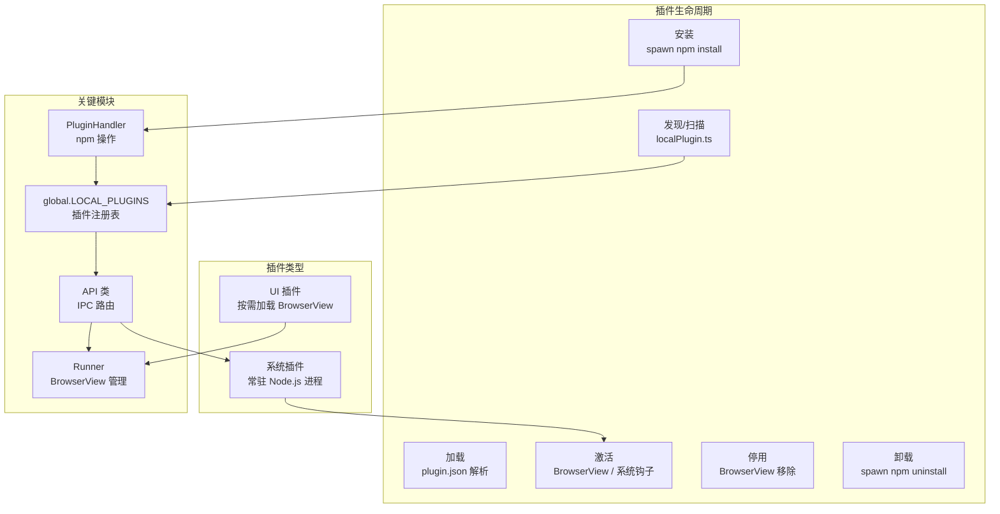
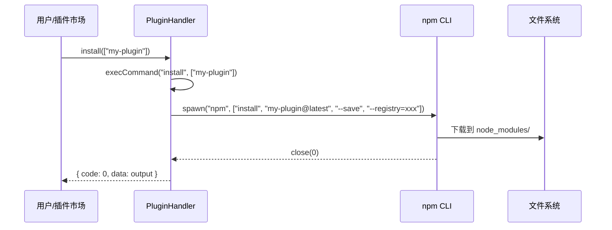
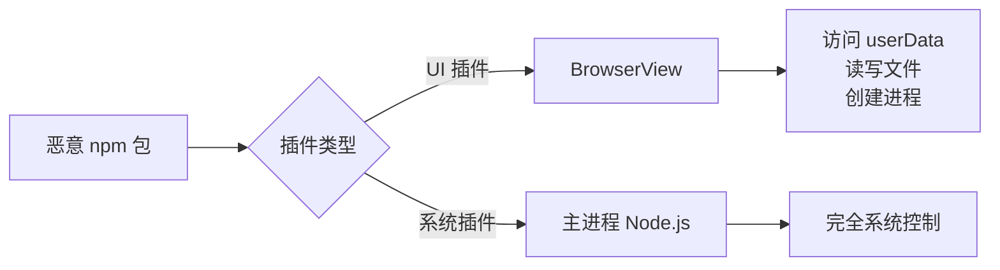

# Rubick 插件系统深度分析

> **覆盖源码**: `src/core/plugin-handler/` (209 行 + 38 行 types), `src/main/common/registerSystemPlugin.ts` (56 行), `src/common/utils/localPlugin.ts` (120 行), `src/main/common/initLocalConfig.ts`, `src/core/db/`
> **核心问题**: npm 包如何成为桌面插件？双类型插件（UI/系统）如何共存？

---

## 1. 架构总览



---

## 2. plugin.json 规范

每个插件根目录必须有 `plugin.json`，这是插件的"身份证"：

```json
{
  "pluginName": "rubick-system-feature",
  "version": "1.0.0",
  "description": "系统插件-设置中心",
  "main": "index.html",
  "preload": "preload.js",
  "logo": "https://xxx/logo.png",
  "pluginType": "system",
  "entry": "dist/main.js",
  "features": [
    {
      "code": "settings",
      "explain": "系统设置",
      "icon": "https://xxx/settings.png",
      "cmds": [
        { "type": "over", "label": "偏好设置", "match": "关键词" },
        { "type": "over", "label": "设置" }
      ]
    }
  ]
}
```

### 字段详解

| 字段 | 类型 | 必填 | 说明 |
|------|------|------|------|
| `pluginName` | string | ✅ | 可读名称 |
| `name` | string | — | npm 包名（由 package.json 提供） |
| `main` | string | UI 插件 | HTML 入口文件 |
| `preload` | string | — | 预加载脚本（相对于插件根目录） |
| `pluginType` | `"ui"|"system"` | ✅ | 插件类型 |
| `entry` | string | 系统插件 | Node.js 入口文件 |
| `features[]` | array | ✅ | 功能定义（1 个插件可注册多个 feature） |
| `features[].code` | string | ✅ | 功能标识码 |
| `features[].cmds[]` | array | ✅ | 命令匹配规则 |
| `features[].cmds[].type` | `"text"|"img"|"file"|"regex"|"over"` | ✅ | 匹配类型 |

### cmd 匹配类型详解

| type | 触发条件 | 示例 |
|------|---------|------|
| `text` | 用户输入的文本匹配 `label` | 搜索"翻译"→ 显示翻译插件 |
| `img` | 剪贴板有图片 | 复制图片 → 显示图片处理插件 |
| `file` | 剪贴板有文件且扩展名匹配 `match` 正则 | 复制 .png → 显示压缩图片插件 |
| `regex` | 用户输入匹配 `match` 正则 | 输入 hex 颜色 → 显示颜色转换插件 |
| `over` | 始终显示（适合设置页） | 偏好设置、帮助 |

---

## 3. 插件注册表：global.LOCAL_PLUGINS

`src/common/utils/localPlugin.ts:120` 行定义了一个全局变量 `global.LOCAL_PLUGINS`，它是插件的运行时注册表：

```typescript
// 文件存储: rubick-plugins-new/rubick-local-plugin.json
// 结构: [{ pluginName, name, pluginType, features, logo, ... }]

global.LOCAL_PLUGINS = {
  PLUGINS: [],  // 运行时插件列表（内存缓存）

  // 插件 CRUD
  downloadPlugin(plugin) { /* npm install + addPlugin */ },
  refreshPlugin(plugin) { /* 刷新插件信息 */ },
  addPlugin(plugin) { /* 写入 PLUGINS + 持久化到 JSON */ },
  updatePlugin(plugin) { /* 更新指定插件 */ },
  deletePlugin(plugin) { /* npm uninstall + 移除 */ },

  // 查询
  getLocalPlugins() { /* 从内存/JSON 读取 */ },
}
```

**设计分析**：`LOCAL_PLUGINS` 是一个全局单例 + JSON 文件持久化的混合方案。在 Electron 中，全局变量可以在主进程的所有模块间共享，无需依赖注入。`rubick-local-plugin.json` 作为持久化层，启动时加载到内存，运行中修改后立即写回。

**关键问题**：JSON 文件持久化在并发写入时有数据丢失风险。但考虑到桌面应用是单用户单进程的，这个风险在可接受范围内。

---

## 4. npm 安装：PluginHandler

`src/core/plugin-handler/index.ts:209` 行 — 核心插件管理器。

### 4.1 安装流程



### 4.2 插件目录初始化

```typescript
constructor(options: AdapterHandlerOptions) {
  // 初始化插件存放目录
  if (!fs.existsSync(options.baseDir)) {
    fs.mkdirsSync(options.baseDir)
    fs.writeFileSync(`${options.baseDir}/package.json`, JSON.stringify({
      dependencies: {},
      volta: { node: '16.19.1' }  // Fix: 固定 Node 版本
    }))
  }
  // 从 DB 读取 registry 配置
  const dbdata = ipcRenderer.sendSync('msg-trigger', {
    type: 'dbGet',
    data: { id: 'rubick-localhost-config' }
  })
  this.registry = dbdata.data.register || 'https://registry.npmmirror.com/'
}
```

注意：**这里在 main 进程中应该使用 `ipcMain` 而非 `ipcRenderer`**。说明这个 `PluginHandler` 文件同时被主进程和渲染进程使用（在渲染进程中也创建了实例）。

### 4.3 install/update/uninstall 命令

```typescript
async install(adapters, options) {
  const cmd = options.isDev ? 'link' : 'install'
  await this.execCommand(cmd, adapters)
}

async uninstall(adapters, options) {
  const cmd = options.isDev ? 'unlink' : 'uninstall'
  await this.execCommand(cmd, adapters)
}

async execCommand(cmd, modules) {
  return new Promise((resolve, reject) => {
    const npm = spawn('npm', args, { cwd: this.baseDir })
    npm.stdout.on('data', data => output += data)
    npm.on('close', (code) => {
      code ? reject({ code, data: output }) : resolve({ code: 0, data: output })
    })
  })
}
```

**关键决策：spawn npm 而非编程式调用**。这意味着：
- 每次安装都会启动一个全新的 npm 进程（开销 ~200ms）
- 输出是纯文本，需要解析 stdout/stderr
- 宿主机的 npm 版本决定了兼容性
- 但获得的是完整的 npm 生态——依赖解析、peerDependencies、lockfile 全部免费

### 4.4 更新检查

```typescript
async upgrade(name) {
  const installedVersion = pkg.dependencies[name].replace('^', '')
  const { data } = await axios.get(`https://registry.npmmirror.com/${name}`)
  const latestVersion = data['dist-tags'].latest
  if (latestVersion > installedVersion) {
    await this.install([name], { isDev: false })
  }
}
```

注意：版本比较是字符串比较（`latestVersion > installedVersion`），这不是语义化版本比较。`"9.0.0" > "10.0.0"` 在字符串比较中会返回 `true`（因为 '9' > '1'）。这**可能是一个 bug**，应该使用 `semver.gt()` 进行比较。

---

## 5. 系统插件运行机制

### 5.1 注册流程

`src/main/common/registerSystemPlugin.ts:56` 行：

```typescript
export default () => {
  // 1. 从 LOCAL_PLUGINS 过滤出 system 类型
  const systemPlugins = totalPlugins.filter(p => p.pluginType === 'system')
  
  // 2. 加载每个系统插件的 entry 模块
  systemPlugins.forEach(plugin => {
    const pluginModule = __non_webpack_require__(plugin.indexPath)()
    hooks.onReady.push(pluginModule.onReady)
  })

  // 3. 应用就绪后触发所有 Ready 钩子
  const triggerReadyHooks = (ctx) => {
    hooks.onReady.forEach(hook => {
      hook && hook(ctx)
    })
  }

  return { triggerReadyHooks }
}
```

### 5.2 系统插件与 UI 插件的核心差异

| 维度 | UI 插件 | 系统插件 |
|------|---------|---------|
| 运行位置 | BrowserView（渲染进程） | Node.js（主进程） |
| 创建方式 | `new BrowserView()` | `__non_webpack_require__()` |
| 生命周期 | 按需加载，用完即走 | 随应用启动，常驻运行 |
| API 暴露 | `window.rubick.*` (preload) | Electron API 完全访问 |
| 适用场景 | 搜索呼起的工具（翻译、二维码） | 后台服务（快捷键监听、剪切板增强） |
| 重启要求 | 不需要 | 安装后需要重启 |

### 5.3 系统插件的钩子系统

系统插件的 `onReady(ctx)` 接收完整的 Electron API 对象：

```typescript
// App 类中调用
this.systemPlugins.triggerReadyHooks(
  Object.assign(electron, {
    mainWindow: this.windowCreator.getWindow(),
    API,  // 完整的 API 实例
  })
)
```

这意味着系统插件可以：
- 创建新窗口 (`new BrowserWindow()`)
- 注册全局快捷键 (`globalShortcut`)
- 访问 IPC API (`API.dbGet`, `API.loadPlugin`)
- 操作主窗口 (`mainWindow.show()`)

--- 

## 6. feature 注册机制

插件通过 `features` 数组声明能力，每个 `feature` 有一个 `code` 和多个 `cmds`。

```typescript
// API.ts 中的 feature 管理
public setFeature({ data }, window) {
  this.currentPlugin = {
    ...this.currentPlugin,
    features: (() => {
      // 检查是否已存在相同 code 的 feature
      let has = this.currentPlugin.features.some(f => f.code === data.feature.code)
      if (!has) return [...this.currentPlugin.features, data.feature]
      return this.currentPlugin.features
    })()
  }
  // 同步到渲染进程
  window.webContents.executeJavaScript(
    `window.updatePlugin(${JSON.stringify({ currentPlugin: this.currentPlugin })})`
  )
}
```

搜索时，options.ts 遍历所有 `LOCAL_PLUGINS` 的 features，按 cmd 匹配规则过滤：

```typescript
function searchKeyValues(lists, value, strict = false) {
  return lists.filter(item => {
    if (typeof item === 'string') return !!PinyinMatch.match(item, value)
    if (item.type === 'regex' && !strict) return formatReg(item.match).test(value)
    if (item.type === 'over' && !strict) return true  // 始终显示
    return false
  })
}
```

---

## 7. 安全分析

### 7.1 当前安全隐患

1. **`contextIsolation: false`**：插件的 JavaScript 和 Electron 渲染进程共享同一个上下文
2. **`nodeIntegration: true`**：插件可以直接 `require('child_process')` 执行任意命令
3. **`@electron/remote`**：插件可以从渲染进程创建新窗口、访问主进程 API
4. **系统插件 `__non_webpack_require__`**：直接在 main 进程中加载并执行插件代码，无任何隔离
5. **npm 包的供应链风险**：任何人可以向 npm 发布一个恶意包作为插件

### 7.2 攻击面



---

## 8. 代码问题总结

| 问题 | 文件 | 行号 | 影响 |
|------|------|------|------|
| 版本字符串比较（非 semver） | `plugin-handler/index.ts` | 81 | 无法正确检测 >9.x 版本的更新 |
| 使用 `ipcRenderer` 而非 `ipcMain` | `plugin-handler/index.ts` | 54 | 在主进程中运行时可能出错 |
| dispatch 在 main 中创建 PluginHandler | `localPlugin.ts` | 11 | 构造函数从 main 进程初始化时行为不一致 |
| 无插件沙箱隔离 | 全局 | — | 任意插件可访问系统 |
| 无 API 版本声明 | plugin.json | — | 插件无法声明需要的 rubick API 版本 |
| 系统插件无热重载 | 全局 | — | 安装后必须重启应用 |
