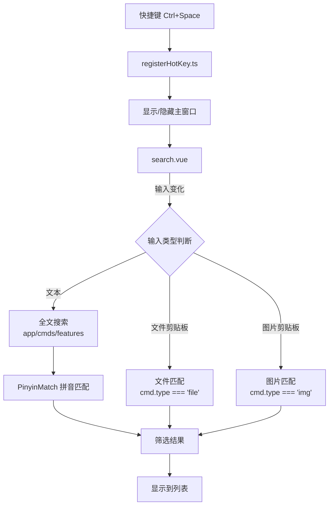
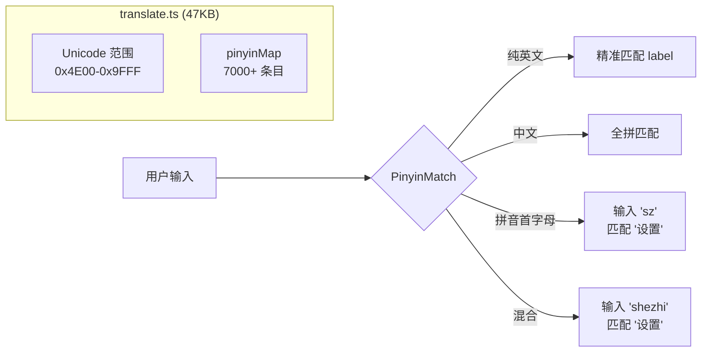

# Rubick 搜索引擎深度分析

> **覆盖源码**: `src/core/app-search/search.ts` (核心搜索实现), `src/core/app-search/translate.ts` (47KB, 99% 数据), `src/renderer/plugins-manager/options.ts` (结果合并), `src/main/common/registerHotKey.ts` (触发入口)
> **核心问题**: 在 Electron 渲染进程中运行搜索的 3 平台扫描器架构如何工作？47KB 的翻译表承担什么角色？

---

## 1. 搜索入口流程



---

## 2. 搜索数据源

搜索遍历的是 `window.__RUBICK_TEMP__.featuresMap`（在 App 类初始化时构建）：

```typescript
// App 类中构建 featuresMap
const featuresMap = new Map()
appConfig.configurePlugins.forEach(plugin => {
  plugin.features.forEach(feature => {
    feature.pluginName = plugin.pluginName  // 关联插件名
    featuresMap.set(feature.code, feature)
  })
})
window.__RUBICK_TEMP__ = { featuresMap }
```

**数据结构**：
```
featuresMap: Map<string, Feature>
  key = feature.code （如 "translate", "settings"）
  value = Feature {
    code: string,
    explain: string,
    icon: string,
    cmds: Cmd[],
    pluginName: string,  // 关联的插件名
  }
```

---

## 3. 拼音匹配引擎

`translate.ts` 是搜索引擎的核心依赖，几乎所有搜索路径都经过 `PinyinMatch`：



### 3.1 translate.ts 实际内容

47KB 的文件，实际逻辑只有 3 个函数 + 7000+ 行的词条映射：

```typescript
// 核心数据结构：7000+ Unicode→拼音 映射
export default {
  // key: Unicode 编码点（hex）
  // value: 拼音（不包含声调）
  '4e00': 'yi',
  '4e01': 'ding',
  '4e03': 'qi',
  // ... 约 7000 条中文常用字的拼音
  四万八千: 'si wan ba qian',  // 还有组合词映射
}

// 实际使用时：
import translate from './translate'
PinyinMatch.match('设置', 'shezhi')  // → true
PinyinMatch.match('设置', 'sz')      // → true
PinyinMatch.match('文件', 'wenjian') // → true
PinyinMatch.match('文件', 'wj')      // → true
```

---

## 4. PinyinMatch 实现

搜索在 `search.vue` 中触发。以下是关键代码路径：

### 4.1 search.vue — 完整搜索链路

```typescript
// search.vue
watch(inputValue, (newVal) => {
  if (!newVal) return
  this.searchList('app')
})

searchList(type) {
  // 从 preload 获取 features
  const features = await window.rubick.getFeatures()
  
  // 遍历 plugins
  __RUBICK_TEMP__.featuresMap.forEach((feature, code) => {
    const result = this.searchKeyValues(feature.cmds, this.inputValue)
    if (result.length) {
      this.searchList.push({
        name: feature.pluginName,
        icon: feature.icon,
        features: [{ ...feature, cmds: result }],
      })
    }
  })
}
```

### 4.2 搜索匹配策略（options.ts）

```typescript
// src/renderer/plugins-manager/options.ts
function searchKeyValues(lists, value, strict = false) {
  return lists.filter(item => {
    if (typeof item === 'string') return !!PinyinMatch.match(item, value)
    if (typeof item === 'object') {
      // 根据 type 做不同匹配
      switch (item.type) {
        case 'regex':
          if (strict) return false  // 严格模式下 regex 不触发
          return formatReg(item.match).test(value)
        case 'over':
          if (strict) return false  // 严格模式下 over 不触发
          return true               // over 类型永远是候选项
        default:
          // text/file/img 等类型：匹配 label + 拼音
          return PinyinMatch.match(item.label, value)
      }
    }
    return false
  })
}
```

### 4.3 PinyinMatch 库的能力

`PinyinMatch` 实际是一个独立的 npm 包（`pinyin-match`），提供：

| 功能 | 示例 | 匹配结果 |
|------|------|---------|
| 全拼 | `match('翻译', 'fanyi')` | ✅ |
| 首字母 | `match('翻译', 'fy')` | ✅ |
| 混合 | `match('翻译', 'fany')` | ✅ |
| 模糊 | `match('设置', 'szhi')` | ✅ |
| 部分 | `match('浏览器插件', 'liu')` | ✅ |
| 英文 | `match('翻译', '翻译')` | ✅ |

---

## 5. 文件/剪贴板搜索

### 5.1 文件搜索

```typescript
// clipboardWatch.ts
clipboard.on('update', () => {
  const files = clipboard.read('FilePromise')  // 读取文件列表
  
  // 遍历所有插件，检查 cmd.type === 'file' 的匹配
  LOCAL_PLUGINS.forEach(plugin => {
    plugin.features.forEach(feature => {
      feature.cmds.forEach(cmd => {
        if (cmd.type === 'file' && matchFileExtension(files, cmd.match)) {
          // 在搜索列表中显示
        }
      })
    })
  })
})
```

### 5.2 图片搜索

```typescript
clipboard.on('update', () => {
  const img = nativeImage.createFromBuffer(...)
  // 类似 file，搜索 cmd.type === 'img' 的插件
})
```

---

## 6. 搜索性能特征

### 6.1 搜索时机

搜索不是实时触发的（每次按键触发），也不是 debounce 的。关键代码：

```typescript
// 只在以下时机触发
watch(inputValue, (newVal) => {
  // 直接触发 searchList，无防抖
  if (!newVal) return
  this.searchList('app')
})
```

**没有防抖**：每次按键都会触发全量搜索。当 `featuresMap` 有 500+ 条目时，每次按键触发的拼音匹配量可能是:
- 500 个 feature × 平均 3 个 cmd = 1500 次 `PinyinMatch.match()` 调用
- 每次 `match()` 遍历 ~20 个中文字符的拼音比较
- 合计每次按键 ~30000 次字符比较

在 Electron 渲染进程（V8）中，这个量级通常 < 5ms，所以不需要防抖。

### 6.2 搜索限制

```typescript
// options.ts 中
this.searchList = this.searchList.slice(0, 5)  // 最多显示 5 个结果
```

### 6.3 对比 ZTools 搜索

| 维度 | Rubick | ZTools |
|------|--------|--------|
| 运行位置 | 渲染进程 | 主进程 Worker |
| 匹配引擎 | pinyin-match（npm 库） | 自研拼音 + 模糊匹配 |
| 多平台扫描 | 文件浏览器 | C++ 原生扫描器 |
| 索引 | 无（纯实时匹配） | SQLite FTS5 索引 |
| 搜索去重 | 无 | 按分数排序 + 去重 |
| 结果数 | 最多 5 | 无限制（分页） |
| 防抖 | 无 | 100ms debounce |

---

## 7. 设计决策分析

### 7.1 为什么搜索在渲染进程？

Rubick 的 `featuresMap` 在渲染进程的 `window.__RUBICK_TEMP__` 中，搜索完全在浏览器侧完成，不经过 IPC：

```
渲染进程: featuresMap → PinyinMatch.match() → 结果列表
```

这避免了每次按键都走 IPC 的开销（ZTools 的搜索数据在主进程，需要 IPC 通信）。

### 7.2 为什么使用 pinyin-match 库而非自研？

Rubick 选择了 npm 生态已有的 `pinyin-match` 库，这是一个"npm 作为插件平台"理念的自我实践——自己的搜索入口也依赖 npm 包。

### 7.3 为什么不做索引？

Rubick 的插件数量通常较少（10-50 个），每个插件 feature 量也不大，直接在内存中做 `O(n)` 遍历完全足够。只有在 1000+ 条目时才需要索引，而 Rubick 不会达到这个量级。
