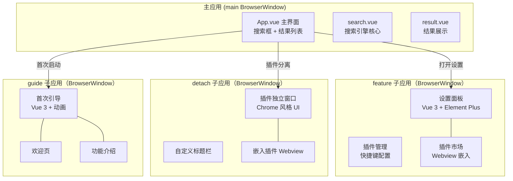
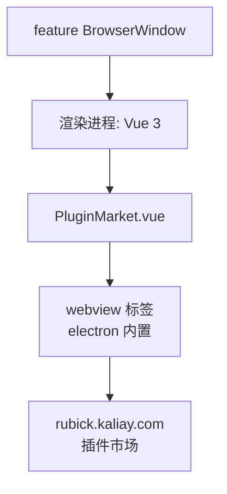
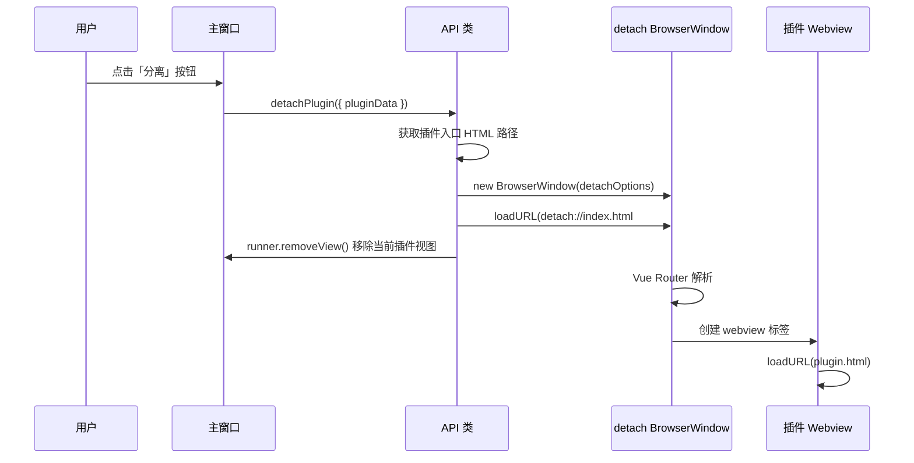

# Rubick 子应用架构深度分析

> **覆盖源码**: `feature/` (53 文件, ~13K 行), `detach/` (26 文件, ~21K 行), `guide/` (17 文件, ~9K 行), `src/main/common/detach.ts`, `src/main/browsers/runner.ts`
> **核心问题**: 三个独立的 Vue 3 子应用如何与主应用协同？BrowserWindow → BrowserView 的生命周期如何衔接？

---

## 1. 子应用总览



---

## 2. feature 子应用（设置面板）

`feature/` 是 Rubick 的设置面板，使用 Vue 3 + Element Plus 构建。

### 2.1 目录结构

```
feature/
├── src/
│   ├── App.vue                # 根组件
│   ├── main.ts                # 入口 + 注册 Element Plus
│   ├── router/
│   │   └── index.ts           # 路由（设置/插件/快捷键/关于）
│   ├── views/
│   │   ├── General.vue        # 通用设置（语言/主题/开机自启）
│   │   ├── Plugin.vue         # 插件管理（安装/卸载/启用）
│   │   ├── PluginMarket.vue   # 插件市场（Webview 嵌入）
│   │   ├── Hotkey.vue         # 快捷键设置
│   │   └── About.vue          # 关于页
│   ├── stores/
│   │   └── index.ts           # Pinia 状态管理
│   └── components/
│       ├── PluginCard.vue      # 插件卡片组件
│       ├── PluginDetail.vue    # 插件详情弹窗
│       └── TitleBar.vue        # 自定义标题栏
```

### 2.2 子应用通信

feature 子应用的 IPC 通信方式与其他子应用一致——直接使用 Electron IPC：

```typescript
// feature/src/stores/index.ts — Pinia store
import { ipcRenderer } from 'electron'

export const usePluginStore = defineStore('plugin', {
  state: () => ({
    plugins: [],
    loading: false,
  }),

  actions: {
    async fetchPlugins() {
      this.loading = true
      // 通过 IPC 获取插件列表
      const plugins = ipcRenderer.sendSync('msg-trigger', {
        type: 'getLocalPlugins',
        data: {},
      })
      this.plugins = plugins
      this.loading = false
    },

    async installPlugin(name: string) {
      await ipcRenderer.sendSync('msg-trigger', {
        type: 'installPlugin',
        data: { name },
      })
    },

    async uninstallPlugin(name: string) {
      await ipcRenderer.sendSync('msg-trigger', {
        type: 'uninstallPlugin',
        data: { name },
      })
    },
  },
})
```

### 2.3 插件市场——Webview 在 Webview 中



`PluginMarket.vue` 使用 Electron 的 `webview` 标签嵌入外部网站。注意：这需要在 `webPreferences` 中启用 `webviewTag: true`。

```html
<!-- PluginMarket.vue -->
<webview
  :src="marketUrl"
  style="width: 100%; height: 100%"
  @did-finish-load="onLoad"
  @new-window="handleNewWindow"
/>
```

---

## 3. detach 子应用（独立插件窗口）

`detach/` 是最复杂的子应用（~21K 行），为插件分离模式提供类似 Chrome 的窗口 UI。

### 3.1 分离机制



### 3.2 Detach 窗口配置

```typescript
// api.ts 中的 detachPlugin 方法
const detachWin = new BrowserWindow({
  width: 1000,
  height: 700,
  frame: false,                    // 无边框（自定义标题栏）
  transparent: true,               // 透明背景
  show: false,                     // 延迟显示
  skipTaskbar: false,              // 在任务栏显示
  webPreferences: {
    preload: join(__dirname, '../public/preload.js'),
    contextIsolation: false,       // 注意：同样不安全
    nodeIntegration: true,         // 注意：同样不安全
    webviewTag: true,              // 需要嵌入插件 webview
  },
})
```

### 3.3 目录结构

```
detach/
├── src/
│   ├── App.vue                 # 根组件
│   ├── main.ts                 # Vue 3 入口
│   ├── router/
│   │   └── index.ts            # Hash 路由（#/pluginName）
│   ├── stores/
│   │   ├── index.ts            # 插件状态
│   │   └── webview.ts          # Webview 状态
│   ├── components/
│   │   ├── TitleBar.vue        # 自定义标题栏（拖动 + 控制按钮）
│   │   ├── SearchBox.vue       # 搜索框（分离后仍可搜索）
│   │   ├── WebviewContainer.vue # 插件容器组件
│   │   └── LoadingIndicator.vue # 加载指示器
│   └── utils/
│       ├── ipc.ts              # IPC 封装
│       └── platform.ts         # 平台检测
```

### 3.4 路由实现

```typescript
// detach/src/router/index.ts
import { createRouter, createWebHashHistory } from 'vue-router'

const routes = [
  {
    path: '/',                    // 默认页：加载对应插件
    component: () => import('../views/PluginView.vue'),
  },
  {
    path: '/:pluginName',         // 按插件名加载
    component: () => import('../views/PluginView.vue'),
    props: true,
  },
]

const router = createRouter({
  history: createWebHashHistory(),
  routes,
})
```

### 3.5 Webview 容器组件

```typescript
// detach/src/components/WebviewContainer.vue
const props = withDefaults(defineProps<{
  pluginName: string
  pluginPath: string
}>(), {})

const webviewRef = ref<Electron.WebviewTag>()

onMounted(() => {
  const webview = webviewRef.value!
  
  // 监听插件加载完成
  webview.addEventListener('did-finish-load', () => {
    // 插件就绪，可以调用 preload API
  })

  // 监听页面标题变化（用于标题栏）
  webview.addEventListener('page-title-updated', (e) => {
    document.title = e.title
  })
})
```

---

## 4. guide 子应用（首次引导）

`guide/` 是最简单的子应用（~9K 行），仅用于首次启动时的引导。

### 4.1 触发条件

```typescript
// App 类初始化时
if (!localConfig.get('notFirstUse')) {
  // 首次启动：创建 guide 窗口
  const guideWin = new BrowserWindow({
    width: 600,
    height: 500,
    frame: false,
    transparent: true,
    show: false,
    webPreferences: {
      preload: guidePreloadPath,
      contextIsolation: false,
      nodeIntegration: true,
    },
  })
  guideWin.loadURL('guide://index.html')
  guideWin.show()
  
  // 主窗口保持隐藏
  this.mainWindow.hide()
}
```

### 4.2 目录结构

```
guide/
├── src/
│   ├── App.vue
│   ├── main.ts
│   ├── components/
│   │   ├── PageOne.vue       # 欢迎页（Logo + 简介）
│   │   ├── PageTwo.vue       # 功能演示动画
│   │   └── PageThree.vue     # 快捷键设置
│   ├── stores/
│   │   └── index.ts          # 引导进度
│   └── utils/
│       └── ipc.ts
```

### 4.3 引导完成

```typescript
// guide/src/utils/ipc.ts
export function closeGuide() {
  ipcRenderer.sendSync('guide:service', { type: 'closeGuide' })
}

// PageThree.vue — 最后一步
const finishGuide = () => {
  // 写入标记
  closeGuide()
}
```

主进程处理：

```typescript
// main process
ipcMain.on('guide:service', (event, arg) => {
  if (arg.type === 'closeGuide') {
    guideWin.close()
    mainWindow.show()
    localConfig.set('notFirstUse', true)
  }
})
```

---

## 5. 子应用通信模式总结

| 通信方式 | 用途 | 示例 |
|---------|------|------|
| `sendSync('msg-trigger', { type, data })` | 统一 API 入口 | 获取插件列表、数据库操作 |
| `send('re-register')` | 通知主进程重新注册快捷键 | 快捷键配置变化后 |
| `send('removePlugin')` | 异步通知移除插件 | 不关心返回结果 |
| `sendSync('guide:service', { type })` | 引导窗口专用 IPC | 关闭引导 |
| `sendSync('detach:service', { type })` | 分离窗口专用 IPC | 窗口控制 |
| `before-input-event` | 系统键盘事件注入 | ESC 处理 |
| `@electron/remote` API | 直接访问主进程能力 | `BrowserWindow` 创建 |
| `executeJavaScript` | 主进程向渲染进程注入代码 | 动态更新插件状态 |

---

## 6. 与 ZTools 对比

| 维度 | Rubick | ZTools |
|------|--------|--------|
| 子应用数量 | 3（feature/detach/guide） | 0（全部在主窗口） |
| 子应用框架 | 独立的 Vue 3 应用 | N/A |
| 子应用通信 | IPC + sendSync | IPC + 事件 |
| 子应用大小 | 13K / 21K / 9K 行 | N/A |
| 插件分离 | DetachWindow + BrowserView | SuperPanel（独立窗口） |
| 设置面板 | 独立 BrowserWindow | 主窗口标签页 |
| Webview 里嵌 Webview | 插件市场用 webview 标签 | BrowserView 模式 |

**核心差异**：Rubick 的"独立子应用"架构是一种更激进的解耦——每个子应用是完整的 Vue 3 + Vite 项目，有独立的 `package.json`、`router`、`store`。这带来了更好的模块化，但也增加了构建复杂度（需要 4 个 Vite 构建入口）。ZTools 将所有 UI 集中在主窗口，用组件化的方式管理，构建更简单。
