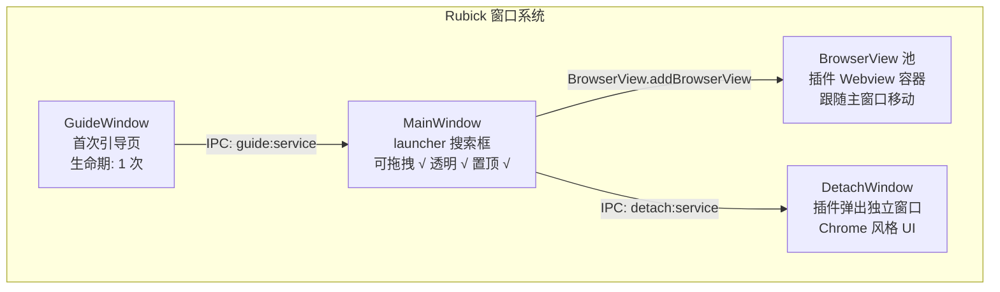
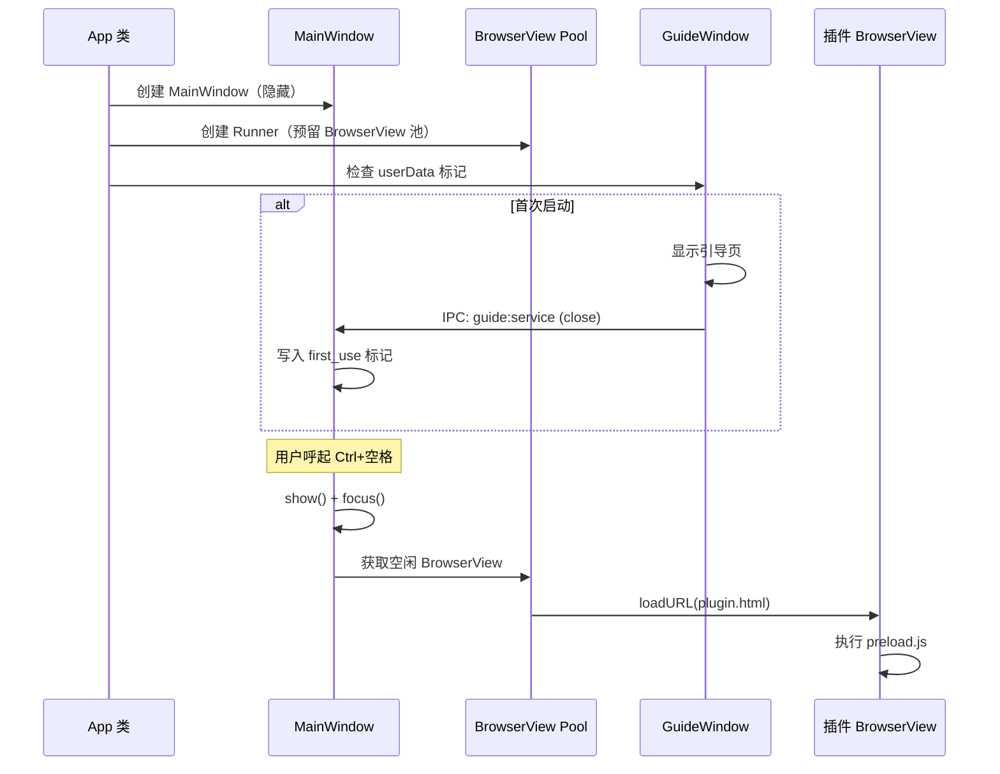
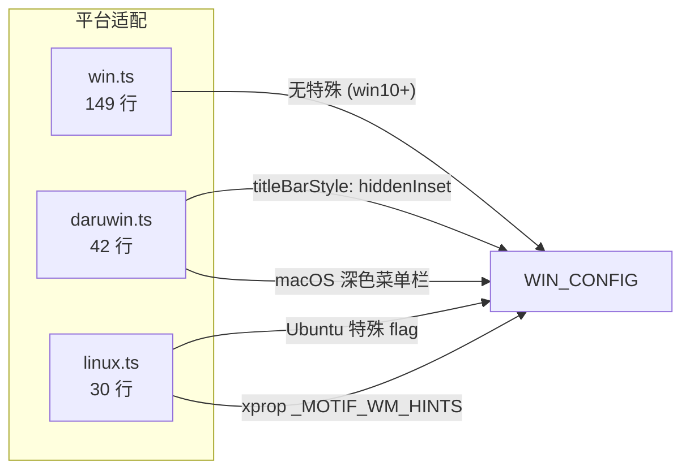

# Rubick 窗口系统深度分析

> **覆盖源码**: `src/main/browsers/runner.ts` (224 行), `src/main/browsers/win.ts` (149 行), `src/main/browsers/darwin.ts` (42 行), `src/main/browsers/linux.ts` (30 行), `src/main/display/` (屏幕坐标系), `detach/` (26 文件 ~21K 行), `guide/` (17 文件 ~9K 行)
> **核心问题**: 4 种窗口类型如何协同工作？BrowserView 池的复用策略如何精简到极致？

---

## 1. 窗口类型总览



### 1.1 窗口打开时序



---

## 2. MainWindow：主搜索窗口

`src/main/browsers/win.ts:149` 行 — 窗口创建工厂。

### 2.1 窗口配置

```typescript
const winConfig = {
  width: 570,
  height: 400,
  frame: false,              // 无边框
  transparent: true,         // 透明背景（圆角）
  show: false,               // 延迟显示
  alwaysOnTop: true,         // 置顶
  skipTaskbar: true,         // 不显示在任务栏
  resizable: false,          // 不可缩放
  hasShadow: false,          // 无系统阴影
  webPreferences: {
    contextIsolation: false, // 不安全但插件兼容
    nodeIntegration: true,   // 不安全但插件兼容
    webviewTag: true,        // 允许嵌入 webview（插件市场用）
    backgroundThrottling: false,
    preload: `${__dirname}/preload.js`,
  }
}
```

### 2.2 平台差异



注意 macOS 上的 `titleBarStyle: 'hiddenInset'` + `vibrancy: 'sidebar'` 实现原生毛玻璃效果，这是在 Windows 和 Linux 上无法直接复现的。

### 2.3 窗口定位算法

`src/main/display/getWinPosition.ts:72` 行 — 多显示器鼠标跟随：

```typescript
export function getWinPosition(winWidth, winHeight, query) {
  // 1. 获取鼠标所在显示器
  const cursorPoint = screen.getCursorScreenPoint()
  const currentDisplay = screen.getDisplayNearestPoint(cursorPoint)
  
  // 2. 只接受 retina 之外的显示器
  if (currentDisplay.scaleFactor === 2) { /* 跳过 retina 屏幕 */ }
  
  // 3. 计算居中位置（横向）和大约 1/3 高度（纵向）
  const bounds = currentDisplay.bounds
  const x = Math.round(bounds.x + (bounds.width - winWidth) / 2)
  const y = Math.round(bounds.y + Math.round(bounds.height * 0.25))
  
  return { x, y }
}
```

**设计分析**：定位在 `bounds.height * 0.25` 而非居中，是因为搜索框通常在屏幕顶部 1/3 区域操作体验更好（触手可及），这也是 Spotlight/Raycast 的设计哲学。

---

## 3. Runner：BrowserView 池

`src/main/browsers/runner.ts:224` 行 — BrowserView 管理。

### 3.1 为什么不是新 BrowserWindow？

**关键设计决策**：所有插件运行在 BrowserView 中，而非独立的 BrowserWindow。

| BrowserView | BrowserWindow |
|-------------|---------------|
| `addBrowserView(win)` | `new BrowserWindow()` |
| 随主窗口移动 | 需要手动同步位置 |
| 无独立任务栏图标 | 每个窗口有 Taskbar 图标 |
| 天然在主窗口上方 | 置顶链条复杂 |
| 轻量 ~2MB | 每个 ~10MB+ |

### 3.2 View 池设计

```typescript
export default class runner {
  private view: BrowserView  // 单实例！

  constructor() {
    this.view = new BrowserView({
      webPreferences: {
        preload: join(__dirname, '../preload.js'),
        contextIsolation: false,
        nodeIntegration: true,
        enableRemoteModule: true,
      }
    })
    mainWindow.setBrowserView(this.view)  // 关联到主窗口
  }

  show(url) {
    this.view.webContents.loadURL(url)
    this.setBounds(INPUT_HIGHT)  // 调整到搜索结果下方
  }

  hide() {
    this.view.webContents.close()  // 注意：关闭了 WebContents
  }
}
```

**关键发现**：Runner 只有一个 BrowserView 实例！这意味着：
- 同一时间只能显示一个插件
- 切换插件需要销毁当前 View
- 无法实现插件"后台运行"

```typescript
// 位置同步
setBounds(inputHeight) {
  const [width, height] = mainWindow.getSize()
  this.view.setBounds({
    x: 0, y: inputHeight,  // 在搜索框下方
    width, height: height - inputHeight
  })
}
```

### 3.3 对比 ZTools 的 BrowserView 池

| 维度 | Rubick | ZTools |
|------|--------|--------|
| View 数量 | 1（单例） | 4（预创建池） |
| 复用策略 | 销毁 + 重建 | 按需激活 |
| 后台运行 | 不支持 | 支持（最小化后保持活跃） |
| IPC 传递 | `executeJavaScript` | `BrowserView.webContents` |
| 生命周期 | `loadURL → show → close` | `pool acquire → show → release` |

---

## 4. DetachWindow：分离窗口

`detach/` 目录是一个独立的 Vue 3 应用（~21K 行），用于插件分离到独立窗口时的 UI。

### 4.1 分离流程

```typescript
// api.ts
async detachPlugin(event, window) {
  // 1. 获取插件信息
  const currentPlugin = this.getLocalPlugins().find(...)
  
  // 2. 创建 detach 窗口
  const detachWin = new BrowserWindow({
    width: 1000, height: 700,
    frame: false,
    transparent: true,
    ...  // 同样 contextIsolation: false, nodeIntegration: true
  })
  
  // 3. 加载 detach Vue 应用
  detachWin.loadURL(`detach://index.html#${pluginName}`)
  
  // 4. 隐藏主窗口的 BrowserView
  this.runner.removeView()
}
```

### 4.2 Detach 窗口架构

```
detach/
├── App.vue               # 根组件
├── components/
│   ├── TitleBar.vue      # 自定义标题栏（拖拽 + 关闭）
│   ├── ToolBar.vue       # 插件控制栏
│   ├── WebviewWindow.vue # 嵌入 WebView 显示插件
│   └── SearchBox.vue     # 分离后的搜索框
├── stores/
│   └── index.ts          # 插件状态管理
└── router/
    └── index.ts          # 根据 hash 路由到不同插件
```

DetachWindow 在 `#` 哈希路由后拼接插件名，Vue router 解析后动态创建对应的 Webview 标签。

---

## 5. GuideWindow：首次引导

`guide/` 目录也是一个独立的 Vue 3 应用（~9K 行）：

```
guide/
├── App.vue
├── components/
│   ├── PageOne.vue    # 欢迎页
│   ├── PageTwo.vue    # 功能介绍
│   └── PageThree.vue  # 快捷键设置
└── stores/
    └── index.ts       # 引导状态
```

引导完成后通过 IPC 通知主进程：

```typescript
// guide 应用关闭时
ipcRenderer.sendSync('guide:service', { type: 'closeGuide' })

// 主进程中
ipcMain.on('guide:service', (event, arg) => {
  if (arg.type === 'closeGuide') {
    mainWindow.show()  // 引导完成，显示主窗口
    // 写入 notFirstUse 标记
    localConfig.set('notFirstUse', true)
  }
})
```

---

## 6. 窗口拖拽系统

`src/renderer/App.vue` 中的拖拽实现：

```typescript
handleMouseDown(event) {
  this.dragging = true
  this.startPosition = { x: event.clientX, y: event.clientY }
  // 同步通知 main 进程
  window.rubick.setStartPosition(event)
}

onMounted(() => {
  document.addEventListener('mouseup', this.handleMouseUp)
  document.addEventListener('mousemove', (event) => {
    if (this.dragging) {
      // main 进程根据偏移量移动窗口
      window.rubick.windowMoving({ x, y })
    }
  })
})
```

Main 进程中 `windowMoving` 的实现：

```typescript
async windowMoving({ data }) {
  const [x, y] = this.mainWindow.getPosition()
  this.mainWindow.setPosition(x + data.x - this.startX, y + data.y - this.startY)
}
```

---

## 7. 关键发现

### 7.1 窗口安全

**所有窗口**（包括 detach 和 guide）都启用了 `contextIsolation: false` + `nodeIntegration: true`，这在整个应用中形成了统一的安全模型——但也意味着整个应用是脆弱的。

### 7.2 高度自适应流

```typescript
// 插件通过 preload 调用
window.rubick.setExpendHeight(500)  // 告诉主窗口需要多高

// API
async setExpendHeight({ data }) {
  const height = data + INPUT_HEIGHT
  this.mainWindow.setSize(570, height)
  // BrowserView 自动拉伸
}
```

### 7.3 BrowserView 无动画

ZTools 有渐变进入效果，Rubick 的 BrowserView 是直接显示/隐藏，没有任何过渡动画。

### 7.4 检测处理 `mousemove` 在 `onMounted` 中

拖拽的 `mousemove` listener 是在 `onMounted` 中添加的——这意味着如果拖拽过程中鼠标移出窗口，监听到 `mouseup` 就会丢失。这是一个已知的边缘情况（ZTools 使用 `document.addEventListener` 在 `mousedown` 时临时添加，`mouseup` 时移除，更规范）。
