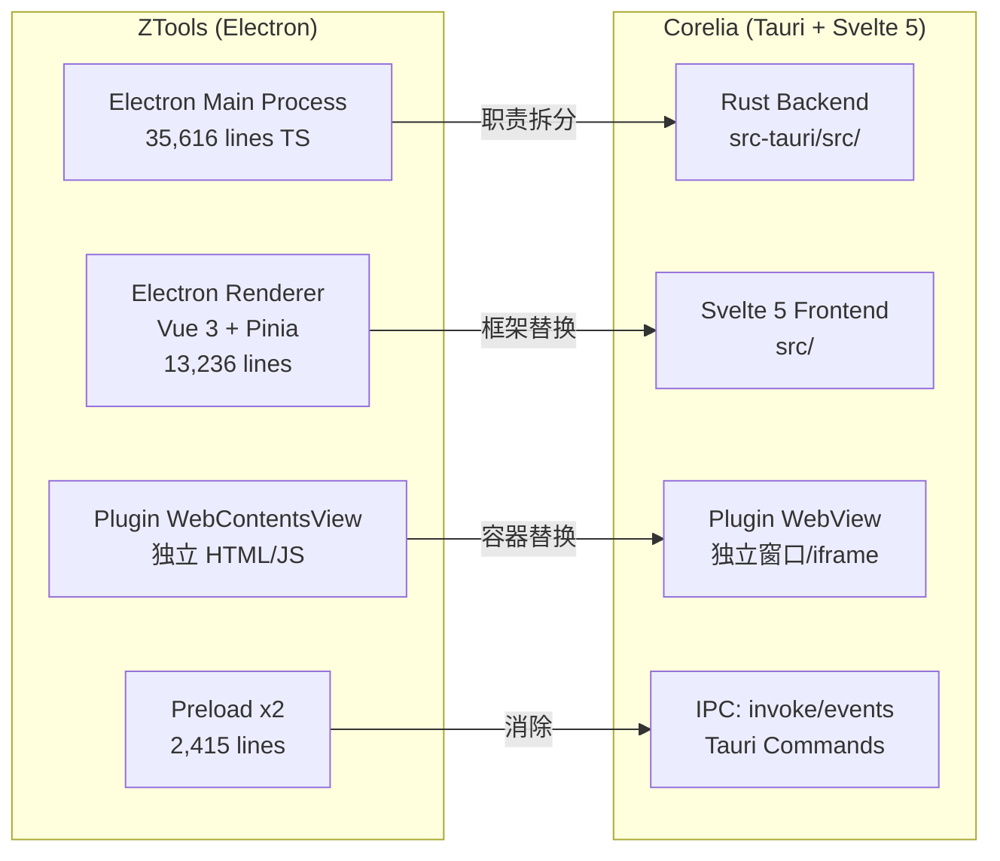
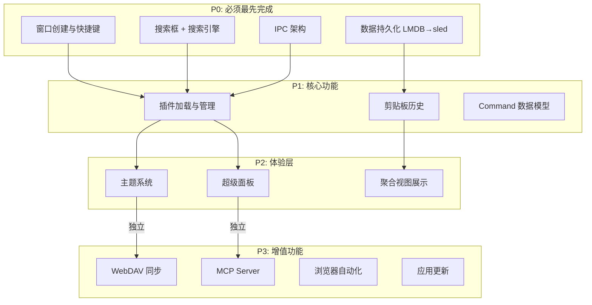
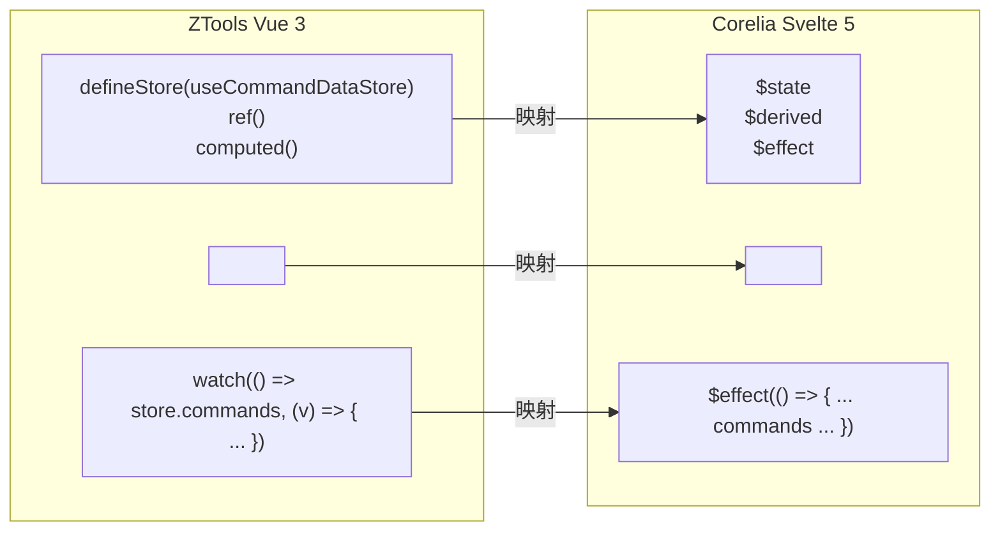

# Corelia 迁移设计指南 —— 从 ZTools (Electron) 到 Tauri 2.x + Svelte 5

> **本指南目标:** 将 ZTools 的每个核心子系统逐一映射到 Tauri 2.x + Svelte 5 的技术等价物，提供具体的代码结构建议和 Rust crate 选型
> **基础分析:** ZTools ANALYSIS_REPORT.md

---

## 目录

1. [框架映射总览](#1-框架映射总览)
2. [项目目录结构设计](#2-项目目录结构设计)
3. [数据持久化层（Rust）](#3-数据持久化层rust)
4. [插件系统重新设计](#4-插件系统重新设计)
5. [窗口与快捷键系统](#5-窗口与快捷键系统)
6. [剪贴板管理（Rust）](#6-剪贴板管理rust)
7. [搜索与 UI（Svelte 5）](#7-搜索与-ui-svelte-5)
8. [全局状态管理（Svelte 5 Runes）](#8-全局状态管理-svelte-5-runes)
9. [超级面板实现方案](#9-超级面板实现方案)
10. [主题系统](#10-主题系统)
11. [进阶设施迁移](#11-进阶设施迁移)
12. [IPC 与 Command 体系](#12-ipc-与-command-体系)

---

## 1. 框架映射总览



### 1.1 核心技术等价物

| ZTools 组件 | Electron 技术 | Corelia 技术 | 迁移难度 |
|-------------|--------------|-------------|---------|
| 主进程 | Node.js + Electron API | Rust + Tauri API | 🔴 需重写 |
| 渲染进程 | Vue 3 + Pinia | Svelte 5 + Runes | 🟡 需改造 |
| IPC 桥接 | preload.ts + contextBridge | Tauri Commands + Events | 🟢 简化 |
| 插件容器 | WebContentsView | Tauri WebviewWindow | 🟡 概念相似 |
| 数据库 | LMDB (node-lmdb) | sled / lmdb-rs | 🟢 相同概念 |
| 剪贴板 | C++ Node-API | tauri-plugin-clipboard + arboard | 🟢 有现成插件 |
| 全局快捷键 | globalShortcut | tauri-plugin-global-shortcut | 🟢 有现成插件 |
| 原生模块 | C++ .node 文件 | Rust crates | 🟢 统一为 Rust |

### 1.2 迁移优先级矩阵



---

## 2. 项目目录结构设计

### 2.1 Corelia 建议目录结构（对应 ZTools 模块）

```
corelia/
├── src/                          # Svelte 5 前端
│   ├── lib/
│   │   ├── components/
│   │   │   ├── search/           # 搜索系统 (对应 ZTools SearchBox + SearchResults)
│   │   │   │   ├── SearchBox.svelte
│   │   │   │   ├── SearchResults.svelte
│   │   │   │   ├── AggregateView.svelte
│   │   │   │   ├── VerticalList.svelte
│   │   │   │   └── DetailPanel.svelte
│   │   │   ├── common/           # 通用组件
│   │   │   │   ├── Icon.svelte
│   │   │   │   └── AdaptiveIcon.svelte
│   │   │   ├── SuperPanel.svelte # 超级面板
│   │   │   └── FloatingBall.svelte
│   │   ├── stores/               # Svelte 5 Runes 状态 (对应 Pinia stores)
│   │   │   ├── commandStore.svelte.ts    # 对应 commandDataStore.ts
│   │   │   ├── windowStore.svelte.ts     # 对应 windowStore.ts
│   │   │   └── pluginStore.svelte.ts     # 新增: 插件状态
│   │   ├── services/             # IPC 服务层
│   │   │   ├── commandService.ts         # 指令相关 invoke 调用
│   │   │   ├── pluginService.ts          # 插件相关 invoke 调用
│   │   │   ├── clipboardService.ts       # 剪贴板相关
│   │   │   └── settingsService.ts        # 设置相关
│   │   ├── composables/          # 可复用逻辑
│   │   │   ├── useSearch.ts              # 搜索逻辑
│   │   │   ├── useNavigation.ts          # 键盘导航
│   │   │   └── useTheme.ts              # 主题
│   │   └── utils/
│   │       ├── pinyinSearch.ts           # 拼音搜索
│   │       └── highlight.ts              # 高亮算法
│   └── App.svelte
├── src-tauri/                    # Rust 后端
│   ├── src/
│   │   ├── main.rs               # 应用入口
│   │   ├── lib.rs                # Tauri builder
│   │   ├── commands/             # Tauri Commands (对应 ZTools api/)
│   │   │   ├── mod.rs
│   │   │   ├── commands.rs       # 指令相关命令
│   │   │   ├── plugins.rs        # 插件管理命令
│   │   │   ├── clipboard.rs      # 剪贴板命令
│   │   │   ├── settings.rs       # 设置命令
│   │   │   ├── sync.rs           # 同步命令
│   │   │   └── system.rs         # 系统命令
│   │   ├── managers/             # 管理器 (对应 ZTools managers/)
│   │   │   ├── mod.rs
│   │   │   ├── plugin_manager.rs # 插件生命周期
│   │   │   ├── window_manager.rs # 窗口管理
│   │   │   ├── clipboard_manager.rs # 剪贴板监听
│   │   │   └── assembly_coordinator.rs # 装配状态机
│   │   ├── core/                 # 核心模块
│   │   │   ├── mod.rs
│   │   │   ├── db/               # 数据持久化
│   │   │   │   ├── mod.rs
│   │   │   │   ├── database.rs   # DB 接口
│   │   │   │   ├── namespace.rs  # 命名空间隔离
│   │   │   │   └── sync_meta.rs  # 同步元数据
│   │   │   ├── sync/             # WebDAV 同步
│   │   │   ├── scanner/          # 应用扫描
│   │   │   ├── launcher/         # 应用启动
│   │   │   └── mcp_server.rs     # MCP 服务
│   │   ├── plugin_api/           # 插件 API (对应 ZTools api/plugin/)
│   │   │   ├── mod.rs
│   │   │   ├── dispatcher.rs     # API 分发器
│   │   │   ├── lifecycle.rs      # 生命周期 API
│   │   │   ├── database.rs       # 数据库 API
│   │   │   ├── clipboard.rs      # 剪贴板 API
│   │   │   ├── ui.rs             # UI 控制 API
│   │   │   ├── shell.rs          # Shell 执行 API
│   │   │   ├── window.rs         # 窗口管理 API
│   │   │   └── http.rs           # HTTP 请求 API
│   │   └── utils/
│   │       ├── mod.rs
│   │       └── icon.rs           # 图标处理
│   ├── Cargo.toml
│   └── capabilities/             # Tauri 权限配置
│       └── default.json
├── plugins/                      # 用户插件目录 (对应 ZTools internal-plugins/)
│   └── setting/                  # 设置插件
└── package.json
```

### 2.2 文件级映射详解

```mermaid
flowchart TD
    subgraph "ZTools File"
        Z1["src/main/index.ts\n应用入口"]
        Z2["src/main/managers/windowManager.ts\n窗口管理"]
        Z3["src/main/managers/pluginManager.ts\n插件生命周期"]
        Z4["src/main/managers/pluginAssemblyCoordinator.ts\n装配状态机"]
        Z5["src/main/api/index.ts\nAPI 管理器"]
        Z6["src/main/core/lmdb/\n数据持久化"]
        Z7["src/main/managers/clipboardManager.ts\n剪贴板"]
        Z8["src/main/core/sync/\n同步引擎"]
        Z9["src/renderer/src/stores/commandDataStore.ts\n搜索核心"]
        Z10["src/renderer/src/components/search/SearchBox.vue\n搜索框 UI"]
        Z11["resources/preload.js\n插件运行时"]
        Z12["src/preload/index.ts\n主窗口 preload"]
    end
    
    subgraph "Corelia File"
        C1["src-tauri/src/main.rs\n+ lib.rs"]
        C2["src-tauri/src/managers/window_manager.rs"]
        C3["src-tauri/src/managers/plugin_manager.rs"]
        C4["src-tauri/src/managers/assembly_coordinator.rs"]
        C5["src-tauri/src/commands/mod.rs"]
        C6["src-tauri/src/core/db/\n+ Cargo.toml (sled/lmdb)"]
        C7["src-tauri/src/managers/clipboard_manager.rs"]
        C8["src-tauri/src/core/sync/"]
        C9["src/lib/stores/commandStore.svelte.ts"]
        C10["src/lib/components/search/SearchBox.svelte"]
        C11["src-tauri/src/plugin_api/dispatcher.rs\n+ 插件 WebView 窗口"]
        C12["无需对应\nTauri invoke 直接暴露"]
    end
    
    Z1 -->|"重写为 Rust"| C1
    Z2 -->|"用 tauri::Window + plugin"| C2
    Z3 -->|"状态机概念保留, 实现换 Rust"| C3
    Z4 -->|"状态机概念保留"| C4
    Z5 -->|"Tauri 的 #[tauri::command]"| C5
    Z6 -->|"sled::Tree 替代 LMDB"| C6
    Z7 -->|"arboard + tauri-plugin-clipboard"| C7
    Z8 -->|"reqwest + webdav-handler"| C8
    Z9 -->|"Svelte 5 $state/$derived"| C9
    Z10 -->|"Svelte 5 template"| C10
    Z11 -->|"插件 JS 通过 IPC 调用 Rust Command"| C11
    Z12 -->|"消除: 无需 preload"| C12
```



---

## 3. 数据持久化层（Rust）

### 3.1 存储引擎选型

| 引擎 | Rust crate | 特点 | 适用场景 | 与 LMDB 对比 |
|------|-----------|------|---------|-------------|
| **sled** | `sled` | 嵌入式 KV 存储, ACID, 纯 Rust | **主数据库** | 最接近 LMDB: 零拷贝读, MVCC, 单写多读 |
| **lmdb-rs** | `heed` / `libmdbx` | LMDB Rust 绑定 | 兼容 ZTools 数据 | 完全相同的性能特征 |
| **SQLite** | `rusqlite` + `diesel` | 关系型 | 插件元数据、配置 | SQL 灵活但查询延迟 10x+ |

**推荐: sled**。原因：
- 纯 Rust 实现, 无需链接 C 库
- API 比 LMDB 更安全（编译期检查）
- `Tree` 概念天然支持命名空间隔离
- ACID 事务保证

### 3.2 sled 三库设计（对应 ZTools LMDB 三库）

```rust
use sled::{Db, Tree};
use std::path::PathBuf;
use serde::{Serialize, Deserialize};

pub struct CoreliaDb {
    db: Db,
}

impl CoreliaDb {
    pub fn open(path: PathBuf) -> Result<Self, Box<dyn std::error::Error>> {
        let db = sled::open(path)?;
        Ok(CoreliaDb { db })
    }
    
    // 三棵树: 对应 LMDB 的 main/meta/attachment
    pub fn main_tree(&self) -> Tree { self.db.open_tree("main").unwrap() }
    pub fn meta_tree(&self) -> Tree { self.db.open_tree("meta").unwrap() }
    pub fn attachment_tree(&self) -> Tree { self.db.open_tree("attachment").unwrap() }
    
    // 命名空间隔离: 透明前缀注入
    pub fn plugin_tree(&self, plugin_name: &str) -> Tree {
        self.db.open_tree(format!("plugin_{}", plugin_name)).unwrap()
    }
}
```

**ZTools 的 LMDB 使用 key prefix 实现命名空间隔离（如 `PLUGIN/my-plugin/key`）；sled 的 Tree 概念是原生命名空间隔离**——每个插件拥有独立的 Tree，删除插件时直接 `db.drop_tree("plugin_xxx")`，比 ZTools 的前缀方案更干净。

### 3.3 性能对比预估值

| 操作 | ZTools (LMDB) | Corelia (sled) | 差异 |
|------|---------------|----------------|------|
| 冷启动读 | ~0.01ms | ~0.02ms | sled 略慢 (Rust 额外开销) |
| 热读 | ~0.001ms | ~0.005ms | 差距可忽略 |
| 批量写 | ~0.1ms | ~0.08ms | sled 相当或更快 |
| 命名空间隔离 | key prefix 扫描 | Tree 级别隔离 | **sled 优势** |
| 并发 | 单写多读 | 单写多读 | 一致 |

---

## 4. 插件系统重新设计

### 4.1 架构差异：Electron vs Tauri

**ZTools 的插件运行模型**（Electron）:
```
主进程 BrowserWindow (Vue)
  └── 内容区: contentView.addChildView(plugin WebContentsView)
       └── 插件 A 的 HTML/CSS/JS (通过 preload.js 获得 ztools API)
```

**Corelia 的插件运行模型**（Tauri）:
```
Tauri 主窗口 (Svelte 5)
  └── 内容区: <iframe> 或 WebviewWindow
       └── 插件 A 的 HTML/CSS/JS (通过 Tauri IPC invoke 调用 Rust command)
```

### 4.2 核心区别

| 维度 | ZTools (WebContentsView) | Corelia (WebviewWindow) |
|------|-------------------------|------------------------|
| 嵌入方式 | `contentView.addChildView()` | 独立窗口或 iframe |
| detach | `removeChildView` → `BrowserWindow.addChildView` | `WebviewWindow.set_focus()` |
| 生命周期 | PluginManager 管理 | Tauri Window + 事件 |
| JS 注入 | `session.setPreload()` | `window.__TAURI__.invoke()` |
| API 通道 | `plugin.api` 单一 IPC | 每个 Rust command 独立 `#[tauri::command]` |
| 安全 | preload 有权限, 但随意挂载 window | Tauri 的 IPC 权限系统 (`allowlist`) |

### 4.3 插件装配状态机（Rust 实现）

ZTools 的 `PluginAssemblyCoordinator` 在 Rust 中实现更自然——通过 Rust 的 `enum` 状态 + `Result` 链：

```rust
#[derive(Debug, Clone, PartialEq)]
pub enum AssemblyStatus {
    Idle,
    Assembling { id: String, started_at: Instant },
    DomReady { id: String },
    ReadyToDisplay { id: String },
    Displayed { id: String },
    Aborted { id: String, reason: String },
}

pub struct AssemblyCoordinator {
    current_session: Mutex<Option<AssemblySession>>,
}

struct AssemblySession {
    id: String,
    plugin_path: String,
    status: AssemblyStatus,
    webview: Option<tauri::WebviewWindow>,
}

impl AssemblyCoordinator {
    pub fn begin_assembly(&self, plugin_path: &str) -> Result<String, String> {
        let mut session = self.current_session.lock().map_err(|e| e.to_string())?;
        
        // 中止旧会话
        if let Some(ref old) = *session {
            // ZTools 同样的逻辑: 新会话使旧会话失效
            debug!("Aborting previous session: {}", old.id);
        }
        
        let new_id = format!("asm_{}_{}", chrono::Utc::now().timestamp_nanos(), 
                             rand::random::<u64>());
        
        *session = Some(AssemblySession {
            id: new_id.clone(),
            plugin_path: plugin_path.to_string(),
            status: AssemblyStatus::Assembling { id: new_id.clone(), started_at: Instant::now() },
            webview: None,
        });
        
        Ok(new_id)
    }
}
```

Rust 的实现优势：`Mutex<Option<AssemblySession>>` 比 ZTools 的 JS `currentSession: AssemblySession | null` 更安全——Rust 编译器保证你在访问 `session` 时不会出现 null pointer 问题。

### 4.4 插件 API 注册表模式

ZTools 使用 `registerPluginApiServices({})` 注册到单一 `plugin.api` 通道。在 Tauri 中，**不需要这个模式**——每个 Rust 函数用 `#[tauri::command]` 标注就是天然的注册表：

```rust
// 不需要 dispatch table——Tauri 自动注册
#[tauri::command]
async fn db_get(app: tauri::AppHandle, plugin_name: String, key: String) -> Result<Option<String>, String> {
    let db = app.state::<CoreliaDb>();
    let tree = db.plugin_tree(&plugin_name);
    match tree.get(key.as_bytes()) {
        Ok(Some(value)) => Ok(Some(String::from_utf8_lossy(&value).to_string())),
        Ok(None) => Ok(None),
        Err(e) => Err(e.to_string()),
    }
}

#[tauri::command]
async fn show_notification(title: String, body: String) -> Result<(), String> {
    // Tauri 2.x notification plugin
    Ok(())
}
```

**插件端调用**（插件 HTML 页面中的 JS）:

```javascript
// 插件通过 Tauri IPC 直接调用 Rust command——不需要 custom preload
const { invoke } = window.__TAURI__.core;

// 插件获取自己的命名空间
const pluginName = '__CORELLA_PLUGIN_NAME__'; // 由插件加载器注入

// 读数据库
const data = await invoke('db_get', { pluginName, key: 'my-data' });

// 显示通知
await invoke('show_notification', { title: '完成', body: '处理成功' });

// 执行 shell
const result = await invoke('exec_shell', { 
  pluginName, 
  command: 'ls -la' 
});
```

**这比 ZTools 的两套 preload 方案更简洁**：
- 不需要 `resources/preload.js`
- 不需要 `src/preload/index.ts`
- 不需要 `contextBridge.exposeInMainWorld`
- 不需要 `pluginApiDispatcher.ts` 的注册表

### 4.5 插件数据隔离（Rust）

```rust
impl CoreliaDb {
    // 插件写入 -> 自动隔离到 plugin_tree
    pub fn plugin_put(&self, plugin_name: &str, key: &str, value: &str) -> Result<(), String> {
        let tree = self.plugin_tree(plugin_name);
        tree.insert(key.as_bytes(), value.as_bytes())
            .map_err(|e| e.to_string())?;
        Ok(())
    }
    
    // 删除插件 -> 清理整棵树
    pub fn drop_plugin(&self, plugin_name: &str) -> Result<(), String> {
        self.db.drop_tree(format!("plugin_{}", plugin_name))
            .map_err(|e| e.to_string())?;
        Ok(())
    }
}
```

---

## 5. 窗口与快捷键系统

### 5.1 ZTools vs Corelia 对照

| ZTools 功能 | ZTools 实现 | Corelia 实现 | Tauri API |
|-------------|------------|-------------|-----------|
| 透明窗口 | `transparent: true` | `tauri.conf.json > window.transparent` | 配置 |
| 全局快捷键 | `globalShortcut.register()` | `tauri-plugin-global-shortcut` | 插件 |
| 双击修饰键 | `uiohook-napi` 低级键盘钩子 | Rust `rdev` crate + `listen()` | 原生 |
| 托盘图标 | `Tray` + `Menu` | `tauri-plugin-tray` | 插件 |
| 窗口材质 | Mica/Acrylic: C++ Node-API | Rust `windows-rs` crate | 原生 |
| 窗口定位 | `screen.getCursorScreenPoint()` | `tauri::Monitor::from_window()` | API |
| 应用快捷键映射 | `Map<string, string>` | Rust `HashMap` + 配置文件 | 数据 |

### 5.2 核心快捷键系统设计

```rust
// src-tauri/src/managers/window_manager.rs
use tauri::{AppHandle, Manager, Window};
use tauri_plugin_global_shortcut::{Code, GlobalShortcutExt, Modifiers, Shortcut};

pub struct WindowManager {
    shortcut_map: std::sync::Mutex<std::collections::HashMap<String, String>>,
    // key: "Ctrl+Shift+T" -> value: "翻译插件/翻译选中文本"
}

impl WindowManager {
    pub fn register_shortcut(&self, app: &AppHandle, shortcut_str: &str, target: &str) {
        let shortcut = Shortcut::new(Some(Modifiers::ALT), Code::KeyZ); // 解析 shortcut_str
        
        app.global_shortcut().register(shortcut, move |app, event, _| {
            if event.state == ShortcutState::Pressed {
                // 触发时携带剪贴板上下文
                let clipboard = app.state::<ClipboardManager>();
                let context = ShortcutLaunchContext {
                    search_query: String::new(),
                    pasted_text: clipboard.read_text(),
                    // ...
                };
                
                // 调用 Command 处理
                if let Err(e) = app.emit("shortcut-triggered", ShortcutEvent {
                    target: target.to_string(),
                    context,
                }) {
                    error!("Failed to emit shortcut event: {}", e);
                }
            }
        });
    }
}
```

### 5.3 应用快捷键执行链路

```mermaid
flowchart TD
    A[User presses Ctrl+Shift+T] -->|tauri-plugin-global-shortcut| B[Shortcut event received]
    B --> C[WindowManager: 解析 target]
    C --> D{target 格式?}
    D -->|"翻译插件/翻译"| E[调用 plugin_manager.exec()]
    D -->|"翻译"| F[搜索所有插件命令]
    F --> G{找到几个匹配?}
    G -->|1 个| E
    G -->|0 个| H[通知用户]
    G -->|>1 个| I[显示歧义提示]
    E --> J[插件处理传入的剪贴板文本]
    J --> K[显示结果]
```

---

## 6. 剪贴板管理（Rust）

### 6.1 Rust 剪贴板监听方案

ZTools 用 C++ Node-API 实现了跨平台剪贴板监听。在 Tauri 中，推荐用 Rust 原生实现：

| 平台 | ZTools (C++) | Corelia (Rust) | Rust crate |
|------|-------------|----------------|------------|
| Windows | `AddClipboardFormatListener` | `SetClipboardViewer` + `WM_DRAWCLIPBOARD` | `windows-rs` |
| macOS | NSPasteboard polling | `NSPasteboard.changeCount` 轮询 | `objc2` + `dispatch` |
| Linux | 不支持 | `x11` 或 `wl-clipboard-rs` | `xclipboard` / `wl-clipboard-rs` |

### 6.2 推荐的剪贴板 crate 组合

```toml
# Cargo.toml
[dependencies]
arboard = "3"                    # 读写剪贴板（基础能力）
tauri-plugin-clipboard-manager = "2"  # Tauri 官方剪贴板插件

# 监听剪贴板变化需要额外 crate
[target.'cfg(windows)'.dependencies]
windows = { version = "0.58", features = ["Win32_Foundation", "Win32_UI_WindowsAndMessaging"] }

[target.'cfg(target_os = "macos")'.dependencies]
objc2 = "0.5"
```

### 6.3 跨平台剪贴板监听适配器

```rust
pub enum ClipboardBackend {
    Windows(WindowsClipboardListener),
    MacOs(MacOsClipboardListener), 
}

pub trait ClipboardListener: Send {
    fn start<F: Fn(ClipboardEvent) + Send + 'static>(&self, callback: F) -> Result<(), String>;
    fn stop(&self) -> Result<(), String>;
}

pub struct ClipboardManager {
    backend: ClipboardBackend,
    db: Arc<CoreliaDb>,
    history: Mutex<Vec<ClipboardEntry>>,
}

impl ClipboardManager {
    pub fn new(db: Arc<CoreliaDb>) -> Self {
        let backend = if cfg!(windows) {
            ClipboardBackend::Windows(WindowsClipboardListener::new())
        } else if cfg!(target_os = "macos") {
            ClipboardBackend::MacOs(MacOsClipboardListener::new())
        } else {
            todo!("Linux clipboard listener")
        };
        
        ClipboardManager { backend, db, history: Mutex::new(vec![]) }
    }
    
    pub fn start_listening(&self) -> Result<(), String> {
        let db = self.db.clone();
        let history = self.history.clone();
        
        self.backend.start(move |event| {
            // 保存到 LMDB/sled
            let entry = ClipboardEntry {
                id: uuid::Uuid::new_v4().to_string(),
                content: event.content,
                content_type: event.content_type,
                timestamp: chrono::Utc::now(),
            };
            
            db.main_tree().insert(
                format!("ZTOOLS/clipboard/{}", entry.id),
                serde_json::to_string(&entry).unwrap()
            ).ok();
            
            // 通知前端
            // app.emit("clipboard-changed", &entry).ok();
            
            let mut hist = history.lock().unwrap();
            hist.insert(0, entry);
            if hist.len() > 1000 { hist.truncate(1000); }
        })
    }
}
```

**为什么不用 tauri-plugin-clipboard-manager 自带的监听？**

Tauri 2.x 的 clipboard-manager 插件主要提供**读写操作**（read/write），但不提供事件驱动的**变化监听**。剪贴板监听需要额外的平台特定实现——这正是 ZTools 投入了大量 C++ 代码的领域。Corelia 需要自己实现这部分。

---

## 7. 搜索与 UI（Svelte 5）

### 7.1 ZTools (Vue 3 + Pinia) → Corelia (Svelte 5 Runes)



### 7.2 Command Store 的 Svelte 5 实现

```typescript
// src/lib/stores/commandStore.svelte.ts
import Fuse from 'fuse.js'
import { pinyin } from 'pinyin-pro'

// Command 类型定义（复用 ZTools 的设计）
export type CommandType = 'direct' | 'plugin' | 'builtin'
export type CommandSubType = 'app' | 'system-setting' | 'local-shortcut'
export type MatchCmdType = 'text' | 'regex' | 'over' | 'img' | 'files' | 'window'

export interface Command {
  name: string
  path: string
  type: CommandType
  subType?: CommandSubType
  featureCode?: string
  pluginName?: string
  pinyin?: string
  pinyinAbbr?: string
  icon?: string
  matchCmd?: MatchCmd
}

// Svelte 5 rune-based store (替代 Pinia defineStore)
export function createCommandStore() {
  // $state 替代 Vue ref/Pinia state
  let commands = $state<Command[]>([])
  let pinnedApps = $state<string[]>([])
  let history = $state<string[]>([])
  let searchQuery = $state('')
  let fuseInstance: Fuse<Command> | null = null
  
  // $derived 替代 Vue computed
  let filteredCommands = $derived.by(() => {
    if (!searchQuery.trim()) return []
    if (!fuseInstance) return []
    
    // ZTools 的拼音搜索管道
    const exactResults = fuseInstance.search(searchQuery)
    if (exactResults.length > 0) return exactResults.map(r => r.item)
    
    // 拼音全文匹配
    const pinyinFull = pinyin(searchQuery, { toneType: 'none' })
    return fuseInstance.search(pinyinFull).map(r => r.item)
  })
  
  // 聚合视图数据
  let aggregateView = $derived({
    pinned: pinnedApps.map(id => commands.find(c => c.path === id)).filter(Boolean),
    recent: history.slice(0, 10).map(id => commands.find(c => c.path === id)).filter(Boolean),
    searchResults: filteredCommands,
  })
  
  return {
    // 只读 getter
    get commands() { return commands },
    get pinnedApps() { return pinnedApps },
    get history() { return history },
    get searchQuery() { return searchQuery },
    get filteredCommands() { return filteredCommands },
    get aggregateView() { return aggregateView },
    
    // 操作方法
    setCommands: (cmds: Command[]) => {
      commands = cmds
      fuseInstance = new Fuse(cmds, {
        keys: ['name', 'pinyin', 'pinyinAbbr'],
        threshold: 0.4,
        includeScore: true,
      })
    },
    
    setSearchQuery: (q: string) => { searchQuery = q },
    
    addToHistory: (path: string) => {
      history = [path, ...history.filter(h => h !== path)].slice(0, 50)
      // 持久化到 Rust 后端
      // invoke('save_history', { history })
    },
    
    togglePinned: (path: string) => {
      if (pinnedApps.includes(path)) {
        pinnedApps = pinnedApps.filter(p => p !== path)
      } else {
        pinnedApps = [...pinnedApps, path]
      }
    }
  }
}

// 导出单例（Svelte 5 的 module-level $state）
export const commandStore = createCommandStore()
```

### 7.3 搜索框组件（Svelte 5）

```svelte
<!-- src/lib/components/search/SearchBox.svelte -->
<script lang="ts">
  import { commandStore } from '$lib/stores/commandStore.svelte.ts'
  import { onMount } from 'svelte'
  
  let { 
    currentView = 'search', 
    onClosePlugin,
    onArrowKeydown 
  } = $props()
  
  let inputRef: HTMLInputElement
  let isComposing = $state(false)
  
  // 双向绑定搜索查询
  let searchValue = $state('')
  
  $effect(() => {
    commandStore.setSearchQuery(searchValue)
  })
  
  function handleCompositionStart() { isComposing = true }
  function handleCompositionEnd() { isComposing = false }
  
  function handleKeydown(e: KeyboardEvent) {
    if (e.key === 'Escape') {
      if (currentView === 'plugin') {
        onClosePlugin?.()
      }
      // 否则关闭窗口（通过 IPC）
    }
    if (e.key === 'ArrowDown' || e.key === 'ArrowUp') {
      onArrowKeydown?.(e)
    }
    if (e.key === 'Enter' && !isComposing) {
      // 选中第一个结果
    }
  }
  
  function focus() { inputRef?.focus() }
  
  // 暴露给父组件的函数
  $effect(() => {
    if (currentView === 'search') {
      inputRef?.focus()
    }
  })
</script>

<div class="search-box" role="search">
  <div class="search-input-container">
    {#if currentView === 'plugin'}
      <div class="plugin-tag">
        <span class="plugin-tag-title">当前插件</span>
        <button class="plugin-tag-close" onclick={onClosePlugin}>
          <svg width="10" height="10" viewBox="0 0 10 10">...</svg>
        </button>
      </div>
    {/if}
    
    <input
      bind:this={inputRef}
      type="text"
      class="search-input"
      placeholder="搜索应用、命令、设置..."
      bind:value={searchValue}
      onkeydown={handleKeydown}
      oncompositionstart={handleCompositionStart}
      oncompositionend={handleCompositionEnd}
    />
  </div>
</div>

<style>
  .search-box { /* ... */ }
  .search-input { /* ... */ }
</style>
```

### 7.4 搜索结果组件（Svelte 5）

```svelte
<!-- src/lib/components/search/SearchResults.svelte -->
<script lang="ts">
  import { commandStore } from '$lib/stores/commandStore.svelte.ts'
  import AggregateView from './AggregateView.svelte'
  import VerticalList from '../common/VerticalList.svelte'
  
  let { onSelect } = $props()
  
  let hasSearchContent = $derived(commandStore.searchQuery.trim().length > 0)
  let searchMode = $derived(hasSearchContent ? 'list' : 'aggregate')
</script>

<div class="search-results">
  {#if searchMode === 'aggregate'}
    <AggregateView
      pinned={commandStore.aggregateView.pinned}
      recent={commandStore.aggregateView.recent}
      onselect={onSelect}
    />
  {:else if searchMode === 'list'}
    <VerticalList
      items={commandStore.filteredCommands}
      onselect={onSelect}
    />
  {/if}
</div>
```

### 7.5 键盘导航

```typescript
// src/lib/composables/useNavigation.ts
export function useNavigation() {
  let selectedRow = $state(0)
  let selectedCol = $state(0)
  let maxCols = $state(7)
  
  function handleArrowKey(e: KeyboardEvent) {
    switch(e.key) {
      case 'ArrowRight':
        selectedCol = Math.min(selectedCol + 1, maxCols - 1)
        break
      case 'ArrowLeft':
        selectedCol = Math.max(selectedCol - 1, 0)
        break
      case 'ArrowDown':
        selectedRow++
        selectedCol = 0
        break
      case 'ArrowUp':
        selectedRow = Math.max(selectedRow - 1, 0)
        break
    }
  }
  
  return {
    get selectedRow() { return selectedRow },
    get selectedCol() { return selectedCol },
    handleArrowKey,
    reset: () => { selectedRow = 0; selectedCol = 0 },
  }
}
```

---

## 8. 全局状态管理（Svelte 5 Runes）

### 8.1 Svelte 5 x Pinia Store 映射表

| ZTools (Pinia) | Corelia (Svelte 5) | 说明 |
|----------------|-------------------|------|
| `ref()` | `$state()` | 响应式状态 |
| `computed()` | `$derived()` | 派生状态 |
| `watch()` | `$effect()` | 副作用 |
| `onMounted()` | `onMount()` | 生命周期 |
| `defineStore()` | 模块级 `$state` + 工厂函数 | 不需要 store 注册 |
| `storeToRefs()` | 直接解构 | Runes 天然解构 |
| `pinia.subscribe()` | `$effect.tracking()` | 精确跟踪 |

### 8.2 Window Store

```typescript
// src/lib/stores/windowStore.svelte.ts
export type ThemeMode = 'system' | 'light' | 'dark'
export type ThemeColor = 'blue' | 'green' | 'purple' | 'red' | 'orange' | 'cyan'

export function createWindowStore() {
  let themeMode = $state<ThemeMode>('system')
  let themeColor = $state<ThemeColor>('blue')
  let windowVisible = $state(false)
  let currentView = $state<'search' | 'plugin'>('search')
  
  // 系统主题检测
  let systemDark = $state(false)
  
  $effect(() => {
    const mq = window.matchMedia('(prefers-color-scheme: dark)')
    systemDark = mq.matches
    const handler = (e: MediaQueryListEvent) => { systemDark = e.matches }
    mq.addEventListener('change', handler)
    return () => mq.removeEventListener('change', handler)
  })
  
  let resolvedTheme = $derived(
    themeMode === 'system' ? (systemDark ? 'dark' : 'light') : themeMode
  )
  
  return {
    get themeMode() { return themeMode },
    setThemeMode: (m: ThemeMode) => { themeMode = m },
    get themeColor() { return themeColor },
    setThemeColor: (c: ThemeColor) => { themeColor = c },
    get resolvedTheme() { return resolvedTheme },
    get windowVisible() { return windowVisible },
    get currentView() { return currentView },
    setCurrentView: (v: 'search' | 'plugin') => { currentView = v },
  }
}

export const windowStore = createWindowStore()
```

### 8.3 Plugin Store

```typescript
// src/lib/stores/pluginStore.svelte.ts
export interface PluginInfo {
  name: string
  title: string
  version: string
  description: string
  path: string
  logo?: string
  features: PluginFeature[]
}

export interface PluginFeature {
  code: string
  explain: string
  cmds: string[]
}

export function createPluginStore() {
  let plugins = $state<PluginInfo[]>([])
  let activePlugin = $state<PluginInfo | null>(null)
  let isLoading = $state(false)
  
  return {
    get plugins() { return plugins },
    get activePlugin() { return activePlugin },
    get isLoading() { return isLoading },
    
    setPlugins: (p: PluginInfo[]) => { plugins = p },
    setActive: (p: PluginInfo | null) => { activePlugin = p },
    
    // 加载插件列表（通过 IPC 调用 Rust）
    loadPlugins: async () => {
      isLoading = true
      try {
        const result = await invoke('get_plugins')
        plugins = result as PluginInfo[]
      } finally {
        isLoading = false
      }
    },
  }
}

export const pluginStore = createPluginStore()
```

---

## 9. 超级面板实现方案

### 9.1 ZTools 的挑战移植到 Tauri

ZTools 的超级面板在 Electron 中实现：一个独立的透明 `BrowserWindow`，位于鼠标位置附近，内容由 Vue 渲染。

在 Tauri 中，有两种方案：

**方案 A：透明子窗口**（推荐，功能最完整）

```rust
// Rust: 创建超级面板窗口
#[tauri::command]
async fn show_super_panel(app: AppHandle, x: i32, y: i32, content_type: String) -> Result<(), String> {
    let panel_window = tauri::WebviewWindowBuilder::new(
        &app,
        "super-panel",
        tauri::WebviewUrl::App("super-panel.html".into()),
    )
    .inner_size(300.0, 400.0)
    .position(x as f64, y as f64)
    .decorations(false)
    .transparent(true)
    .always_on_top(true)
    .skip_taskbar(true)
    .build()
    .map_err(|e| e.to_string())?;
    
    panel_window.show().map_err(|e| e.to_string())?;
    Ok(())
}
```

**方案 B：Svelte 内嵌浮层**（实现简单，但局限在主窗口内）

```svelte
<!-- 在 App.svelte 中 -->
{#if showSuperPanel}
  <div 
    class="super-panel-overlay" 
    style="left: {panelX}px; top: {panelY}px"
  >
    <div class="super-panel-content">
      {#if contentType === 'text'}
        <button onclick={() => handleAction('translate')}>翻译</button>
        <button onclick={() => handleAction('search')}>搜索</button>
        <button onclick={() => handleAction('encode')}>编码转换</button>
      {:else if contentType === 'image'}
        <button onclick={() => handleAction('ocr')}>OCR 识别</button>
        <button onclick={() => handleAction('compress')}>压缩图片</button>
      {/if}
    </div>
  </div>
{/if}
```

### 9.2 鼠标选中内容检测

ZTools 通过 C++ 原生模块实现。在 Tauri 中：

```rust
// 方式 1: 通过 tauri-plugin-shell + 平台工具
// Windows: 模拟 Ctrl+C, 读取剪贴板
// macOS: AppleScript 或 Accessibility API

#[tauri::command]
async fn get_selected_text(app: AppHandle) -> Result<String, String> {
    let clipboard_manager = app.state::<ClipboardManager>();
    
    #[cfg(target_os = "macos")]
    {
        // 使用 AppleScript 获取选中文本
        let script = "tell application \"System Events\" to keystroke \"c\" using {command down}";
        std::process::Command::new("osascript")
            .arg("-e")
            .arg(script)
            .output()
            .map_err(|e| e.to_string())?;
        
        // 短暂延迟等待剪贴板更新
        std::thread::sleep(std::time::Duration::from_millis(50));
    }
    
    #[cfg(target_os = "windows")]
    {
        // Windows: 模拟 Ctrl+C
        // 使用 SendInput API 或 keybd_event
    }
    
    clipboard_manager.read_text()
}
```

---

## 10. 主题系统

### 10.1 CSS 变量方案（与 ZTools 一致）

```css
/* src/app.css */
:root {
  --color-primary: #4f8cff;
  --color-bg: #ffffff;
  --color-bg-secondary: #f5f5f5;
  --color-text: #333333;
  --color-text-secondary: #888888;
  --radius: 8px;
  --shadow: 0 4px 16px rgba(0, 0, 0, 0.12);
}

:root[data-theme="dark"] {
  --color-bg: #1e1e1e;
  --color-bg-secondary: #2d2d2d;
  --color-text: #e0e0e0;
  --color-text-secondary: #999999;
  --shadow: 0 4px 16px rgba(0, 0, 0, 0.4);
}

/* 主题色变体 */
:root[data-color="green"] {
  --color-primary: #52c41a;
}
:root[data-color="purple"] {
  --color-primary: #722ed1;
}
```

### 10.2 Svelte 5 主题管理

```typescript
// src/lib/composables/useTheme.ts
import { windowStore } from '$lib/stores/windowStore.svelte.ts'

export function useTheme() {
  $effect(() => {
    const mode = windowStore.resolvedTheme
    const color = windowStore.themeColor
    
    document.documentElement.setAttribute('data-theme', mode)
    document.documentElement.setAttribute('data-color', color)
  })
}
```

---

## 11. 进阶设施迁移

### 11.1 WebDAV 同步

| ZTools | Corelia | Rust crate |
|--------|---------|-----------|
| webdav-client.ts | reqwest + webdav 协议 | `reqwest` |
| syncEngine.ts | 同步引擎 | Rust 实现 |
| pluginSyncWatcher.ts | 插件目录监听 | `notify` crate |
| pluginHasher.ts | SHA-256 哈希 | `sha2` crate |

```rust
// 插件目录监听
use notify::{Config, Event, EventKind, RecommendedWatcher, Watcher};
use std::sync::mpsc;

pub struct PluginSyncWatcher {
    watcher: RecommendedWatcher,
    dirty_plugins: Arc<Mutex<HashSet<String>>>,
}

impl PluginSyncWatcher {
    pub fn watch(plugin_dir: &Path) -> Result<Self, String> {
        let dirty = Arc::new(Mutex::new(HashSet::new()));
        let dirty_clone = dirty.clone();
        
        let (tx, rx) = mpsc::channel();
        let mut watcher = RecommendedWatcher::new(tx, Config::default())
            .map_err(|e| e.to_string())?;
        
        watcher.watch(plugin_dir, RecursiveMode::Recursive)
            .map_err(|e| e.to_string())?;
        
        std::thread::spawn(move || {
            for event in rx {
                if let Ok(event) = event {
                    if matches!(event.kind, EventKind::Modify(_) | EventKind::Create(_)) {
                        if let Some(path) = event.paths.first() {
                            if let Some(plugin_name) = path.parent().and_then(|p| p.file_name()) {
                                dirty_clone.lock().unwrap()
                                    .insert(plugin_name.to_string_lossy().to_string());
                            }
                        }
                    }
                }
            }
        });
        
        Ok(PluginSyncWatcher { watcher, dirty_plugins: dirty })
    }
}
```

### 11.2 MCP Server

```toml
# Cargo.toml
[dependencies]
axum = "0.8"
serde = { version = "1", features = ["derive"] }
serde_json = "1"
tower-http = "0.6"
```

```rust
use axum::{Router, routing::post, Json, extract::State};
use serde::{Serialize, Deserialize};
use std::sync::Arc;

#[derive(Serialize, Deserialize)]
struct McpRequest {
    jsonrpc: String,
    method: String,
    id: u64,
    params: Option<serde_json::Value>,
}

#[derive(Serialize)]
struct McpResponse {
    jsonrpc: String,
    id: u64,
    result: Option<serde_json::Value>,
    error: Option<McpError>,
}

pub struct McpServer {
    app_state: Arc<AppState>,
}

impl McpServer {
    pub async fn start(self, port: u16) -> Result<(), String> {
        let app = Router::new()
            .route("/mcp", post(Self::handle_rpc))
            .with_state(self.app_state);
        
        let addr = format!("0.0.0.0:{}", port);
        let listener = tokio::net::TcpListener::bind(&addr)
            .await
            .map_err(|e| e.to_string())?;
        
        axum::serve(listener, app)
            .await
            .map_err(|e| e.to_string())?;
        
        Ok(())
    }
    
    async fn handle_rpc(
        State(state): State<Arc<AppState>>,
        Json(req): Json<McpRequest>,
    ) -> Json<McpResponse> {
        match req.method.as_str() {
            "tools/list" => {
                // 返回所有插件的工具声明
                Json(McpResponse { 
                    jsonrpc: "2.0".into(), id: req.id, 
                    result: Some(serde_json::json!({ "tools": state.get_tools() })),
                    error: None 
                })
            }
            "tools/call" => {
                // 调用指定插件工具
                // ...
                todo!()
            }
            _ => Json(McpResponse {
                jsonrpc: "2.0".into(), id: req.id,
                result: None,
                error: Some(McpError { code: -32601, message: "Method not found".into() })
            })
        }
    }
}
```

### 11.3 应用更新

ZTools 使用独立的 updater 程序替换 `app.asar`。在 Tauri 中：

```toml
# Cargo.toml
[dependencies]
tauri-plugin-updater = "2"
```

配置 `tauri.conf.json`：

```json
{
  "plugins": {
    "updater": {
      "endpoints": ["https://github.com/your/corelia/releases/latest/download/update-{target}-{arch}-{version}.json"],
      "pubkey": "your-public-key"
    }
  }
}
```

---

## 12. IPC 与 Command 体系

### 12.1 ZTools 的 IPC 层（3 个角色 + 2 个 preload）→ Corelia（1 个角色 + 0 个 preload）

```mermaid
flowchart LR
    subgraph "ZTools IPC Architecture"
        R[Vue Renderer] -->|window.ztools.*| P1[src/preload/index.ts]
        P1 -->|ipcRenderer.invoke| M1[Main Process Handler]
        
        PL[Plugin HTML] -->|ztools.*| P2[resources/preload.js]
        P2 -->|plugin.api channel| M2[pluginApiDispatcher]
        M2 -->|dispatch| M3[API Modules]
    end
    
    subgraph "Corelia IPC Architecture"
        S[Svelte Renderer] -->|invoke('cmd', args)| RUST[#[tauri::command] fn]
        PW[Plugin Webview] -->|invoke('cmd', args)| RUST
    end
```

**Corelia 的优势**：
- **3 层 IPC → 1 层 IPC**：消除 preload 桥接层
- **2 个 preload 文件 → 0 个**：Tauri 的 invoke 直接从 WebView 调用 Rust
- **手动 dispatch → 编译器自动路由**：`#[tauri::command]` 宏生成路由表

### 12.2 指令系统 Commands 清单

以下是 Corelia 需要实现的 Tauri Commands 清单（对应 ZTools 的 IPC handlers）：

```rust
// === 搜索与指令 ===
#[tauri::command] async fn search_commands(query: String) -> Result<Vec<Command>, String>
#[tauri::command] async fn launch_command(path: String, feature_code: Option<String>) -> Result<(), String>
#[tauri::command] async fn get_history() -> Result<Vec<HistoryEntry>, String>
#[tauri::command] async fn toggle_pinned(path: String) -> Result<(), String>

// === 插件管理 ===
#[tauri::command] async fn get_plugins() -> Result<Vec<PluginInfo>, String>
#[tauri::command] async fn install_plugin(path: String) -> Result<(), String>
#[tauri::command] async fn uninstall_plugin(name: String) -> Result<(), String>
#[tauri::command] async fn open_plugin(name: String, feature_code: String) -> Result<(), String>
#[tauri::command] async fn execute_plugin_command(name: String, cmd: String, payload: String) -> Result<String, String>

// === 剪贴板 ===
#[tauri::command] async fn get_clipboard_history() -> Result<Vec<ClipboardEntry>, String>
#[tauri::command] async fn clear_clipboard_history() -> Result<(), String>
#[tauri::command] async fn read_clipboard_text() -> Result<String, String>
#[tauri::command] async fn write_clipboard_text(text: String) -> Result<(), String>

// === 窗口 ===
#[tauri::command] async fn show_main_window() -> Result<(), String>
#[tauri::command] async fn hide_main_window() -> Result<(), String>
#[tauri::command] async fn toggle_main_window() -> Result<(), String>
#[tauri::command] async fn show_super_panel(x: i32, y: i32, content_type: String) -> Result<(), String>

// === 系统 ===
#[tauri::command] async fn scan_apps() -> Result<Vec<Command>, String>
#[tauri::command] async fn exec_command(cmd: String) -> Result<String, String>
#[tauri::command] async fn get_system_info() -> Result<SystemInfo, String>
#[tauri::command] async fn set_theme(mode: String, color: String) -> Result<(), String>

// === 同步 ===
#[tauri::command] async fn sync_start(webdav_url: String, username: String, password: String) -> Result<SyncStatus, String>
#[tauri::command] async fn sync_status() -> Result<SyncStatus, String>
```

### 12.3 事件系统（ZTools IPC send → Corelia Events）

ZTools 使用 `webContents.send()` 推送事件到渲染进程。Corelia 用 Tauri Events：

```rust
// Rust: 推送事件
app.emit("clipboard-changed", ClipboardEntry { ... }).ok();
app.emit("plugin-loaded", PluginLoadedEvent { name: "...".into() }).ok();
app.emit("shortcut-triggered", ShortcutEvent { target: "...".into() }).ok();
```

```typescript
// Svelte: 监听事件
import { listen } from '@tauri-apps/api/event'

onMount(() => {
  const unlisten = await listen('clipboard-changed', (event) => {
    clipboardStore.addEntry(event.payload as ClipboardEntry)
  })
  
  return () => unlisten()  // 清理监听器
})
```

---

## 13. 迁移工作量估算

| 模块 | 代码规模 | 迁移类型 | Rust 代码量 | TS/JS 代码量 | 预计工时 |
|------|---------|---------|------------|-------------|---------|
| 数据持久化 | ~500 行 JS | 重写为 Rust | ~400 行 | 0 | 2-3 天 |
| 窗口管理 | ~1,300 行 TS | 重写为 Rust + Config | ~600 行 | ~100 行 config | 3-4 天 |
| 剪贴板监听 | ~800 行 TS + C++ | 重写为 Rust | ~500 行 | 0 | 4-5 天 |
| 插件系统 | ~4,000 行 TS | 架构调整 | ~1,500 行 | ~300 行 | 7-10 天 |
| 搜索引擎 + 指令 | ~1,700 行 TS | 保留逻辑，换框架 | 0 | ~1,000 行 | 3-4 天 |
| 搜索 UI | ~3,200 行 Vue | 重写为 Svelte 5 | 0 | ~2,500 行 | 5-7 天 |
| 超级面板 | ~1,600 行 Vue | 重写 + Rust 支持 | ~300 行 | ~800 行 | 3-4 天 |
| 主题系统 | ~300 行 CSS/Vue | 保留 CSS + 换 Svelte | 0 | ~200 行 | 1 天 |
| 同步引擎 | ~1,500 行 TS | 重写为 Rust | ~1,000 行 | 0 | 5-7 天 |
| MCP Server | ~300 行 TS | 重写为 Rust | ~400 行 | 0 | 2-3 天 |
| **合计** | **~15,200 行** | **混合** | **~4,700 行** | **~4,900 行** | **5-7 周** |

---

> **总结：** Corelia 可以在保留 ZTools 核心架构设计（万物皆指令、装配状态机、数据命名空间隔离、注册表模式 API 分发）的同时，利用 Tauri 的优势（统一 Rust 后端、简化 IPC、更低内存占用）做出更好的实现。关键差异在于插件容器（WebContentsView → WebviewWindow）和 IPC 层（两套 preload → 零 preload），这两处 Corelia 可以做得更简洁。
