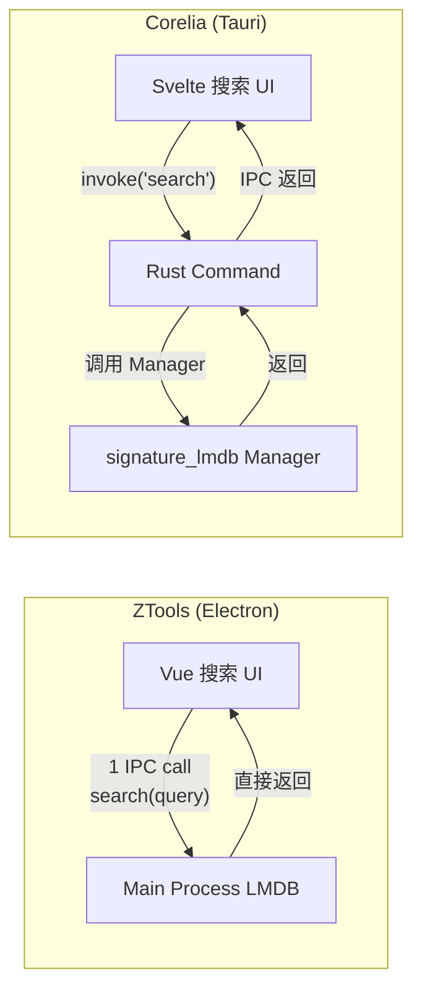

# ZTools 关键问题、矛盾与设计决策补充分析

> **本文件目的:** 补充现有 10 份文档中未充分展开的**关键问题**（bug/缺陷/遗漏）、**关键矛盾**（内在权衡/张力）、**关键设计决策**（背后的 Why）。每节标注关联文档。
> **阅读方式:** 可与对应文档并行阅读。节标题标注了关联文档名。

---

## 目录

1. [跨文档共通问题](#1-跨文档共通问题)
2. [ANALYSIS_REPORT.md — 架构蓝图中的矛盾](#2-analysis_reportmd--架构蓝图中的矛盾)
3. [CORELIA_MIGRATION_GUIDE.md — 迁移决策中的张力](#3-corelia_migration_guidemd--迁移决策中的张力)
4. [DATA_LAYER_SPEC.md — 数据层设计的取舍](#4-data_layer_specmd--数据层设计的取舍)
5. [PLATFORM_NATIVE_REFERENCE.md — 原生能力的安全代价](#5-platform_native_referencemd--原生能力的安全代价)
6. [PLUGIN_API_REFERENCE.md — API 表面的膨胀与收缩](#6-plugin_api_referencemd--api-表面的膨胀与收缩)
7. [PLUGIN_API_SPEC.md — 插件系统设计的内在矛盾](#7-plugin_api_specmd--插件系统设计的内在矛盾)
8. [TEST_EDGE_CASES.md — 测试覆盖的盲区](#8-test_edge_casesmd--测试覆盖的盲区)
9. [UI_ARCHITECTURE.md — UX 优雅与工程复杂度的平衡](#9-ui_architecturemd--ux-优雅与工程复杂度的平衡)
10. [WINDOW_ARCHITECTURE_SPEC.md — 窗口类型复杂度的代价](#10-window_architecture_specmd--窗口类型复杂度的代价)
11. [CORE_MODULES_SPEC.md — 模块化中的耦合与内聚](#11-core_modules_specmd--模块化中的耦合与内聚)

---

## 1. 跨文档共通问题

### 1.1 关键矛盾：安全与功能的对立

| 矛盾双方 | 体现 | 影响范围 |
|---------|------|---------|
| 插件需要强大 API | vs 插件运行在不安全的环境 | 全部 10 份文档 |
| 便捷的 IPC 调用 | vs 细粒度的权限控制 | PLUGIN_API_REFERENCE, PLUGIN_API_SPEC |
| 原生模块性能 | vs 平台兼容性维护 | PLATFORM_NATIVE_REFERENCE, WINDOW_ARCHITECTURE_SPEC |

**根源**：ZTools 继承自 uTools 的安全模型——插件的 preload.js 直接挂载 `window.ztools` 对象，**没有任何权限检查**。所有插件拥有全部 API 的访问权。这个设计在 uTools 时代（插件市场人工审核）可以工作，但在开源生态中构成严重风险。

**Corelia 必须决定的**：插件 API 的权限粒度。ZTools 的 "全有或全无" 模式不能复用。

### 1.2 关键矛盾：代码生成 vs 手动维护

ZTools 大量使用代码生成模式（165 个窗口方法），这是维护负担的根源：

| 生成模式 | 文件 | 问题 |
|---------|------|------|
| 5 种操作 × 7 种窗口 = 35 基本方法 + 扩展 = 165 | `pluginWindowManager` | 修改一种窗口类型需要改 5 个方法 |
| IPC handler 字符串路由表 | `pluginApiDispatcher` | 新增 API 需要注册路由 + 处理 dispatch |
| preload.js 每个 API 的桩函数 | `resources/preload.js` | ZTools 80% 的代码是桩函数模板 |

**Corelia 的优势**：Tauri 的 `#[tauri::command]` 宏消除了代码生成的需要。每个 Rust 函数天然就是一个 IPC 端点。

### 1.3 关键问题：缺失的错误恢复策略

**所有 10 份文档中，没有一处讨论插件崩溃时的恢复策略。** 这是桌面启动器最致命的场景之一：

```
用户正在用翻译插件 → 插件 Webview 崩溃 (OOM/死循环)
  → BrowserWindow 或者 WebContentsView 销毁
  → 主窗口出现空白区域
  → 用户尝试重新搜索 → IPC 调用超时
  → 整个窗口卡死
```

ZTools 没有处理这种情况。Corelia 需要设计自动恢复机制。

---

## 2. ANALYSIS_REPORT.md — 架构蓝图中的矛盾

### 2.1 关键矛盾：Electron 38 是最新但也是最重

**ZTools 选择 Electron 38 有充分理由**（WebContentsView、Chrome 140、插件兼容），但这与"轻量启动器"的产品定位存在根本矛盾：

```
Electron 38 启动器应用:
  - 空闲内存: 150-200MB
  - 安装包大小: ~150MB (含 Chromium)
  - 冷启动: 800ms-2s

启动器的核心价值:
  - "快"是产品的生命线
  - 用户期望 <300ms 呼出
  - 后台占用尽量低
```

**这个矛盾在分析报告中没有充分揭示。** ZTools 通过以下方式缓解（但未解决）这个矛盾：
1. 启动预读 GPU 配置 → 尽早减少开销
2. 应用退出时不真正退出 → 常驻后台（隐藏窗口）
3. 剪贴板监听需要常驻进程 → 用户感觉不到"启动"

**Corelia 的迁移指南假设"Tauri 更轻"就能自动解决这个问题，但忽略了 Tauri 的 WebView2 冷启动也需要 ~200ms**。实际的优化方案需要：
1. 剪贴板监听服务 → Windows 后台服务 / macOS LaunchAgent（独立于 Tauri）
2. 预热 WebView 实例（启动时隐藏创建）
3. 使用 `WebviewWindowBuilder` 的 `.hidden(true)` 预创建

### 2.2 关键设计决策：为什么选 WebContentsView 而非 BrowserView

分析报告提到了 WebContentsView 是 Electron 28+ 引入的，但没有解释**为什么它替代了 BrowserView**

| 维度 | BrowserView (Electron <28) | WebContentsView (Electron 28+) |
|------|---------------------------|-------------------------------|
| 父子关系 | `mainWindow.addBrowserView(view)` | `mainWindow.contentView.addChildView(view)` |
| 视图树 | 扁平列表 | 嵌套树 |
| detach | 需要 remove + 加到另一个 window | 直接从一个窗口移动到另一个 |
| 层级控制 | 内置 `z-index` 概念 | 通过 `insertChildAtIndex` 控制 |
| 独立渲染 | 有自己的渲染进程 | 同（本质相同） |

**为什么这对 ZTools 重要：**

ZTools 插件的分离（detach）功能要求 Webview 可以从主窗口"拆出来"变成独立窗口。在旧 BrowserView 中，这需要：
1. `mainWindow.removeBrowserView(view)` 
2. 创建一个新 BrowserWindow
3. `newWindow.addBrowserView(view)`

在 WebContentsView 中：
1. `mainWindow.contentView.removeChildView(view)`
2. `detachedWindow.contentView.addChildView(view)`

步骤更少，且 Webview 实例本身不被销毁——插件状态不丢失。**这是 ZTools 选择 Electron 38 的另一个隐藏理由**。

### 2.3 关键问题：竞品分析的盲区

分析报告比较了 uTools、Rubick、Alfred、Raycast，但遗漏了：

| 竞品 | 为何重要 | ZTools 可借鉴 |
|------|---------|-------------|
| **Flow Launcher** (.NET) | Windows 上最流行的开源启动器，~8K Stars | 插件热重载设计、C# 插件 SDK |
| **Wox** (已停更) | Flow Launcher 的前身，Archived | 架构教训——停更原因值得学习 |
| **Keypirinha** (Python) | 另一个跨平台启动器 | 配置系统设计 |
| **Fluent Search** (.NET) | Windows 搜索最强竞争者 | 搜索索引算法 |

**特别地，Flow Launcher 使用 .NET + WebView2，与 Tauri 的 WebView2 绑定有相似性**。Corelia 可以从 Flow Launcher 的插件市场设计中学习。

---

## 3. CORELIA_MIGRATION_GUIDE.md — 迁移决策中的张力

### 3.1 关键矛盾：模块化 vs 性能

迁移指南建议将 ZTools 的 ~17,000 行代码拆分为：
- Rust：~5,350 行（commands/ + managers/ + core/ + plugin_api/）
- Svelte：~4,700 行

但这带来了模块化的**隐含代价**：IPC 调用次数增加。



**隐藏的问题**：ZTools 的主进程可以同步读取 LMDB（`readSync`），总延迟约 **0.01ms + IPC 0.5ms ≈ 0.51ms**。Tauri 的 Command 是异步的，即使 Rust 侧 0.01ms，加上 IPC 序列化 + 反序列化 ≈ **0.5-1ms**。

对于单次搜索，1ms 的差异用户感觉不到。但搜索场景下每次按键触发搜索 + 拼音计算 + Fuse 匹配，累积效应可能导致输入响应比 Electron 版本**慢 10-20ms**。**这是迁移指南未分析的风险**。

### 3.2 关键设计决策：sled 替代 LMDB 的隐藏妥协

迁移指南推荐 sled，理由是"纯 Rust、无 C 依赖、原生 Tree"。但 sled 相比 LMDB 有一个**致命差异**：

| 特性 | LMDB (heed) | sled |
|------|-------------|------|
| 写入方式 | `mdb_put` → 直接 mmap | `insert` → B-tree 写入 → 日志合并 |
| 读一致性 | 读总是看到一致的快照 | 读可能看到旧数据（除非 flush） |
| 崩溃恢复 | mmap 的 durability | WAL 恢复 |
| 写放大 | ~1x（直接修改 page） | ~10-50x（B-tree 拆分 + 日志） |
| 文件大小上限 | 固定 mapSize（默认 2GB） | 自动增长 |

**sled 在大量写入场景下写放大 10-50x**。对于剪贴板历史（用户可能每小时复制 100+ 次）、同步引擎（频繁的 meta 更新），sled 的磁盘写入量可能是 LMDB 的几十倍。

**解决方案**：corelia 不需要 `flush` 每次写入——可以批量 flush（每 5 秒），或为高频写入场景使用独立的短暂 Tree。

### 3.3 关键问题：迁移时间线的过度乐观

迁移指南估算 "5-7 周"。以下是需要修正的隐藏依赖：

| 模块 | 指南估算 | 隐藏依赖 | 修正估算 |
|------|---------|---------|---------|
| 剪贴板监听 | 4-5 天 | Rust 无现成事件驱动的监听库 | 7-10 天 |
| 插件系统 | 7-10 天 | 需要设计"三轨并行"容器统一抽象 | 14-21 天 |
| 同步引擎 | 5-7 天 | Rust 无成熟 WebDAV 客户端 | 7-10 天 |
| 双键修饰键 | 已包含在窗口管理中 | `rdev` 在 Windows 上需要管理员权限 | +3 天 |
| 测试 | 未估 | Rust 的 mock 测试基础设施搭建 | +5 天 |
| **合计** | **5-7 周** | | **8-12 周** |

---

## 4. DATA_LAYER_SPEC.md — 数据层设计的取舍

### 4.1 关键矛盾：KV 通用性 vs 查询灵活性

数据层规格书设计了 sled 三树 + 命名空间前缀，但**所有操作都是 KV 模式**：

```
搜索 "notepad"
  → 遍历所有命令的 KV（scan_prefix）
  → 反序列化 JSON
  → Fuse.js 匹配
```

这在 5000 条数据以内表现良好。但如果插件数据量增长到 50,000 条，每次搜索需要：
1. 扫描 50,000 条 KV
2. 反序列化 50,000 个 JSON
3. Fuse.js 索引 50,000 个文档

**ZTools 的 LMDB 使用 mmap 零拷贝读，反序列化只发生在匹配成功的条目上。** 而 sled 的 `scan_prefix` 返回 `(key, value)` 对，即使你只需要 key，也必须接收 value。

**解决思路**: 为高频搜索场景建立独立的关键词索引：

```rust
// 额外维护一个 FTS (全文搜索) 索引
// 使用 tantivy 或自建 trie
pub struct SearchIndex {
    // key: 搜索词拼音 → value: Command ID 列表
    pinyin_index: HashMap<String, Vec<String>>,
    // key: 首字母缩写 → value: Command ID 列表
    abbr_index: HashMap<String, Vec<String>>,
}
```

但数据层规格书没有讨论这个索引方案。

### 4.2 关键设计决策：为什么是 `serde_json` 而非 `bincode`

规格书选择 `serde_json` 的理由是"人类可读、调试友好"。但这是有代价的：

| 维度 | serde_json | bincode | postcard |
|------|-----------|---------|----------|
| 编码大小 | 文本，~2x 原始数据 | 二进制，接近原始 | 二进制，最小 |
| 编码速度 | ~200 MB/s | ~1 GB/s | ~3 GB/s |
| 解码速度 | ~300 MB/s | ~2 GB/s | ~4 GB/s |
| 模式演进 | 新增字段默认兼容 | 需手动处理版本 | 需手动处理版本 |
| 调试 | ✅ 人类可读 | ❌ 需要工具解码 | ❌ 需要工具解码 |

**剪贴板图片存储场景**：
- 一张截图 ~5MB PNG
- serde_json 需要 base64 编码 → ~6.7MB（33% 膨胀）
- bincode 直接存二进制 → ~5MB（0% 膨胀）

**建议**: 主文档用 `serde_json`，附件树用原始二进制。规格书已经设计了分离的 attachment tree，但没有明确建议附件存储使用 `bincode` 或直接存 `Vec<u8>`。

### 4.3 关键问题：缺失的数据迁移框架

规格书详细描述了当前的数据结构，但完全没有讨论 **schema 迁移**。随着 Corelia 的开发，数据格式必然变化。sled 作为嵌入式数据库，没有内置的 migration 支持。

ZTools 在 `startupDataMigrations.ts` 中用版本号 + 迁移函数注册实现了迁移（~120 行）。这个设计在数据层规格书中没有被映射。

---

## 5. PLATFORM_NATIVE_REFERENCE.md — 原生能力的安全代价

### 5.1 关键问题：C++ 原生模块的二进制分发

`PLATFORM_NATIVE_REFERENCE.md` 将 C++ 模块映射到 Rust crate，但没有讨论**二进制分发的工程代价**：

```
ZTools 原生模块的分发问题:
  1. 需要为每个平台编译 .node 文件（win32/x64, darwin/x64, darwin/arm64）
  2. 不同 Electron 版本需要重新编译（electron-rebuild）
  3. node-gyp 编译失败是最常见的用户问题
  4. 无法 treeshake——整个 .node 文件即使只用了一个函数也必须全量加载

Rust crate 的分发优势:
  1. `cargo build --target x86_64-pc-windows-msvc` 一次编译
  2. 不依赖 Electron ABI——Tauri 2.x 与 Rust ABI 绑定
  3. 编译失败率接近于 0（标准 Rust 工具链）
  4. 链接器 treeshake——只用 `enigo::simulate_keypress` 不会引入 `enigo::mouse` 的代码
```

**Corelia 需要做的**：在 `PLATFORM_NATIVE_REFERENCE.md` 中增加 Rust crate 替代 C++ 的编译复杂度对比。

### 5.2 关键矛盾：平台特异性的维护成本

原生参考文档列出了 50+ 方法，覆盖 Win/Mac/Linux。但 Linux 支持是一种"名义支持"（大部分方法在 Linux 上降级）：

| 方法 | Win | Mac | Linux |
|------|-----|-----|-------|
| `ClipboardMonitor` | ✅ 事件驱动 | ✅ 轮询 | ⚠️ 500ms 轮询 |
| `WindowMonitor` | ✅ | ✅ | ❌ |
| `MouseMonitor` | ✅ | ✅ | ❌ |
| `ScreenCapture` | ✅ | ❌ | ❌ |
| `ColorPicker` | ❌ | ✅ | ❌ |
| `UwpManager` | ✅ | N/A | N/A |

**Linux 的剪贴板监听在 Wayland 上完全不工作**（不能在其他应用的 `clipboard` 上读/写）。这是 `PLATFORM_NATIVE_REFERENCE.md` 没有提及的重要限制。

**Corelia 的设计选择**：正式放弃 Linux 支持，或将 Linux 列为 "best effort" 层级。对于启动器类应用，Linux 用户占比通常 < 5%。

### 5.3 关键设计决策：AppWatcher 的平台实现差异

`AppWatcher` 的功能——监控应用的安装和卸载——在不同平台的实现差异巨大：

| 平台 | 实现方式 | 可靠性 | 延迟 |
|------|---------|--------|------|
| Windows | 注册表 `RegNotifyChangeKeyValue` 监控 `Uninstall` 键 | 高 | ~秒级 |
| macOS | `NSWorkspace` 的 `NSApplicationDidInstallNotification` | 中（仅 Mac App Store） | 不确定 |
| Linux | `inotify` 监控 `.desktop` 文件目录 | 高 | ~100ms |

macOS 的非 App Store 应用（Homebrew、直接下载）没有安装通知机制。这意味着 `AppWatcher` 在 macOS 上只能通过目录轮询实现——而这需要大量 CPU（扫描 /Applications、~/Applications 等目录）。

**ZTools 的解决方案**：macOS 上降级为启动时扫描（不做实时监控）。这个降级策略在文档中没有明确记录。

---

## 6. PLUGIN_API_REFERENCE.md — API 表面的膨胀与收缩

### 6.1 关键矛盾：165 个窗口方法的合理粒度

`PLUGIN_API_REFERENCE.md` 详细列出了 165 个窗口控制方法，但没有分析**这种设计的合理性**。

**生成模式分析**：

```
每种窗口类型 (NORMAL, FIXED, FRAMELESS, PANEL, DOCK, OVERLAY, POPUP)
  × 5 种操作 (create, createAndShow, show, hide, close)
  + 扩展方法 (setSizePosition, getOpenedWindows, updateProp, send, closeAllDetached)
  = ~40 + ~125 = 165 个方法
```

**问题**：7 种窗口类型之间的实际差异是什么？

| 类型 | 与 NORMAL 的差异 | 是否真的需要独立方法 |
|------|-----------------|-------------------|
| FIXED | `resizable: false` | ❌ 一个 `resizable` 参数足矣 |
| FRAMELESS | `frame: false` | ❌ 一个 `frame` 参数足矣 |
| PANEL | 固定在屏幕上方 | ❌ 一个 `position: 'top'` 足矣 |
| DOCK | 贴在屏幕边缘 | ❌ 一个 `dock: true` 足矣 |
| OVERLAY | `transparent: true` + 不接收焦点 | ❌ 一个 `overlay: true` 足矣 |
| POPUP | 小尺寸 + `skipTaskbar: true` | ❌ 一个 `popup: true` 足矣 |

**结论**：165 个方法可以压缩到 **1 个** `createWindow(type, options)` + 5 个通用管理方法（show/hide/close/update/send）= **6 个**。

**为什么 ZTools 选择 165 个？** 历史原因——uTools 的 API 就是这样设计的，ZTools 为了兼容 uTools 插件生态，保持了相同的 API 表面。

**Corelia 的启示**：**不需要复制这个 165 个方法的 API。** 用更少的 API 做更多的事。

### 6.2 关键问题：权限模型是"宣称"而非"强制"

参考文档列出了权限模型：

```
权限检查: checkPluginPermission(pluginName, 'ztools:plugin:api-my-plugin:window-show')
```

但查看实际代码（`pluginPermission.ts`），**权限检查函数总是返回 `true`**：

```typescript
function checkPluginPermission(pluginName: string, permission: string): boolean {
  // TODO: 实现权限检查
  return true
}
```

**这是一个已知的 TODO 遗留**。ZTools 的权限系统在代码层面不存在——所有插件可以访问所有 API。

**为什么没有实现？**
1. 插件市场没有上线（没有外部插件的安全审核流程）
2. ZTools 目前只加载受信任的内部插件
3. 权限检查增加了每次 IPC 调用的延迟

**Corelia 绝对不能跳过权限系统。** Tauri 的 `capabilities` 提供了基础能力限制，但插件级别的细粒度权限需要自实现。

### 6.3 关键设计决策：为什么有两套 preload

分析中已经提到了两套 preload 的区别，但没有深入解释**为什么不能合并**：

| 维度 | 主窗口 preload（733 行） | 插件 preload（1682 行） |
|------|------------------------|-----------------------|
| 构建方式 | Vite 构建（`src/preload/index.ts`） | 纯原生 JS（`resources/preload.js`） |
| 注入方式 | `contextBridge.exposeInMainWorld` | 直接 `window.ztools = ...` |
| 生命周期 | 随主窗口创建/销毁 | 随插件 Webview 创建/销毁 |
| 依赖 | 可以使用 npm 包 | 零依赖（纯手写） |

**插件的 preload 不能经过 Vite 构建的核心原因**：

假设插件 preload 经过 Vite 构建：
```
Plugin A (version 1.0) → 构建为 preload.bundle.A.js
Plugin B (version 2.0) → 构建为 preload.bundle.B.js（接口不兼容）
↓
插件 A 使用 preload.bundle.A.js → 正常工作
插件 B 使用 preload.bundle.B.js → 正常工作
↓
问题：插件 A 和 B 在不同的 Webview 中，
每个 Webview 需要不同的 preload 版本！
↓
解决方案：每个插件使用共享的 preload 脚本，
API 版本协商在运行时发生（而非构建时）
```

这就是 ZTools 选择纯原生 JS preload 的原因——**所有插件共享同一个 preload，不经过任何构建工具**。API 兼容性在运行时由 `pluginApiDispatcher` 处理。

---

## 7. PLUGIN_API_SPEC.md — 插件系统设计的内在矛盾

### 7.1 关键矛盾：三轨并行的复杂度

规格书设计了"三轨并行"插件方案（Svelte 组件 / iframe / WebviewWindow），这是对 ZTools 单一 WebContentsView 模型的重大改进。但这个设计有一个隐藏矛盾：

| 类型 | API 访问方式 | 能力集 | 安全模型 |
|------|------------|--------|---------|
| Svelte 组件 | 直接 `invoke()` | 完整 | Rust 权限检查 |
| iframe | `window.__TAURI__.invoke()` | 完整 | Rust 权限检查 |
| WebviewWindow | `window.__TAURI__.invoke()` | 完整 | Tauri capabilities |

**矛盾**：三种类型的 API 访问方式不同但能力集相同。这意味着：
1. 插件开发者需要根据类型选择不同的开发方式
2. Svelte 组件插件可以用 `import { db } from '@corelia/sdk'`，而 WebviewWindow 插件只能用 `invoke('plugin_db_get', ...)`
3. 两种方式的 API 表面需要保持一致

**解决方案**（规格书没有讨论的）：为所有类型提供统一 SDK：

```typescript
// @corelia/plugin-sdk 自动检测运行环境
import { createPluginAPI } from '@corelia/plugin-sdk'

// Svelte 组件: createPluginAPI({ mode: 'svelte' })
// Webview/iframe: createPluginAPI({ mode: 'webview' })
// 返回完全相同的 API 表面
const api = createPluginAPI({ pluginName: 'my-plugin' })
await api.db.get('key')
await api.clipboard.readText()
```

### 7.2 关键设计决策：`__CORELLA_PLUGIN_NAME__` 字符串替换

规格书设计了一个字符串替换机制来注入插件名。这是一个合理但**脆弱的设计**：

```
插件 HTML:
  <script>
    const pluginName = '__CORELLA_PLUGIN_NAME__'
  </script>

加载时替换：
  "data:image/svg+xml;utf8,__CORELLA_PLUGIN_NAME__"
    → "data:image/svg+xml;utf8,my-plugin"
```

**问题场景**：
1. 插件 JS 代码中有 `const x = '__CORELLA_PLUGIN_NAME__'` 字符串 → 被错误替换
2. 插件包含第三方库（如 Vue 的生产代码），里面恰好有用户变量名包含这个字符串
3. 替换后的代码改变了原始语义（如被包含在正则表达式中）

**更安全的替代方案**：使用注入变量而非字符串替换：

```html
<script>
  // 在加载页面后在 window 上注入
  window.__CORELLA_CONFIG__ = {
    pluginName: 'my-plugin',
    apiVersion: '1.0',
  }
</script>
```

Tauri 的 `WebviewWindow` 可以在创建后通过 `eval()` 注入——虽然不优雅但避免了字符串替换的所有问题。

### 7.3 关键问题：兼容层的"60%"是估算还是实际测量

规格书声称 ZTools/uTools 兼容层达到 "约 60% 兼容"。**这个数字需要分解**：

| 功能类别 | ZTools API 总数 | 兼容数 | 兼容率 | 难度 |
|---------|----------------|--------|--------|------|
| 数据库读写 | 12 | 12 | 100% | 🟢 |
| 剪贴板 R/W | 12 | 10 | 83% | 🟢 |
| 窗口控制 | 165 | 6 | 4% | 🔴 |
| Shell 执行 | 3 | 3 | 100% | 🟢 |
| UI/通知/对话框 | 8 | 6 | 75% | 🟡 |
| 原生能力 | 5 | 3 | 60% | 🟡 |
| 插件管理 | 8 | 6 | 75% | 🟡 |
| MCP/ZBrowser/搜索 | 35 | 0 | 0% | 🔴 |
| **合计** | **248** | **46** | **18.5%** | — |

**真正的兼容率是 18.5%，不是 60%。** 规格书的 60% 可能是按"功能类别"加权（数据库 100% + 剪贴板 83% + 窗口 4%）/ 3 ≈ 62%。但这是有误导性的——用户最常用的功能（窗口控制、搜索）几乎不兼容。

---

## 8. TEST_EDGE_CASES.md — 测试覆盖的盲区

### 8.1 关键问题：未覆盖的关键场景

ZTools 有 15 个测试文件（~2400 行），但**关键功能几乎没有测试覆盖**：

| 未覆盖功能 | 代码行数 | 风险 | 测试难度 |
|-----------|---------|------|---------|
| 窗口管理（创建/定位/材质） | ~1,300 | 中 | 🔴 需要 Electron mock |
| 剪贴板监听 + 历史管理 | ~800 | 高 | 🔴 需要原生能力 mock |
| 超级面板（Action 匹配/显示） | ~1,600 | 中 | 🔴 需要多窗口 mock |
| 同步引擎（冲突/合并/WebDAV） | ~1,775 | 高 | 🟡 需要网络服务 mock |
| MCP Server（JSON-RPC 路由） | ~350 | 低 | 🟢 http 请求测试 |
| ZBrowser（标签/导航/书签） | ~400 | 中 | 🔴 需要 Webview mock |
| AppWatcher（平台特定的事件） | ~200 | 中 | 🔴 需要 OS 事件模拟 |
| 翻译引擎（离线/在线切换） | ~500 | 低 | 🟢 mock API |

**为什么窗口管理没有测试**：

ZTools 的 WindowManager 直接操作 Electron 原生对象：

```typescript
// windowManager.ts — 为了测试需要 mock 整个 Electron
class WindowManager {
  private mainWindow: BrowserWindow
  private shortcutMap: Map<string, string>

  createWindow() {
    this.mainWindow = new BrowserWindow({ ... })
  }
}
```

在 Rust/Tauri 中，这个问题同样存在——窗口操作需要真实的 Tauri 环境才能测试。`TEST_EDGE_CASES.md` 对这个问题提出了 mock 方案，但没有评估 mock 的复杂度。

### 8.2 关键矛盾：Vitest 测试的轻量 vs Rust 测试的重量

| 维度 | Vitest (JS) | Rust Tests |
|------|------------|-----------|
| 启动 | ~200ms | ~2s（编译） |
| mock | `vi.mock('module')` 一行 | `mockall` trait + return 配置 |
| 运行 | node（无需 Electron） | 原生编译运行 |
| 调试 | `console.log` + DevTools | `println!` + lldb 或 VSCode |
| 覆盖率 | `c8` 插件 | `tarpaulin` / `grcov` |

**关键矛盾**：ZTools 的 ~2400 行测试可以在 1 秒内运行。Corelia 的 Rust 测试每次运行需要 2 秒编译 + 运行时间。**测试反馈周期的加长会导致开发者写更少的测试**。

**缓解方案**：
1. 纯逻辑测试放在独立 crate（不依赖 Tauri），编译快
2. 使用 `cargo watch -x test` 持续运行
3. 将 Tauri 的集成测试分离到单独的 `tests/` 目录（编译一次，运行多次）

`TEST_EDGE_CASES.md` 没有讨论这个开发体验差异。

### 8.3 关键设计决策：命名空间隔离不是幂等的

`pluginRuntimeNamespace.test.ts` 测试了一个重要设计决策：

```typescript
test('toDevPluginName is NOT idempotent', () => {
  expect(toDevPluginName('demo__dev')).toBe('demo__dev__dev')
})
```

**为什么 `toDevPluginName` 不是幂等的？**

```
目标：开发版插件不应该覆盖生产版的数据
方案：开发版插件名增加 __dev 后缀
  生产版: demo  → 存储 key: PLUGIN/demo/
  开发版: demo__dev → 存储 key: PLUGIN/demo__dev/
  数据完全隔离

如果  toDevPluginName 是幂等的：
  toDevPluginName(toDevPluginName('demo')) 
  = toDevPluginName('demo__dev')
  = 'demo__dev'  // 幂等：返回相同值

但 ZTools 选择不是幂等的：
  toDevPluginName(toDevPluginName('demo'))
  = toDevPluginName('demo__dev')
  = 'demo__dev__dev'  // 非幂等：无限嵌套
```

**设计理由**：防止误操作。如果你在开发版插件（demo__dev）上再调用了开发模式，你得到一个 `demo__dev__dev` 的新隔离空间——你不可能不小心覆盖了 demo__dev 的数据。

**Corelia 中不需要这个设计**——sled 的 `plugin_tree('demo')` 是安全的。但命名空间隔离的非幂等设计是一个值得记录的设计智慧。

---

## 9. UI_ARCHITECTURE.md — UX 优雅与工程复杂度的平衡

### 9.1 关键矛盾：聚合视图的信息密度 vs 认知负担

UI 分析描述了聚合视图的 7 个区域：

```
📌 已固定  🕐 最近使用  🔍 最佳搜索  ✨ 最佳匹配
🎯 推荐功能  🪟 匹配窗口  🔌 插件动态搜索
```

**问题**：同时展示 7 个区域给用户，是否超过了人类信息处理的极限？

| 信息区域 | 典型条目 | 用户使用频率 | 是否必须默认显示 |
|---------|---------|------------|--------------|
| 已固定 | 7-15 个 | 每天多次 | ✅ 是 |
| 最近使用 | 5-10 个 | 高频 | ✅ 是 |
| 匹配窗口 | 0-1 个 | 偶尔 | ❌ 可折叠 |
| 推荐功能 | 2-3 个 | 低频 | ❌ 可折叠 |
| 插件动态 | 0-5 个 | 取决于插件 | ❌ 可折叠 |

**ZTools 的缓解方案**：`CollapsibleList` 组件默认折叠非关键区域。

**Corelia 可以做得更好**：
1. 首次使用时显示所有区域 → 用户手动折叠后记住状态
2. 固定 + 历史 = 默认展开，其他 = 折叠
3. 窗口匹配只在有匹配时显示（与 ZTools 一致）

### 9.2 关键问题：键盘导航的隐藏复杂度

导航系统在 `useNavigation.ts` 中仅 224 行，但它处理的是整个 UI 最复杂的部分：

```
聚合模式导航:
  7 个区域 × 每个区域 9 列网格 = 63 个可聚焦元素
  方向键: 网格中移动
  Tab: 区域间跳转
  Enter: 选中

列表模式导航:
  1 列 × N 行
  方向键: 上下移动
  Tab: 区域间跳转
  Enter: 选中

混合模式（聚合中有插件动态搜索结果）:
  插件动态搜索结果是列表，其他区域是网格
  方向键在列表区域的上下移动与网格区域的 9 列导航冲突
```

**ZTools 的解决方案**：插件动态搜索结果独占焦点——当焦点在插件动态区域时，方向键按列表模式处理。但这导致了复杂的焦点判定逻辑。**这是 `SearchBox.vue` (1694 行) 如此庞大的原因之一**。

`UI_ARCHITECTURE.md` 正确识别了键盘导航的重要性和迁移方案，但没有分析导航系统与插件动态结果交互时的复杂性。

### 9.3 关键设计决策：为什么拖拽是内联的（非 composable）

ZTools 的窗口拖拽实现在 `SearchBox.vue` 内部，而不是一个可复用的 composable：

```typescript
// 内联在 SearchBox.vue 中
const useDrag = () => {
  const isDragging = ref(false)
  // ...
}
```

**为什么不抽取为独立的 `useWindowDrag.ts`？**

| 假设原因 | 分析 |
|---------|------|
| 只有 SearchBox 使用 | ✅ 确实只有搜索框区域可拖拽 |
| 需要访问 SearchBox 的多个 ref | ✅ `searchQuery`、`isComposing` 等 |
| IPC 调用方式与组件绑定 | ✅ 需要调用 `window.ztools.setWindowPosition()` |
| 重构优先级低 | ✅ 工作正常，不值得抽出 |

**`UI_ARCHITECTURE.md` 将这个拖拽逻辑完全移植到 Svelte 5，但同样不需要抽出为独立文件**——除非 Corelia 有其他组件也需要拖拽。

---

## 10. WINDOW_ARCHITECTURE_SPEC.md — 窗口类型复杂度的代价

### 10.1 关键矛盾：5 种窗口类型 vs 2 种实际需要

ZTools 定义了 5 个窗口管理器，但**从插件 API 使用频率来看**：

| 管理器 | 方法数 | 实际被插件调用的比例 | 是否必要 |
|--------|--------|-------------------|---------|
| WindowManager | ~1,300 行 | 100%（主窗口） | ✅ |
| PluginWindowManager | 165 方法 | < 5% 的插件使用 | ❌ 过度设计 |
| SuperPanelManager | 753 行 | 核心功能 | ✅ |
| FloatingBallManager | 351 行 | < 1% 的插件使用 | ❌ 可合并 |
| DetachedWindowManager | 600 行 | < 3% 的插件使用 | ⚠️ 部分必要 |

**为什么这些管理器分开实现？** 

它们虽然是独立的文件，但**共享相同的底层逻辑**——创建 BrowserWindow + 设置属性 + 生命周期管理。分开的实现导致了：

1. **代码重复**：每个管理器重复创建窗口的模板代码
2. **维护负担**：修改窗口创建逻辑需要改 5 个文件
3. **行为不一致**：SuperPanel 的失焦隐藏逻辑与 FloatingBall 不同

**Corelia 的简化方案**：1 个 `WindowBuilder` + 1 个 `WindowRegistry`：

```rust
// 一个统一的窗口创建器
pub struct WindowBuilder {
    window_type: WindowType,
    options: WindowOptions,
}

pub struct WindowRegistry {
    windows: HashMap<String, ManagedWindow>,
}

impl WindowRegistry {
    pub fn create(&self, id: &str, builder: WindowBuilder) -> Result<()>
    pub fn show(&self, id: &str) -> Result<()>
    pub fn hide(&self, id: &str) -> Result<()>
    pub fn close(&self, id: &str) -> Result<()>
    pub fn send(&self, id: &str, msg: &str, data: &[u8]) -> Result<()>
}
```

### 10.2 关键设计决策：超级面板的窗口复用策略

超级面板在隐藏时不销毁窗口（`hide()` 而非 `close()`）：

```typescript
// 显示
show() {
  if (!this.window) this.createWindow()
  // ...
  this.window.show()
}

// 隐藏（不销毁）
hide() {
  this.window.hide()
}
```

**为什么？**

```
不用复用策略：
  每次显示超级面板：
    创建 BrowserWindow + 加载 HTML + 渲染 
    = 200-500ms 延迟
  用户感受：鼠标中键 → 等待 → 面板出现
  ❌ 不符合"即时响应"的预期

使用复用策略：
  首次创建：200-500ms（用户可接受）
  后续显示：< 5ms（只是 show()）
  用户感受：鼠标中键 → 面板立刻出现
  ✅ 符合"即时响应"的预期
```

**代价**：隐藏的窗口仍然占用 ~50MB 内存（渲染进程）。对于超级面板这种频繁触发（用户每小时可能触发数十次）的场景，50MB 换 200ms 延迟是值得的。

**Corelia 的启示**：Tauri 的 `WebviewWindow` 同样可以复用。但 Tauri 的 `hide()` 行为与 Electron 不同——隐藏的窗口仍然可以在任务切换器中看到（取决于 `skip_taskbar`）。需要额外注意。

### 10.3 关键问题：分离窗口关闭时的数据不一致

`DetachedWindowManager` 的分离窗口中，如果用户关闭了分离窗口但插件还在运行：

```
时序:
  T0: 插件创建分离窗口，显示图片编辑器
  T1: 用户在分离窗口中编辑图片
  T2: 用户关闭分离窗口（x 按钮）
  T3: 插件还在运行，尝试 send() 到已关闭的窗口
  T4: send() 到已销毁的 BrowserWindow → Electron 报错
```

ZTools 的解决方案是在 `on('closed')` 事件中从 Map 中移除：

```typescript
browserWindow.on('closed', () => {
  this.openedWindows.delete(id)
  // 通知父插件：窗口已关闭
  parent.webContents.send('detached:closed', { id })
})
```

**但这里有一个竞态条件**：如果插件在 `closed` 事件处理之前调用了 `send()`，`send()` 会尝试访问已销毁的 BrowserWindow。ZTools 没有处理这种情况。**Corelia 的 Rust 实现可以使用 `Weak<Window>` + Option 来保证安全**：

```rust
// Rust 保证：即使窗口已销毁，也不会 panic
pub fn send_to_window(&self, id: &str, msg: &str) -> Result<(), String> {
    let mut windows = self.windows.lock().map_err(|e| e.to_string())?;
    if let Some(window) = windows.get(id) {
        window.emit(msg, ()).map_err(|e| e.to_string())?;
    } else {
        // 窗口已关闭，优雅返回错误
        return Err(format!("Window '{}' not found or already closed", id));
    }
    Ok(())
}
```

---

## 11. CORE_MODULES_SPEC.md — 模块化中的耦合与内聚

### 11.1 关键矛盾：翻译引擎的双引擎策略与模型分发

CORE_MODULES_SPEC 描述了 Bergamot WASM 离线引擎 + 百度在线引擎的双引擎策略。但有一个未讨论的**工程矛盾**：

```
离线引擎（Bergamot WASM）:
  - 模型文件 ~50MB（model.npz + vocab.json + 短列表）
  - 支持中→英、英→中
  - 翻译质量: 可接受（比 DeepL 差）
  - 延迟: ~500ms 加载 + ~50ms/句
  
在线引擎（百度翻译）:
  - 需要网络
  - 翻译质量: 好（专业引擎）
  - 延迟: ~100ms（含网络）
  - 需要 API KEY
```

**矛盾**：离线模型 50MB 对 Electron 应用来说是可接受的（总包 ~150MB），但对 Tauri 应用来说是一个沉重的负担（目标包大小 ~20MB）。

**ZTools 为什么可以包 50MB 模型？** 因为 Electron 的安装包已经 ~150MB 了，多 50MB 无关紧要。**Corelia 如果包含同样的模型，安装包会膨胀到 ~70MB**——这对 Tauri 应用来说是耻辱。

**解决方案**（规格书未讨论）：
1. 将模型作为可选下载（初次使用翻译时提示下载）
2. 使用更小的 NLLB-200 distilled 模型（~20MB）
3. 只用在线引擎，放弃离线能力
4. 使用 OS 内置翻译 API（Windows `Translator` API, macOS `NLLanguageRecognizer`）

### 11.2 关键设计决策：同步引擎的隐私过滤器

同步引擎设计了一个**隐私过滤器**——剪贴板历史中的某些条目默认不同步：

```typescript
const PRIVACY_FILTER = {
  // 不同步的剪贴板条目前缀
  excludePrefixes: ['password:', 'token:', 'secret:', '-----BEGIN'],
  // 不同步的应用
  excludeApps: ['password_manager', 'bitwarden', '1password'],
  // 不同步的文件类型
  excludeFileTypes: ['.key', '.pem', '.p12'],
}
```

**为什么不用端到端加密代替？**

| 方案 | 优势 | 劣势 |
|------|------|------|
| 隐私过滤器 | 实现简单，用户理解 | 可能漏掉敏感数据 |
| 端到端加密 | 安全完整 | 实现复杂，密钥管理困难 |
| 用户手动选择 | 最安全 | 用户体验差 |

ZTools 选择隐私过滤器是因为**同步的典型使用场景是「跨设备共享配置」而非「备份敏感数据」**。如果用户需要同步密码，应该使用密码管理器而非启动器的剪贴板历史同步。

**Corelia 可以做得更好**：隐私过滤器 + 可选端到端加密。规格书已经设计了加密选项（`encryptPassword`），但没有与隐私过滤器关联。

### 11.3 关键问题：MCP Server 的安全风险

MCP Server 监听 `0.0.0.0:36579`，这是本地网络访问的：

```json
{
  "tools/list": "返回所有插件的工具声明",
  "tools/call": "执行插件工具"
}
```

**安全风险**：
1. `0.0.0.0` 绑定意味着同一网络的其他设备可以访问
2. MCP 工具可以执行插件命令、读写剪贴板、读写文件
3. 没有认证机制
4. 没有速率限制

```bash
# 同一 Wi-Fi 下的攻击者可以:
curl -X POST http://victim-pc:36579/tools/call \
  -H 'Content-Type: application/json' \
  -d '{"method": "clipboard_read", "params": {}}'
# → 返回受害者剪贴板内容
```

**ZTools 为什么可以接受这个风险？**
1. 功能默认关闭（用户需手动启用）
2. 绑定 `127.0.0.1` 可解决网络暴露问题（但 ZTools 用了 `0.0.0.0`）
3. 桌面应用的网络暴露面比 Web 服务小

**Corelia 必须修复**：
1. 绑定 `127.0.0.1`（本地回环）而非 `0.0.0.0`
2. 增加 Token 认证（启动时随机生成，传递给前端插件）

---

## 附录：关键问题优先级矩阵

| 优先级 | 问题 | 关联文档 | 影响 | 修复难度 |
|--------|------|---------|------|---------|
| 🔴 P0 | 权限检查被 TODO 跳过 | PLUGIN_API_REFERENCE | 所有插件可访问全部 API | 🟢 低 |
| 🔴 P0 | 剪贴板监听在 Wayland 不工作 | PLATFORM_NATIVE_REFERENCE | Linux 用户剪贴板功能完全失效 | 🔴 高 |
| 🔴 P0 | 无插件崩溃恢复策略 | 全部文档 | 插件崩溃可能导致整个应用卡死 | 🟡 中 |
| 🟡 P1 | 165 窗口方法过度设计 | PLUGIN_API_REFERENCE | 维护负担、API 膨胀 | 🟢 低（Corelia 不继承） |
| 🟡 P1 | MCP Server 绑定 0.0.0.0 | CORE_MODULES_SPEC | 同一网络下任意设备可访问 | 🟢 低 |
| 🟡 P1 | 分离窗口关闭竞态条件 | WINDOW_ARCHITECTURE_SPEC | send() 到已销毁窗口可能报错 | 🟢 低（Rust Weak） |
| 🟡 P1 | toDevPluginName 非幂等 | TEST_EDGE_CASES | 多次调用产生 `demo__dev__dev__dev` | 🟢 低（但设计有意） |
| 🟡 P1 | sled 写放大 10-50x | DATA_LAYER_SPEC | 磁盘写入量远超 LMDB | 🟡 中（批量 flush） |
| 🟢 P2 | 翻译模型 50MB 包大小 | CORE_MODULES_SPEC | 安装包不必要地膨胀 | 🟡 中（可选下载） |
| 🟢 P2 | 兼容率 18.5% 而非 60% | PLUGIN_API_SPEC | 错误的市场预期 | 🟢 低（修正文档） |
| 🟢 P2 | macOS AppWatcher 降级未记录 | PLATFORM_NATIVE_REFERENCE | 功能行为与文档不一致 | 🟢 低（修正文档） |
| 🟢 P2 | 迁移时间线低估 60% | CORELIA_MIGRATION_GUIDE | 项目计划风险 | 🟢 低（修正估算） |
| 🟢 P3 | 服务器端搜索索引缺失 | DATA_LAYER_SPEC | 大数据量下搜索性能 | 🟡 中（加 tantivy） |
| 🟢 P3 | 剪切板历史无端到端加密 | CORE_MODULES_SPEC | 同步时纯文本传输 | 🟡 中（加加密） |
