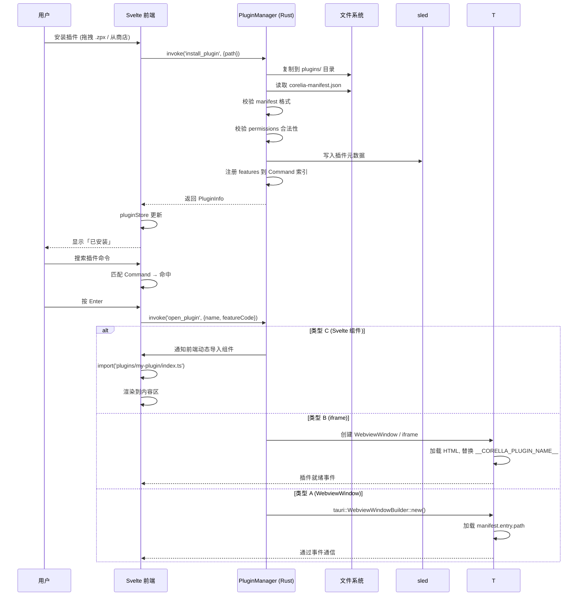

# Corelia 插件系统 API 设计规格说明书

> **基于 ZTools 插件架构分析** | 目标: Tauri 2.x + Svelte 5
> **设计原则:** 零 preload、安全隔离、向前兼容、最小 API 面
> **日期:** 2026-05-30

---

## 1. 架构概述

### 1.1 ZTools vs Corelia 插件架构对比

| 维度 | ZTools (Electron) | Corelia (Tauri) | 改进 |
|------|------------------|----------------|------|
| 插件容器 | WebContentsView (内嵌主窗口) | WebviewWindow (独立) / iframe (内嵌) / Svelte 组件 | 三种模式按需选择 |
| API 注入 | `resources/preload.js` → `window.ztools.*` | `window.__TAURI__.core.invoke()` → Rust `#[tauri::command]` | 消除 preload 层 |
| IPC 路由 | `plugin.api` 单一通道 + dispatcher | 每个 API 独立 `#[tauri::command]` | 编译器自动路由 |
| 数据隔离 | key prefix `PLUGIN/{name}/` | sled `open_tree("plugin_{name}")` | 原生 Tree 级隔离 |
| 权限控制 | 无——preload 有全部能力 | Tauri `capabilities/default.json` + 自定义权限 | 细粒度权限 |
| 插件发现 | 文件系统扫描 + package.json | 文件系统扫描 + manifest.json | 格式升级 |

### 1.2 插件类型

Corelia 支持三种插件实现方式，按推荐优先级排列：

```
类型 C: Svelte 组件插件 ──── 性能最优, 功能受限
    ↑ 推荐内置插件 (设置/剪贴板/计算器)
    
类型 B: iframe 内嵌插件 ──── 简单 HTML/JS, 零窗口开销
    ↑ 推荐简单第三方插件 (备忘录/颜色选择器)
    
类型 A: WebviewWindow 插件 ─── 功能完整, 可 detach 独立
    ↑ 推荐复杂第三方插件 (翻译/图片处理)
```

#### 类型 C: Svelte 组件插件

插件以 Svelte 5 组件 + TypeScript 模块的形式注册到 Corelia：

```typescript
// plugins/my-plugin/index.ts
import type { PluginDefinition } from '@corelia/plugin-sdk'

export default {
  name: 'my-plugin',
  title: '我的插件',
  version: '1.0.0',
  component: () => import('./MyPlugin.svelte'),  // 动态导入
  features: [
    {
      code: 'greet',
      explain: '打招呼',
      cmds: ['hello', '你好'],
    }
  ],
} satisfies PluginDefinition
```

**优势：**
- 零窗口开销——直接渲染在主窗口内容区
- 完整访问 Corelia 的 Svelte 组件库
- 热重载支持（Vite HMR）
- TypeScript 类型安全

**限制：**
- 必须使用 Corelia 的 SDK 开发
- 无法使用任意 HTML/CSS/JS 生态
- 受主窗口安全策略限制

#### 类型 B: iframe 内嵌插件

插件是一个 HTML 页面，通过 `<iframe>` 嵌入主窗口：

```html
<!-- plugins/my-plugin/index.html -->
<!DOCTYPE html>
<html>
<head>
  <script>
    const { invoke } = window.__TAURI__.core
    
    // 调用 Rust Commands
    async function getData() {
      return await invoke('plugin_db_get', {
        pluginName: '__CORELLA_PLUGIN_NAME__',
        key: 'my-data'
      })
    }
  </script>
</head>
<body>
  <div id="app"></div>
</body>
</html>
```

**`__CORELLA_PLUGIN_NAME__` 替换机制：** 插件管理器在加载 HTML 前，通过字符串替换将占位符替换为实际插件名（通过读取 manifest.json 中的 `name` 字段）。这避免了插件需要硬编码自己的名字。

#### 类型 A: WebviewWindow 插件

插件运行在独立的 Tauri WebviewWindow 中：

```rust
// Rust: 创建插件窗口
#[tauri::command]
async fn open_plugin(app: AppHandle, plugin_name: String, feature_code: String) -> Result<(), String> {
    let manifest = app.state::<PluginManager>()
        .get_manifest(&plugin_name)
        .ok_or("Plugin not found")?;
    
    // 插件窗口默认透明、无边框
    let window = tauri::WebviewWindowBuilder::new(
        &app,
        format!("plugin-{}", plugin_name),
        tauri::WebviewUrl::App(manifest.entry_path.into()),
    )
    .title(&manifest.title)
    .inner_size(800.0, 600.0)
    .decorations(false)
    .transparent(true)
    .build()
    .map_err(|e| e.to_string())?;
    
    // 如果插件声明了默认尺寸，设置之
    if let Some((w, h)) = manifest.default_size {
        window.set_size(tauri::LogicalSize::new(w, h)).ok();
    }
    
    window.show().map_err(|e| e.to_string())?;
    Ok(())
}
```

**优势：**
- 支持任意 HTML/CSS/JS
- 可 detach 为独立窗口（用户拖拽分离）
- 与 Corelia 主进程通过 Tauri IPC 通信
- 窗口属性由 manifest.json 声明

**限制：**
- 窗口创建开销（~5ms 冷启动）
- 跨窗口通信需要通过 Rust Commands
- 无法访问 Svelte 组件上下文

---

## 2. 插件 Manifest 规范

每个插件根目录必须有 `corelia-manifest.json`：

```json
{
  "$schema": "https://corelia.app/plugin-manifest-schema.json",
  "name": "my-plugin",
  "title": "我的插件",
  "version": "1.0.0",
  "description": "插件描述",
  "author": "作者名",
  "entry": {
    "type": "svelte-component",
    "path": "./index.ts"
  },
  "features": [
    {
      "code": "greet",
      "explain": "打招呼",
      "cmds": ["hello", "你好"],
      "matchCmd": {
        "type": "text",
        "cmd": "hello"
      }
    }
  ],
  "permissions": [
    "corelia:clipboard-read",
    "corelia:clipboard-write",
    "corelia:db-read",
    "corelia:db-write",
    "corelia:shell-exec"
  ],
  "defaultSize": [800, 600],
  "logo": "./logo.png"
}
```

### 字段说明

| 字段 | 类型 | 必需 | 说明 |
|------|------|------|------|
| `name` | string | ✅ | 插件唯一标识（小写字母 + 连字符） |
| `title` | string | ✅ | 展示名 |
| `version` | string | ✅ | semver 格式 |
| `description` | string | ❌ | 简短描述 |
| `entry.type` | `"svelte-component"` / `"html"` / `"webview"` | ✅ | 插件类型 |
| `entry.path` | string | ✅ | 入口文件路径（相对于插件根目录） |
| `features` | Feature[] | ❌ | 注册的命令列表（至少 1 个） |
| `permissions` | string[] | ❌ | 申请的权限列表 |
| `defaultSize` | [number, number] | ❌ | 默认窗口尺寸（仅 webview 类型） |
| `logo` | string | ❌ | 插件图标路径 |

---

## 3. 插件 API 清单

### 3.1 数据库 API

插件数据库操作自动隔离到 `plugin_{name}` Tree：

```typescript
// 插件端调用
const { invoke } = window.__TAURI__.core

// 读
const data = await invoke('plugin_db_get', { key: 'settings' })

// 写
await invoke('plugin_db_put', { key: 'settings', value: JSON.stringify({ theme: 'dark' }) })

// 删除
await invoke('plugin_db_delete', { key: 'old-key' })

// 列出所有 key
const keys: string[] = await invoke('plugin_db_list', { prefix: 'feature/' })
```

对应的 Rust Commands：

```rust
#[tauri::command]
async fn plugin_db_get(
    app: AppHandle,
    key: String,
) -> Result<Option<String>, String> {
    let db = app.state::<CoreliaDb>();
    let plugin_name = get_calling_plugin(&app)?;  // 自动获取调用者
    let tree = db.plugin_tree(&plugin_name);
    match tree.get(key.as_bytes()) {
        Ok(Some(v)) => Ok(Some(String::from_utf8_lossy(&v).to_string())),
        Ok(None) => Ok(None),
        Err(e) => Err(e.to_string()),
    }
}

// 所有插件数据库命令签名一致：自动识别 plugin_name
```

### 3.2 剪贴板 API

```typescript
// 读剪贴板文本
const text: string = await invoke('plugin_clipboard_read_text')

// 写剪贴板文本
await invoke('plugin_clipboard_write_text', { text: 'hello' })

// 读剪贴板图片 (返回 base64)
const imageBase64: string = await invoke('plugin_clipboard_read_image')

// 监听剪贴板变化
import { listen } from '@tauri-apps/api/event'
const unlisten = await listen('clipboard-changed', (event) => {
    const entry = event.payload as ClipboardEntry
    console.log('新剪贴板条目:', entry)
})
```

### 3.3 Shell 执行 API

```typescript
// 执行命令 (沙盒执行，不能访问系统敏感区域)
const result: ExecResult = await invoke('plugin_exec', {
    command: 'ls',
    args: ['-la', '/tmp'],
})

// result: { stdout: string, stderr: string, exitCode: number }
```

```rust
#[tauri::command]
async fn plugin_exec(
    app: AppHandle,
    command: String,
    args: Vec<String>,
) -> Result<ExecResult, String> {
    // 安全检查：禁止的命令列表
    let blocked = ["rm", "sudo", "dd", "shutdown", "reboot", "format"];
    if blocked.contains(&command.as_str()) {
        return Err(format!("Command '{}' is blocked for security", command));
    }
    
    // 执行
    let output = std::process::Command::new(&command)
        .args(&args)
        .output()
        .map_err(|e| e.to_string())?;
    
    Ok(ExecResult {
        stdout: String::from_utf8_lossy(&output.stdout).to_string(),
        stderr: String::from_utf8_lossy(&output.stderr).to_string(),
        exit_code: output.status.code().unwrap_or(-1),
    })
}
```

### 3.4 通知 API

```typescript
await invoke('plugin_show_notification', {
    title: '下载完成',
    body: '文件已保存到桌面',
})
```

### 3.5 UI 控制 API

```typescript
// 隐藏主窗口 (用完即走)
await invoke('plugin_hide_window')

// 设置搜索框占位文本 (Svelte 组件插件可用)
// (内嵌时通过 SDK 直接调用)
```

### 3.6 HTTP 请求 API

```typescript
// 插件可以通过 Corelia 发出 HTTP 请求 (避免跨域问题)
const response: HttpResponse = await invoke('plugin_http_request', {
    url: 'https://api.example.com/data',
    method: 'GET',
    headers: { 'Authorization': 'Bearer token' },
})
```

---

## 4. 权限系统

### 4.1 权限声明

插件在 `corelia-manifest.json` 中声明所需权限：

```json
{
  "permissions": [
    "corelia:clipboard-read",
    "corelia:clipboard-write",
    "corelia:db-read",
    "corelia:db-write"
  ]
}
```

### 4.2 权限列表

| 权限标识 | 允许的 API | 安全级别 |
|---------|-----------|---------|
| `corelia:db-read` | `plugin_db_get`, `plugin_db_list` | 🟢 低 |
| `corelia:db-write` | `plugin_db_put`, `plugin_db_delete` | 🟢 低 |
| `corelia:clipboard-read` | `plugin_clipboard_read_text`, `plugin_clipboard_read_image` | 🟡 中 |
| `corelia:clipboard-write` | `plugin_clipboard_write_text`, `plugin_clipboard_write_image` | 🟡 中 |
| `corelia:shell-exec` | `plugin_exec` | 🔴 高 |
| `corelia:http-request` | `plugin_http_request` | 🟢 低 |
| `corelia:notification` | `plugin_show_notification` | 🟢 低 |
| `corelia:window-control` | `plugin_hide_window`, `plugin_show_window` | 🟡 中 |

### 4.3 权限校验

```rust
// 在 Command 执行前校验权限
fn check_permission(app: &AppHandle, plugin_name: &str, permission: &str) -> Result<(), String> {
    let plugin_mgr = app.state::<PluginManager>();
    let manifest = plugin_mgr.get_manifest(plugin_name)
        .ok_or("Plugin not found")?;
    
    if manifest.permissions.contains(&permission.to_string()) {
        Ok(())
    } else {
        Err(format!("Plugin '{}' does not have permission: {}", plugin_name, permission))
    }
}

// 用于所有插件 Commands
#[tauri::command]
async fn plugin_clipboard_read_text(app: AppHandle) -> Result<String, String> {
    let plugin_name = get_calling_plugin(&app)?;
    check_permission(&app, &plugin_name, "corelia:clipboard-read")?;
    // ... 执行读取
}
```

### 4.4 Tauri capabilities 集成

同时配置 Tauri 的原生能力限制：

```json
// src-tauri/capabilities/default.json
{
  "identifier": "default",
  "windows": ["main"],
  "permissions": [
    "core:default",
    "shell:allow-execute"
  ]
}

// 插件 WebviewWindow 使用更严格的能力配置
{
  "identifier": "plugin-window",
  "windows": ["plugin-*"],
  "permissions": [
    "core:default"
    // 没有 shell permission——除非插件 manifest 声明
  ]
}
```

---

## 5. 插件生命周期

### 5.1 状态机

```
IDLE
  → INSTALLING    (文件复制 / 依赖解析)
  → INSTALLED     (可用)
  → LOADING       (manifest 解析 / 权限校验)
  → LOADED        (注册 Command 到搜索引擎)
  → ACTIVATING    (Svelte 组件导入 / Webview 创建)
  → ACTIVE        (正常运行)
  → DEACTIVATING  (组件卸载 / Webview 关闭)
  → INACTIVE      (已禁用)
  → UNINSTALLING  (数据清理 / Tree drop)
```

### 5.2 生命周期事件

```rust
pub enum PluginLifecycleEvent {
    Installed { name: String, version: String },
    Activated { name: String },
    Deactivated { name: String, reason: String },
    Uninstalled { name: String },
    Error { name: String, error: String },
}

// 通过 Tauri Events 推送到前端
app.emit("plugin-lifecycle", PluginLifecycleEvent::Activated {
    name: "my-plugin".into(),
}).ok();
```

### 5.3 插件加载流程



---

## 6. 插件开发 SDK

### 6.1 NPM 包 (`@corelia/plugin-sdk`)

```typescript
// @corelia/plugin-sdk 提供的类型和工具
export interface PluginDefinition {
    name: string
    title: string
    version: string
    description?: string
    component?: () => Promise<{ default: any }>  // Svelte 组件
    features: Feature[]
}

export interface Feature {
    code: string
    explain: string
    cmds: string[]
    matchCmd?: MatchCmd
}

export type MatchCmd = TextCmd | RegexCmd | OverCmd | ImgCmd | FilesCmd | WindowCmd

// 数据库操作 (内部调用 invoke)
export const db = {
    get: <T>(key: string): Promise<T | null> => invoke('plugin_db_get', { key }),
    put: <T>(key: string, value: T): Promise<void> => invoke('plugin_db_put', { key, value: JSON.stringify(value) }),
    delete: (key: string): Promise<void> => invoke('plugin_db_delete', { key }),
    list: (prefix?: string): Promise<string[]> => invoke('plugin_db_list', { prefix }),
}

// 剪贴板
export const clipboard = {
    readText: (): Promise<string> => invoke('plugin_clipboard_read_text'),
    writeText: (text: string): Promise<void> => invoke('plugin_clipboard_write_text', { text }),
}

// 通知
export const notification = {
    show: (title: string, body?: string): Promise<void> => invoke('plugin_show_notification', { title, body }),
}

// Shell (需要权限)
export const shell = {
    exec: (command: string, args?: string[]): Promise<ExecResult> => invoke('plugin_exec', { command, args }),
}
```

### 6.2 模板项目

```
plugin-template/
├── corelia-manifest.json
├── index.ts              # 插件入口 (export default PluginDefinition)
├── src/
│   ├── App.svelte        # UI 组件 (类型 C)
│   └── service.ts        # 业务逻辑
├── package.json
└── tsconfig.json
```

---

## 7. 与 ZTools 插件兼容层

Corelia 可以提供一个兼容层，允许 ZTools/uTools 插件有限度地运行：

```javascript
// plugins-legacy/compat-layer.js
// 在插件 Webview 中注入的兼容层，模拟 ztools.* API

const { invoke } = window.__TAURI__.core
const pluginName = '__CORELLA_PLUGIN_NAME__'

window.ztools = {
    // 数据库 (映射到 Corelia 的插件命名空间)
    db: {
        get: (key) => invoke('plugin_db_get', { key }),
        put: (key, value) => invoke('plugin_db_put', { key, value }),
        delete: (key) => invoke('plugin_db_delete', { key }),
    },
    // 剪贴板
    clipboard: {
        readText: () => invoke('plugin_clipboard_read_text'),
        writeText: (text) => invoke('plugin_clipboard_write_text', { text }),
    },
    // 通知
    showNotification: (title, body) => invoke('plugin_show_notification', { title, body }),
    hideWindow: () => invoke('plugin_hide_window'),
    // 有限兼容——仅实现 ZTools API 的子集
}
```

**兼容级别：约 60%。** 无法兼容的 API 包括：`ztools.browser` (ZBrowser)、`ztools.mcp` (MCP Server 服务端)、部分原生 UI 操作。兼容层仅供迁移过渡期使用，不推荐新插件依赖。

---

## 8. 技术决策记录

| 决策 | 选项 | 选择 | 理由 |
|------|------|------|------|
| 插件容器方案 | WebviewWindow / iframe / Svelte 组件 | **三轨并行** | 不同场景不同最优解 |
| API 暴露方式 | `window.__TAURI__` / custom preload | **`window.__TAURI__.core.invoke()`** | 零额外构建步骤 |
| IPC 路由 | 单一通道 + dispatcher / 多 Command | **多 `#[tauri::command]`** | 编译器自动路由，类型安全 |
| 权限模型 | 自实现 / Tauri capabilities | **自实现 + capabilities 双重** | 插件级 + 窗口级双层防护 |
| 插件发现 | 文件系统扫描 / 注册表 | **文件系统扫描** | 简单可靠，用户可直接复制插件目录 |
| 兼容层 | 内置 / 可选 SDK | **可选 SDK 方式** | 不增加核心复杂度 |
| 数据隔离 | key prefix / Tree / Database | **sled Tree** | 原生级隔离，删除干净 |
