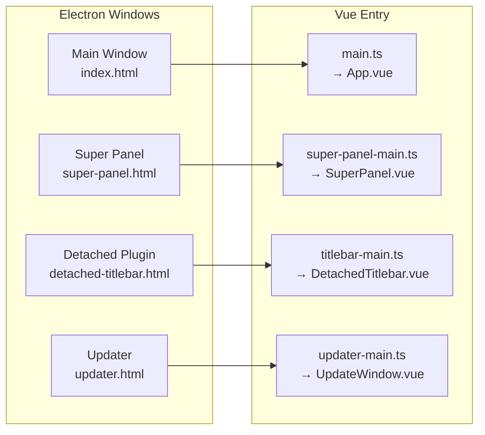

# ZTools UI 层深度架构分析 —— 从 Vue 3 到 Svelte 5 的迁移蓝图

> **分析范围:** `src/renderer/src/` 全部 31 个文件，约 13,236 行
> **分析维度:** 组件结构、状态管理、通信模式、主题、键盘导航、搜索交互
> **目标:** 为 Corelia (Tauri + Svelte 5) 提供逐组件迁移方案

---

## 目录

1. [UI 架构总览](#1-ui-架构总览)
2. [入口与窗口系统](#2-入口与窗口系统)
3. [状态管理层（Pinia → Svelte Runes）](#3-状态管理层pinia--svelte-runes)
4. [搜索交互层](#4-搜索交互层)
5. [超级面板（SuperPanel）](#5-超级面板superpanel)
6. [公共组件体系](#6-公共组件体系)
7. [主题系统](#7-主题系统)
8. [通信模式分析](#8-通信模式分析)
9. [逐组件迁移映射表](#9-逐组件迁移映射表)
10. [Svelte 5 迁移关键技术点](#10-svelte-5-迁移关键技术点)

---

## 1. UI 架构总览

### 1.1 多入口架构

ZTools 不是单页面应用——它有 **4 个独立的入口点**，每个是一个完整的 Vue 应用实例：



| 入口 | 窗口类型 | Pinia | IPC 方式 | 行数 |
|------|---------|-------|---------|------|
| Main Window | 主搜索窗口 | ✅ `commandDataStore` + `windowStore` | `window.ztools.*` | ~5,500 |
| Super Panel | 透明浮动面板 | ❌ 无 | `window.ztools.*` 直调 | 1,750 |
| Detached Titlebar | 插件分离窗口标题栏 | ❌ 无 | `window.electron.ipcRenderer` 遗留 | 852 |
| Updater | 更新弹窗 | ❌ 无 | `window.electron.ipcRenderer` 遗留 | 363 |

**Corelia 映射：** Svelte 5 同样支持多入口——`App.svelte` 主入口 + `super-panel.html` 独立入口。每个入口独立 `mount()`，不共享上下文。

### 1.2 组件树（主窗口）

```
App.vue (1067 行) — 根组件，全局键盘监听
├── SearchBox.vue (1694 行) — 搜索输入框 + 拖拽 + 粘贴 + 插件标签
│   ├── AdaptiveIcon.vue (178 行) — 懒加载图标
│   └── UpdateIcon.vue (37 行) — 更新徽章图标
│
└── SearchResults.vue (1095 行) — 搜索结果容器
    ├── AggregateView.vue (238 行) — 聚合视图
    │   ├── CollapsibleList.vue (169 行) — 可折叠列表
    │   │   └── CommandList.vue (359 行) — 网格命令列表
    │   ├── MainPushList.vue (223 行) — 插件动态搜索结果
    │   └── VerticalList.vue (171 行) — 垂直结果列表
    ├── VerticalList.vue — 列表模式直接使用
    └── DetailPanel.vue (139 行) — 详情面板容器
```

### 1.3 Corelia 建议的组件树

```
App.svelte
├── SearchBox.svelte
│   └── AdaptiveIcon.svelte
│
├── SearchResults.svelte
│   ├── AggregateView.svelte
│   │   ├── CollapsibleList.svelte
│   │   │   └── CommandGrid.svelte  (重命名自 CommandList)
│   │   ├── MainPushList.svelte
│   │   └── VerticalList.svelte
│   ├── VerticalList.svelte
│   └── DetailPanel.svelte
│
├── PluginView.svelte  (新增—解耦 App.vue 的插件渲染)
│   └── (动态 Svelte 组件或 iframe)
│
└── SuperPanel.svelte  (独立入口)
    └── SuperPanelGrid.svelte  (抽离网格逻辑)
```

---

## 2. 入口与窗口系统

### 2.1 ZTools 的入口文件

#### `src/renderer/src/main.ts` (27 行)

```typescript
import { createApp, ref } from 'vue'
import { createPinia } from 'pinia'
import App from './App.vue'

const app = createApp(App)
app.use(createPinia())
app.mount('#app')

// 操作系统检测
const os = navigator.userAgent.includes('Mac') ? 'mac' : 'windows'
document.documentElement.classList.add(`os-${os}`)
```

#### Corelia Svelte 5 等价

```typescript
// src/main.ts
import { mount } from 'svelte'
import App from './App.svelte'

const app = mount(App, { target: document.getElementById('app')! })

// 操作系统检测（Svelte 中通过 $effect 或 onMount 处理）
const os = navigator.userAgent.includes('Mac') ? 'mac' : 'windows'
document.documentElement.classList.add(`os-${os}`)
```

**关键差异：** Svelte 5 没有 `createApp` / `use()` 的概念。`mount()` 直接挂载组件，不需要 Pinia 注册——Svelte 的 `$state` 在模块级别声明，无需 Provider 注入。

#### 多入口映射

| ZTools | Svelte 5 等价 |
|--------|-------------|
| `createApp(App).use(Pinia).mount('#app')` | `mount(App, { target })` |
| `createApp(SuperPanel).mount('#super-panel-app')` | `mount(SuperPanel, { target })` |
| `app.config.warnHandler` | `onMount` 中的 try-catch |
| Pinia 全局状态 | 模块级 `$state` 单例 |

### 2.2 App.vue 的关键结构 (1067 行)

```vue
<!-- ZTools App.vue 的模板骨架 -->
<template>
  <div class="app-container" :class="{ 'has-plugin': currentView === ViewMode.Plugin }">
    <SearchBox
      ref="searchBoxRef"
      v-model="searchQuery"
      :pasted-image="pastedImageData"
      :pasted-files="pastedFilesData"
      :pasted-text="pastedTextData"
      :current-view="currentView"
      @arrow-keydown="handleArrowKeydown"
      @close-plugin="handlePluginStepExit"
    />
    <SearchResults
      v-if="currentView === ViewMode.Search"
      ref="searchResultsRef"
      :search-query="searchQuery"
      :pasted-image="pastedImageData"
      :pasted-files="pastedFilesData"
      :pasted-text="pastedTextData"
      @height-changed="updateWindowHeight"
      @focus-input="searchBoxRef?.focus()"
      @restore-match="restoreMatch"
    />
    <div v-if="currentView === ViewMode.Plugin" class="plugin-container">
      <!-- 插件内容由主进程管理 -->
    </div>
  </div>
</template>
```

**Corelia Svelte 5 等价：**

```svelte
<!-- src/App.svelte -->
<script lang="ts">
  import SearchBox from '$lib/components/search/SearchBox.svelte'
  import SearchResults from '$lib/components/search/SearchResults.svelte'
  import PluginView from '$lib/components/PluginView.svelte'
  import { commandStore } from '$lib/stores/commandStore.svelte.ts'
  import { windowStore } from '$lib/stores/windowStore.svelte.ts'

  let searchBoxRef: SearchBox
  let searchQuery = $state('')
  let pastedImageData = $state<string | null>(null)
  let pastedFilesData = $state<FileItem[] | null>(null)
  let pastedTextData = $state<string | null>(null)

  let currentView = $derived(windowStore.currentView)

  function updateWindowHeight() {
    const el = document.querySelector('.app-container')
    if (el) {
      invoke('resize_window', { height: el.scrollHeight })
    }
  }

  // 插件步骤退出: 3 级回退
  function handlePluginStepExit() {
    if (searchQuery) { searchQuery = ''; return }
    if (pastedTextData) { pastedTextData = null; return }
    windowStore.setCurrentView('search')
  }
</script>

<div class="app-container" class:has-plugin={currentView === 'plugin'}>
  <SearchBox
    bind:this={searchBoxRef}
    bind:searchQuery
    bind:pastedImage={pastedImageData}
    bind:pastedFiles={pastedFilesData}
    bind:pastedText={pastedTextData}
    {currentView}
    onarrowkeydown={handleArrowKeydown}
    oncloseplugin={handlePluginStepExit}
  />
  {#if currentView === 'search'}
    <SearchResults
      {searchQuery}
      {pastedImage=pastedImageData}
      {pastedFiles=pastedFilesData}
      {pastedText=pastedTextData}
      onheightchanged={updateWindowHeight}
      onfocusinput={() => searchBoxRef?.focus()}
    />
  {:else if currentView === 'plugin'}
    <div class="plugin-container">
      <PluginView />
    </div>
  {/if}
</div>
```

**关键差异（Vue 3 → Svelte 5）：**

| 模式 | Vue 3 | Svelte 5 |
|------|-------|----------|
| 双向绑定 | `v-model="x"` + `@update:model-value` | `bind:x` |
| 条件渲染 | `v-if="condition"` | `{#if condition}` |
| 引用 | `ref="compRef"` + `defineExpose()` | `bind:this={compRef}` |
| 事件 | `@event="handler"` + `defineEmits()` | `onevent={handler}` + 回调 props |
| 类名 | `:class="{ active: bool }"` | `class:active={bool}` |
| 枚举 | `enum ViewMode { Search, Plugin }` | TypeScript `union type` |

---

## 3. 状态管理层（Pinia → Svelte Runes）

### 3.1 ZTools 的 Pinia Store 架构

```
src/renderer/src/stores/
├── commandDataStore.ts    (1693 行) — 搜索核心：指令、历史、固定、Fuse索引
├── windowStore.ts          (650 行) — 窗口状态：主题、插件、UI 配置
└── commandUtils.ts        (115 行) — 纯函数工具
```

#### commandDataStore.ts 结构

```typescript
// Pinia Setup Store 语法
export const useCommandDataStore = defineStore('commandData', () => {
  // === State (ref) ===
  const history = ref<HistoryItem[]>([])
  const pinnedCommands = ref<Command[]>([])
  const commands = ref<Command[]>([])
  const fuse = ref<Fuse<Command> | null>(null)
  const loading = ref(false)
  // ... 15+ state fields

  // === Computed (computed) ===
  const recentCommands = computed(() => { /* ... */ })

  // === Methods ===
  async function initializeData() { /* ... */ }
  async function loadCommands() { /* ... */ }
  function search(query: string, commandList?: Command[]): SearchResult[] { /* ... */ }

  return { history, pinnedCommands, commands, fuse, loading, ... }
})
```

#### windowStore.ts 结构

```typescript
export const useWindowStore = defineStore('window', () => {
  // 22 个 state ref:
  const placeholder = ref('搜索应用和指令 / 粘贴文件或图片')
  const avatar = ref(defaultAvatar)
  const theme = ref('system')
  const primaryColor = ref('blue')
  const searchMode = ref<'aggregate' | 'list'>('aggregate')
  const currentPlugin = ref<PluginInfo | null>(null)
  // ...

  // 方法: loadSettings, updatePrimaryColor, applyCustomColor, ...

  return { placeholder, avatar, theme, primaryColor, ... }
})
```

### 3.2 Corelia Svelte 5 Runes 等价

```typescript
// src/lib/stores/commandStore.svelte.ts
// 模块级 $state 单例——不需要 createPinia / defineStore

export function createCommandStore() {
  // === State ($state 替代 ref) ===
  let history = $state<HistoryItem[]>([])
  let pinnedCommands = $state<Command[]>([])
  let commands = $state<Command[]>([])
  let fuse: Fuse<Command> | null = $state(null)
  let loading = $state(false)

  // === Derived ($derived 替代 computed) ===
  let recentCommands = $derived(/* ... */)

  // === Methods ===
  async function initializeData() { /* ... */ }
  async function loadCommands() { /* ... */ }
  function search(query: string): SearchResult[] { /* ... */ }

  return {
    get history() { return history },
    set history(v) { history = v },
    get commands() { return commands },
    get loading() { return loading },
    recentCommands,
    initializeData,
    loadCommands,
    search,
  }
}

export const commandStore = createCommandStore()
```

### 3.3 Pinia → Svelte Runes 映射表

| Pinia 模式 | Vue 3 代码 | Svelte 5 等价 |
|-----------|-----------|-------------|
| Store 定义 | `defineStore('id', () => {...})` | 模块级工厂函数 |
| 响应式状态 | `const x = ref(val)` | `let x = $state(val)` |
| 派生状态 | `const y = computed(() => x.value * 2)` | `let y = $derived(x * 2)` |
| 副作用 | `watch(x, (v) => {...})` | `$effect(() => { ... x ... })` |
| 精确跟踪 | `watch(x, cb, { deep: true })` | `$effect(() => { JSON.stringify(x); })` |
| 生命周期 | `onMounted(() => {...})` | `onMount(() => {...})` |
| 类型 | `defineStore` 自动推断 | 明确返回值类型 |
| 解构 | `storeToRefs(store)` | 直接解构 getter |
| 嵌套路径 | `const a = computed(() => store.x.y)` | `let a = $derived(store.x.y)` |
| 组件使用 | `const store = useXStore()` | `import { store } from './store'` |
| 异步初始化 | `onMounted(init)` | `onMount(init)` 或 `$effect` |

### 3.4 复杂 Vue 3 模式的 Svelte 5 等价

**模式 1：computed get/set（v-model 兼容）**

```vue
<!-- Vue 3 -->
<script setup>
const firstName = ref('')
const lastName = ref('')
const fullName = computed({
  get: () => `${firstName.value} ${lastName.value}`,
  set: (v) => { [firstName.value, lastName.value] = v.split(' ') }
})
</script>
```

```svelte
<!-- Svelte 5 -->
<script lang="ts">
let firstName = $state('')
let lastName = $state('')

// $derived 是只读的——需要手动 setter
let fullName = $derived(`${firstName} ${lastName}`)

function setFullName(v: string) {
  [firstName, lastName] = v.split(' ')
}
</script>
```

**模式 2：watch 多源 + deep**

```vue
<!-- Vue 3 -->
watch(
  [searchQuery, pastedImage, pastedFiles, pastedText],
  ([q, img, files, text]) => {
    commandDataStore.search(q)
  },
  { deep: true }
)
```

```svelte
<!-- Svelte 5 -->
$effect(() => {
  // 访问这些值会自动建立依赖追踪
  const q = searchQuery
  const img = pastedImage
  const files = pastedFiles
  const text = pastedText
  
  commandStore.search(q)
})
```

**模式 3：storeToRefs 解构**

```vue
<!-- Vue 3 -->
<script setup>
import { storeToRefs } from 'pinia'
const store = useCommandDataStore()
const { commands, loading, fuse } = storeToRefs(store)
</script>
```

```svelte
<!-- Svelte 5 — 不需要解构，直接导入单例 -->
<script lang="ts">
import { commandStore } from '$lib/stores/commandStore.svelte.ts'
// 直接使用 commandStore.commands
// 如果你想要解构：
let { commands, loading } = commandStore
</script>
```

---

## 4. 搜索交互层

### 4.1 SearchBox.vue (1694 行) — 最复杂的组件

**功能清单与迁移方案：**

| 功能 | Vue 3 实现 | Svelte 5 实现 | 复杂度 |
|------|-----------|-------------|--------|
| 搜索输入 | `v-model="modelValue"` + emit | `bind:value` + `oninput` | 🟢 简单 |
| IME 合成 | `@compositionstart/end` | 同 `oncompositionstart/end` | 🟢 简单 |
| 窗口拖拽 | `mousedown` → `window.ztools.setWindowPosition()` | 同逻辑，`onmousedown` | 🟢 直接移植 |
| 动态输入宽度 | `.measure-text` span + ResizeObserver | 同方案 | 🟢 直接移植 |
| 粘贴处理 | `@paste` → ClipboardEvent → `window.ztools.getLastCopiedContent()` | 同逻辑，`onpaste` | 🟢 直接移植 |
| 拖放文件 | `@dragenter/over/leave/drop` + dragCounter | 同逻辑 | 🟢 直接移植 |
| 插件标签 | `currentView === 'plugin'` 时显示 | `{#if currentView === 'plugin'}` | 🟢 简单 |
| 上下文菜单 | `window.ztools.showContextMenu()` | 同 Rust Command | 🟢 直接移植 |
| AI 动画 | CSS `@keyframes` + class 切换 | 同 CSS 方案 | 🟢 直接移植 |
| 自适应图标 | `IntersectionObserver` + 暗色模式反转 | 同方案 | 🟢 直接移植 |

**拖拽实现细节（需注意的迁移点）：**

ZTools 的窗口拖拽是一个**内联 composable**（在 SearchBox.vue 内部定义），不是单独的文件：

```typescript
// Vue 3 — 内联拖拽
const useDrag = () => {
  const isDragging = ref(false)
  const dragStart = ref({ x: 0, y: 0 })
  const windowStart = ref({ x: 0, y: 0 })
  const dragReady = ref(false)

  const onDragStart = async (e: MouseEvent) => {
    isDragging.value = true
    dragStart.value = { x: e.screenX, y: e.screenY }
    const pos = await window.ztools.getWindowPosition()
    windowStart.value = { x: pos.x, y: pos.y }
  }
  // ...
}
```

```svelte
<!-- Svelte 5 — 同样内联或抽取 composable -->
<script lang="ts">
function useDrag() {
  let isDragging = $state(false)
  let dragStart = $state({ x: 0, y: 0 })
  let windowStart = $state({ x: 0, y: 0 })
  let dragReady = $state(false)

  async function onDragStart(e: MouseEvent) {
    isDragging = true
    dragStart = { x: e.screenX, y: e.screenY }
    const pos = await invoke('get_window_position')
    windowStart = { x: pos.x, y: pos.y }
  }
  // ...
  return { isDragging, onDragStart, onDragMove, onDragEnd }
}
</script>
```

### 4.2 SearchResults.vue (1095 行) — 搜索结果容器

**核心逻辑：视图模式切换**

```vue
<!-- Vue 3 — 根据 searchMode 切换视图 -->
<div class="search-results">
  <AggregateView v-if="searchMode === 'aggregate'" ... />
  <VerticalList v-else ... />
</div>
```

```svelte
<!-- Svelte 5 -->
<div class="search-results">
  {#if searchMode === 'aggregate'}
    <AggregateView ... />
  {:else}
    <VerticalList ... />
  {/if}
</div>
```

**关键迁移点：vuedraggable → svelte-dnd-action**

ZTools 使用 `vuedraggable`（基于 SortableJS）实现命令列表拖拽排序。Svelte 生态中推荐：

```bash
bun add svelte-dnd-action
```

```svelte
<!-- Svelte 5 拖拽排序 -->
<script lang="ts">
import { dndzone } from 'svelte-dnd-action'
import { flip } from 'svelte/animate'

let items = $state([...])

function handleSort(e: CustomEvent) {
  items = e.detail.items
}
</script>

<div use:dndzone={{ items }} on:consider={handleSort} on:finalize={handleSort}>
  {#each items as item (item.id)}
    <div animate:flip>{item.name}</div>
  {/each}
</div>
```

### 4.3 聚合视图 (AggregateView.vue + CollapsibleList.vue)

**聚合视图的 7 个区域：**

```
┌─ 📌 已固定 (CollapsibleList) ─────────────────┐
│  CommandGrid: 9列网格, 可拖拽排序                │
├─ 🕐 最近使用 (CollapsibleList) ────────────────┤
│  CommandGrid: 9列网格, 默认折叠/展开              │
├─ 🔍 最佳搜索结果 (CollapsibleList) ─────────────┤
│  CommandGrid: 搜索结果高亮                       │
├─ ✨ 最佳匹配 (CollapsibleList) ─────────────────┤
│  CommandGrid: 模糊匹配结果                       │
├─ 🎯 匹配推荐 (CollapsibleList) ─────────────────┤
│  CommandGrid: 推荐功能                           │
├─ 🪟 匹配窗口 (单行) ───────────────────────────┤
│  VerticalList: 当前窗口匹配                      │
├─ 🔌 插件动态搜索 (MainPushList × N) ────────────┤
│  插件实时动态结果                                │
└─────────────────────────────────────────────────┘
```

**折叠逻辑（CollapsibleList）：**

```typescript
// Vue 3 — 计算可见项数量
const defaultVisibleCount = computed(() => {
  if (typeof itemsPerRow === 'number' && typeof defaultVisibleRows === 'number') {
    return itemsPerRow * defaultVisibleRows
  }
  return items.value.length
})

// 折叠时只显示 defaultVisibleCount 项
const visibleItems = computed(() =>
  isExpanded.value ? items.value : items.value.slice(0, defaultVisibleCount)
)
```

```typescript
// Svelte 5 — 等价逻辑
let isExpanded = $state(false)
let defaultVisibleCount = $derived(
  typeof itemsPerRow === 'number' && typeof defaultVisibleRows === 'number'
    ? itemsPerRow * defaultVisibleRows
    : items.length
)
let visibleItems = $derived(
  isExpanded ? items : items.slice(0, defaultVisibleCount)
)
```

### 4.4 键盘导航系统 (useNavigation.ts, 224 行)

ZTools 实现了复杂的键盘导航——两种模式（聚合/列表）各有一套焦点管理逻辑：

| 模式 | 方向键 | Tab | Enter |
|------|--------|-----|-------|
| 聚合 | 上下左右在网格中移动 | 区域间跳转 | 选中/启动 |
| 列表 | 上下移动，行尾自动换行 | 区域循环 | 选中/启动 |

```typescript
// Vue 3 composable
export function useNavigation(mode: Ref<'aggregate' | 'list'>, navigationGrid: Ref<GridSection[]>) {
  const selectedRow = ref(0)
  const selectedCol = ref(0)

  function handleKeydown(e: KeyboardEvent) {
    if (mode.value === 'list') {
      if (e.key === 'ArrowDown') selectedRow.value++
      if (e.key === 'ArrowUp') selectedRow.value = Math.max(0, selectedRow.value - 1)
    } else {
      // 聚合模式: 在网格中上下左右
      switch(e.key) {
        case 'ArrowRight': selectedCol.value++; break
        case 'ArrowLeft': selectedCol.value = Math.max(0, selectedCol.value - 1); break
        case 'ArrowDown': selectedRow.value++; selectedCol.value = 0; break
        case 'ArrowUp': selectedRow.value = Math.max(0, selectedRow.value - 1); break
      }
    }
  }

  return { selectedRow, selectedCol, handleKeydown, resetSelection: () => { ... } }
}
```

```typescript
// Svelte 5 composable — $state 替代 ref
export function useNavigation() {
  let mode = $state<'aggregate' | 'list'>('aggregate')
  let selectedRow = $state(0)
  let selectedCol = $state(0)

  function handleKeydown(e: KeyboardEvent) {
    if (mode === 'list') {
      if (e.key === 'ArrowDown') selectedRow++
      if (e.key === 'ArrowUp') selectedRow = Math.max(0, selectedRow - 1)
    } else {
      switch(e.key) {
        case 'ArrowRight': selectedCol++; break
        case 'ArrowLeft': selectedCol = Math.max(0, selectedCol - 1); break
        case 'ArrowDown': selectedRow++; selectedCol = 0; break
        case 'ArrowUp': selectedRow = Math.max(0, selectedRow - 1); break
      }
    }
  }

  return {
    get mode() { return mode },
    set mode(v) { mode = v },
    get selectedRow() { return selectedRow },
    get selectedCol() { return selectedCol },
    handleKeydown,
    reset: () => { selectedRow = 0; selectedCol = 0 },
  }
}
```

### 4.5 搜索管道 (commandDataStore.ts + useSearchResults.ts)

ZTools 的搜索管道是分层的：

```
用户输入 "sj"
  → commandDataStore.search("sj")
    → Fuse.js 模糊匹配 name 字段
    → 若未命中，pinyin-pro 计算拼音全文
    → Fuse.js 再次匹配拼音全文
    → 拼写缩写精确匹配
    → 按匹配类型加权排序
  → useSearchResults 包装结果
    → 分类：bestSearchResults / bestMatches / recommendations / allListModeResults
    → deduplicateResults: 按 path:featureCode 去重
    → 按使用频率加权排序
```

**核心搜索函数迁移：**

```typescript
// commandDataStore.ts — Vue 3 (片段)
function search(query: string): SearchResult[] {
  if (!fuse.value || !query.trim()) return []

  // 第1层: Fuse 模糊匹配
  let fuseResults = fuse.value.search(query)

  // 第2层: 拼音匹配
  if (fuseResults.length === 0) {
    const pinyinFull = pinyin(query, { toneType: 'none' })
    fuseResults = fuse.value.search(pinyinFull)
  }

  // 第3层: 缩写匹配
  if (fuseResults.length === 0) {
    fuseResults = fuse.value.search(pinyinAbbr(query))
  }

  // 加权排序
  return fuseResults
    .map(r => ({ ...r.item, score: calculateMatchScore(r.item.name, query, r.matches) }))
    .sort((a, b) => b.score - a.score)
}
```

```typescript
// commandStore.svelte.ts — Svelte 5（逻辑完全移植）
function search(query: string): SearchResult[] {
  if (!fuse || !query.trim()) return []

  let fuseResults = fuse.search(query)
  if (fuseResults.length === 0) {
    fuseResults = fuse.search(pinyin(query, { toneType: 'none' }))
  }
  if (fuseResults.length === 0) {
    fuseResults = fuse.search(pinyinAbbr(query))
  }

  return fuseResults
    .map(r => ({ ...r.item, score: calculateMatchScore(r.item.name, query, r.matches) }))
    .sort((a, b) => b.score - a.score)
}
```

**搜索管道的 Svelte 5 响应式集成：**

```svelte
<!-- SearchResults.svelte — 监听搜索查询变化 -->
<script lang="ts">
let searchQuery = $state('')
let searchResults = $derived.by(() => {
  if (!searchQuery.trim()) return []
  return commandStore.search(searchQuery)
})
</script>
```

---

## 5. 超级面板（SuperPanel）

### 5.1 架构差异

| 维度 | ZTools (Electron) | Corelia (Tauri) |
|------|------------------|----------------|
| 窗口类型 | 独立透明 `BrowserWindow` | 独立透明 `WebviewWindow` |
| 框架 | 独立 Vue 实例（无 Pinia） | 独立 Svelte mount |
| 通信 | `window.ztools.onSuperPanelData()` | Tauri Events + invoke |
| 位置 | 鼠标位置附近 | 同——通过 Rust 计算 |
| 拖拽排序 | `vuedraggable` | `svelte-dnd-action` |

### 5.2 ZTools 超级面板的 3 种模式

```
mode: 'pinned'      → 固定项目网格 (3列)
mode: 'search'      → 搜索结果列表 (1列)
mode: 'loading'     → 加载中 (旋转动画)
```

### 5.3 核心状态

```typescript
// Vue 3 SuperPanel.vue — 无 Pinia, 所有状态在组件内
const mode = ref<'pinned' | 'search' | 'loading'>('pinned')
const pinnedCommands = ref<GridItem[]>([])
const searchResults = ref<CommandItem[]>([])
const selectedIndex = ref(0)
const iconErrors = ref(new Set<string>())

// 文件夹系统
const showFolderPopup = ref(false)
const currentFolder = ref<FolderItem | null>(null)
const isRenamingFolder = ref(false)

// 窗口匹配
const showWindowMatch = ref(false)
const windowMatchResults = ref<WindowMatchItem[]>([])
```

### 5.4 Svelte 5 等价

```svelte
<!-- SuperPanel.svelte — 独立入口 -->
<script lang="ts">
type SuperPanelMode = 'pinned' | 'search' | 'loading'

let mode = $state<SuperPanelMode>('pinned')
let pinnedCommands = $state<GridItem[]>([])
let searchResults = $state<CommandItem[]>([])
let selectedIndex = $state(0)
let iconErrors = $state(new Set<string>())

// 文件夹系统
let showFolderPopup = $state(false)
let currentFolder = $state<FolderItem | null>(null)
let isRenamingFolder = $state(false)

// 窗口匹配
let showWindowMatch = $state(false)
let windowMatchResults = $state<WindowMatchItem[]>([])
</script>

<div class="super-panel" class:has-folder={showFolderPopup}>
  {#if mode === 'loading'}
    <div class="loading-spinner" />
  {:else if mode === 'pinned'}
    <!-- 3 列网格 -->
    <div class="grid-3">
      {#each pinnedCommands as item}
        <button class="grid-item" onclick={() => launchItem(item)}>
          <AdaptiveIcon src={item.logo} />
          <span>{item.name}</span>
        </button>
      {/each}
    </div>
  {:else if mode === 'search'}
    <div class="vertical-list">
      {#each searchResults as result, i}
        <button
          class="result-item"
          class:selected={i === selectedIndex}
          onclick={() => launchItem(result)}
        >
          <AdaptiveIcon src={result.logo} />
          <div class="result-text">
            <span>{@html result.highlightedName}</span>
            <small>{result.explain}</small>
          </div>
        </button>
      {/each}
    </div>
  {/if}

  <!-- 文件夹弹窗 -->
  {#if showFolderPopup && currentFolder}
    <div class="folder-popup" transition:slide-up>
      <div class="folder-header">
        <input bind:value={currentFolder.name} />
        <button onclick={closeFolderPopup}>✕</button>
      </div>
      <div class="folder-items">
        {#each currentFolder.items as item}
          <button onclick={() => launchFromFolder(item)}>{item.name}</button>
        {/each}
      </div>
    </div>
  {/if}
</div>
```

### 5.5 超级面板通信方式

ZTools 的超级面板通过 `window.ztools.onSuperPanelData()` 接收数据——主进程推送。Corelia 使用 Tauri Events：

```typescript
// Svelte 超级面板: 监听 Rust 推送事件
import { listen } from '@tauri-apps/api/event'
import { onMount } from 'svelte'

onMount(() => {
  const unlistenData = listen('super-panel-data', (event) => {
    const data = event.payload as SuperPanelData
    pinnedCommands = data.pinned
  })

  const unlistenSearch = listen('super-panel-search', (event) => {
    searchResults = event.payload as CommandItem[]
    mode = 'search'
  })

  // 通知 Rust: 面板已就绪
  invoke('super_panel_ready')

  return () => {
    unlistenData.then(fn => fn())
    unlistenSearch.then(fn => fn())
  }
})
```

---

## 6. 公共组件体系

### 6.1 CommandList.vue → CommandGrid.svelte (359 行)

ZTools 的 CommandList 是一个 9 列网格布局的命令展示组件。它的功能：

| 功能 | 实现方式 | Svelte 5 |
|------|---------|----------|
| 网格布局 | `display: grid; grid-template-columns: repeat(9, 1fr)` | ✅ 相同 CSS |
| 图标 | `AdaptiveIcon` 子组件 | ✅ 子组件 |
| 高亮 | `v-html="getHighlightedName(item)"` | `{@html getHighlightedName(item)}` |
| 拖拽排序 | `vuedraggable` | `use:dndzone` (svelte-dnd-action) |
| DEV 徽章 | `v-if="item.isDev"` | `{#if item.isDev}` |
| 右键菜单 | `@contextmenu.prevent="showMenu($event, item)"` | `oncontextmenu|preventDefault={...}` |
| 自动滚动 | `watch(selectedIndex) → scrollToIndex()` | `$effect → scrollToIndex()` |

### 6.2 AdaptiveIcon.vue (178 行) — 懒加载图标

```vue
<!-- Vue 3 — IntersectionObserver 懒加载 -->
<script setup lang="ts">
const imgRef = ref<HTMLImageElement>()
const displaySrc = ref(DEFAULT_TRANSPARENT_PIXEL)

onMounted(() => {
  const observer = new IntersectionObserver(([entry]) => {
    if (entry.isIntersecting) {
      displaySrc.value = props.src  // 进入视口才加载
      observer.disconnect()
    }
  })
  observer.observe(imgRef.value!)
})
</script>
```

```svelte
<!-- Svelte 5 — IntersectionObserver 同样可用 -->
<script lang="ts">
let imgRef: HTMLImageElement
let displaySrc = $state(DEFAULT_TRANSPARENT_PIXEL)

onMount(() => {
  const observer = new IntersectionObserver(([entry]) => {
    if (entry.isIntersecting) {
      displaySrc = src
      observer.disconnect()
    }
  })
  observer.observe(imgRef)
})
</script>


```

### 6.3 Icon.vue (433 行) — SVG 图标组件

ZTools 的 `Icon.vue` 使用 **Options API** + 大量 `v-if` 控制 SVG path：

```vue
<template>
  <svg viewBox="0 0 24 24">
    <path v-if="name === 'settings'" d="..." />
    <path v-else-if="name === 'search'" d="..." />
    <!-- 20+ 图标 -->
  </svg>
</template>
```

```svelte
<!-- Svelte 5 — {#if} 替代 v-if -->
<svg viewBox="0 0 24 24">
  {#if name === 'settings'}
    <path d="..." />
  {:else if name === 'search'}
    <path d="..." />
  {:else if name === 'plugin'}
    <path d="..." />
  {/if}
</svg>
```

**优化建议：** 将每个图标抽离为独立 Svelte 组件文件，按需导入：

```svelte
<!-- src/lib/components/common/icons/SearchIcon.svelte -->
<svg viewBox="0 0 24 24" {...$$props}>
  <path d="M15.5 14h-.79l-.28-.27A6.47 6.47 0 0 0 16 9.5 6.5 6.5 0 1 0 9.5 16c1.61 0 3.09-.59 4.23-1.57l.27.28v.79l5 4.99L20.49 19l-4.99-5zm-6 0C7.01 14 5 11.99 5 9.5S7.01 5 9.5 5 14 7.01 14 9.5 11.99 14 9.5 14z"/>
</svg>
```

---

## 7. 主题系统

### 7.1 ZTools 的 CSS 变量体系

```css
/* src/renderer/src/style.css (308 行) — 全局主题定义 */
:root {
  --bg-color: #ffffff;
  --text-color: #333333;
  --text-secondary: #888888;
  --border-color: #e5e5e5;
  --primary-color: #4f8cff;
  --primary-gradient: linear-gradient(135deg, #4f8cff, #6c5ce7);
  --radius: 8px;
}

/* 暗色模式 */
@media (prefers-color-scheme: dark) {
  :root {
    --bg-color: #1e1e1e;
    --text-color: #e0e0e0;
    --primary-color: #38bdf8;
  }
}

/* 主题色变体（通过 JS 切换 class） */
.theme-blue  { --primary-color: #0284c7; }
.theme-purple{ --primary-color: #7c3aed; }
.theme-green { --primary-color: #059669; }
/* ... 共 6 种 */
```

### 7.2 主题切换逻辑

```typescript
// windowStore.ts — 主题切换
function updatePrimaryColor(color: string) {
  // 移除旧的 theme 类
  document.body.className = document.body.className
    .replace(/theme-\w+/g, '').trim()
  
  // 添加新类
  if (color !== 'custom') {
    document.body.classList.add(`theme-${color}`)
  } else {
    applyCustomColor()
  }
}

function applyCustomColor(hex: string) {
  document.documentElement.style.setProperty('--primary-color', hex)
  // 自动计算 hover 和 light 变体
  const rgb = hexToRgb(hex)
  const lighter = adjustBrightness(rgb, 1.2)
  document.documentElement.style.setProperty('--primary-hover', lighter)
}
```

### 7.3 Svelte 5 等价

```css
/* src/app.css — 与 ZTools 相同的 CSS 变量方案 */
:root {
  --bg-color: #ffffff;
  --text-color: #333333;
  --primary-color: #4f8cff;
  --radius: 8px;
}

@media (prefers-color-scheme: dark) {
  :root {
    --bg-color: #1e1e1e;
    --text-color: #e0e0e0;
  }
}
```

```typescript
// src/lib/stores/windowStore.svelte.ts
export function createWindowStore() {
  let theme = $state<'system' | 'light' | 'dark'>('system')
  let primaryColor = $state('blue')
  let primaryColorHex = $state('#4f8cff')

  // 系统暗色模式检测
  let systemDark = $state(false)
  $effect(() => {
    const mq = window.matchMedia('(prefers-color-scheme: dark)')
    systemDark = mq.matches
    const handler = (e: MediaQueryListEvent) => { systemDark = e.matches }
    mq.addEventListener('change', handler)
    return () => mq.removeEventListener('change', handler)
  })

  let resolvedTheme = $derived(
    theme === 'system' ? (systemDark ? 'dark' : 'light') : theme
  )

  // 主题切换副作用
  $effect(() => {
    document.documentElement.setAttribute('data-theme', resolvedTheme)
    document.documentElement.setAttribute('data-color', primaryColor)
    if (primaryColor === 'custom') {
      document.documentElement.style.setProperty('--primary-color', primaryColorHex)
    }
  })

  return {
    get theme() { return theme },
    setTheme: (t: typeof theme) => { theme = t },
    get primaryColor() { return primaryColor },
    setPrimaryColor: (c: string) => { primaryColor = c },
    get resolvedTheme() { return resolvedTheme },
  }
}
```

**迁移要点：** CSS 变量方案完全可复用。只需将 `document.body.classList` 切换改为 `document.documentElement.setAttribute('data-theme', ...)`，Svelte 5 的 `$effect` 自动处理 DOM 同步。

---

## 8. 通信模式分析

### 8.1 ZTools 的四层通信

```
┌──────────────────────────────────────────────────┐
│                  渲染进程 (Vue 3)                  │
│                                                    │
│  组件 A ──(emit)──→ 父组件 ──(props)──→ 组件 B      │
│      │                                              │
│      │ (Pinia)                                      │
│      ├──→ commandDataStore ─────→ SearchResults     │
│      │                                              │
│      └──→ window.ztools.*() ────→ 主进程            │
│                                                    │
│  ←── window.ztools.on*() 回调 ──── 主进程           │
└──────────────────────────────────────────────────┘
```

| 通信方式 | 方向 | 使用场景 | 代码模式 |
|---------|------|---------|---------|
| Props | 父→子 | 数据传递 | `:prop="value"` |
| Emit | 子→父 | 事件上报 | `emit('event', payload)` |
| Pinia | 跨组件 | 全局状态 | `useStore().state` |
| IPC (ztools.*) | 双工 | 主进程通信 | `invoke()` / `on*()` |

### 8.2 Corelia Svelte 5 等价

```
┌──────────────────────────────────────────────────┐
│                  渲染进程 (Svelte 5)               │
│                                                    │
│  组件 A ──(回调 props)──→ 父组件 ──(props)──→ B    │
│      │                                              │
│      │ (模块级 $state 单例)                        │
│      ├──→ commandStore ─────────→ SearchResults    │
│      │                                              │
│      └──→ invoke('cmd') ───────→ Rust Backend      │
│                                                    │
│  ←── listen('event') ─────── Rust Backend          │
└──────────────────────────────────────────────────┘
```

| Svelte 5 通信 | 对应 ZTools | 关键差异 |
|--------------|------------|---------|
| Props | Props | 直接映射，`{prop}` 语法 |
| 回调 props | Emit | Svelte 5 用 `onclick` 等回调代替 `emit` |
| 模块级 `$state` | Pinia | 不需要 Provider，导入即用 |
| `invoke()` | `window.ztools.*()` | Tauri 原生 IPC |
| `listen()` | `window.ztools.on*()` | Tauri Events API |

### 8.3 ZTools 的 IPC 事件清单

App.vue 在 `onMounted` 中注册了 **25+** 个 `window.ztools.on*` 事件监听器：

| 事件 | 触发时机 | 处理逻辑 |
|------|---------|---------|
| `onFocusSearch` | 窗口显示 | 聚焦搜索框、更新窗口高度 |
| `onBackToSearch` | 插件返回 | 切换视图为 search |
| `onPluginOpened` | 插件打开 | 切换视图为 plugin |
| `onPluginLoaded` | 插件加载完成 | 更新插件信息、停止加载动画 |
| `onPluginClosed` | 插件关闭 | 回到搜索视图 |
| `onUpdatePlaceholder` | 设置变更 | 更新搜索框占位符 |
| `onUpdatePrimaryColor` | 主题变更 | 切换主题色 |
| `onUpdateWindowMaterial` | 材质变更 | 切换 Mica/Acrylic/None |
| `onSuperPanelLaunch` | 超级面板启动 | 弹出超级面板 |
| `onAppLaunched` | 应用启动 | 关闭窗口 |
| `onPluginsChanged` | 插件列表变更 | 重新加载指令列表 |
| `onSetSearchText` | 外部设置搜索文本 | 设置搜索框内容 |
| ... | ... | ... |

**Corelia 迁移：** 每个 `window.ztools.on*` 变为 `listen('event-name')`：

```typescript
// Svelte 5 — Tauri Events
import { listen } from '@tauri-apps/api/event'

onMount(() => {
  const unlisteners = [
    await listen('focus-search', () => searchBoxRef?.focus()),
    await listen('back-to-search', () => currentView = 'search'),
    await listen('plugin-opened', (e) => handlePluginOpened(e.payload)),
    await listen('primary-color-changed', (e) => primaryColor = e.payload),
    await listen('super-panel-launch', (e) => showSuperPanel(e.payload)),
    // ...
  ]

  return () => { unlisteners.forEach(fn => fn()) }
})
```

---

## 9. 逐组件迁移映射表

### 9.1 主窗口组件

| ZTools 文件 | 行数 | Svelte 5 目标 | 迁移策略 | 预估行数 |
|------------|------|-------------|---------|---------|
| `App.vue` | 1,067 | `App.svelte` | 重新组织：解耦插件渲染到独立组件 | ~600 |
| `SearchBox.vue` | 1,694 | `SearchBox.svelte` | 直接迁移，注意拖拽和粘贴逻辑 | ~1,200 |
| `SearchResults.vue` | 1,095 | `SearchResults.svelte` | 直接迁移，vuedraggable → dndzone | ~800 |
| `AggregateView.vue` | 238 | `AggregateView.svelte` | 直接迁移 | ~200 |
| `CommandList.vue` | 359 | `CommandGrid.svelte` | 改名，拖拽替换 | ~300 |
| `CollapsibleList.vue` | 169 | `CollapsibleList.svelte` | 直接迁移 | ~150 |
| `VerticalList.vue` | 171 | `VerticalList.svelte` | 直接迁移 | ~150 |
| `MainPushList.vue` | 223 | `MainPushList.svelte` | 直接迁移 | ~200 |
| `DetailPanel.vue` | 139 | `DetailPanel.svelte` | 直接迁移 | ~120 |
| `Icon.vue` | 433 | `icons/*.svelte` | 拆分为单独文件 | ~30/图标 |
| `AdaptiveIcon.vue` | 178 | `AdaptiveIcon.svelte` | 直接迁移 | ~150 |
| `UpdateIcon.vue` | 37 | `UpdateIcon.svelte` | 直接迁移 | ~30 |
| (新增) | — | `PluginView.svelte` | 新组件：解耦插件渲染 | ~100 |

### 9.2 独立窗口组件

| ZTools 文件 | 行数 | Svelte 5 目标 | 迁移策略 | 预估行数 |
|------------|------|-------------|---------|---------|
| `SuperPanel.vue` | 1,750 | `SuperPanel.svelte` | 直接迁移，vuedraggable → dndzone | ~1,400 |
| `DetachedTitlebar.vue` | 852 | (可选迁移) | 如果需要独立插件窗口标题栏 | ~600 |
| `UpdateWindow.vue` | 363 | (可选迁移) | tauri-plugin-updater 可替代 | ~150 |

### 9.3 Stores & Composables

| ZTools 文件 | 行数 | Svelte 5 目标 | 迁移策略 | 预估行数 |
|------------|------|-------------|---------|---------|
| `commandDataStore.ts` | 1,693 | `commandStore.svelte.ts` | Pinia → 模块级 $state | ~1,500 |
| `windowStore.ts` | 650 | `windowStore.svelte.ts` | Pinia → 模块级 $state | ~500 |
| `commandUtils.ts` | 115 | `commandUtils.ts` | 纯函数，直接复用 | ~115 |
| `useSearchResults.ts` | 296 | `useSearchResults.ts` | ref → $state，逻辑不变 | ~280 |
| `useNavigation.ts` | 224 | `useNavigation.ts` | ref → $state，逻辑不变 | ~210 |
| `useMainPushResults.ts` | 189 | `useMainPushResults.ts` | ref → $state，逻辑不变 | ~180 |
| `useColorScheme.ts` | 27 | 合并到 windowStore | 内联到 $effect | 0 |

---

## 10. Svelte 5 迁移关键技术点

### 10.1 Vue → Svelte 语法对照表

| 语法 | Vue 3 | Svelte 5 |
|------|-------|----------|
| 插值 | `{{ variable }}` | `{variable}` |
| HTML 插值 | `v-html="html"` | `{@html html}` |
| 条件 | `v-if="cond"` / `v-show="cond"` | `{#if cond}` / `hidden={!cond}` |
| 循环 | `v-for="item in list" :key="item.id"` | `{#each list as item (item.id)}` |
| 双向绑定 | `v-model="x"` | `bind:value={x}` |
| 属性绑定 | `:class="{ active: bool }"` | `class:active={bool}` |
| 事件 | `@click="handler"` | `onclick={handler}` |
| 事件修饰符 | `@keydown.enter.prevent` | `onkeydown={(e) => { if(e.key==='Enter'){...} }}` |
| 插槽 | `<slot name="header" />` | `{@render header()}` (snippets) |
| 动态组件 | `<component :is="Comp" />` | `{#if Comp} <Comp /> {/if}` |
| 过渡 | `<Transition name="fade">` | `transition:fade` |
| 引用 | `ref="el"` | `bind:this={el}` |
| 样式 | `<style scoped>` | `<style>` (默认 scoped) |
| CSS 穿透 | `:deep(.class)` | `:global(.class)` |
| 异步 | `await` 在 `<script setup>` | `{#await promise}` 或 `.then()` |

### 10.2 Svelte 5 迁移要点总结

**要点 1：双向绑定用 `bind:`**
```svelte
<!-- ✅ Svelte 5 -->
<input bind:value={searchQuery} />

<!-- ❌ 错误的尝试 -->
<input value={searchQuery} oninput={(e) => searchQuery = e.target.value} />
<!-- 虽然也 work，但 bind: 更简洁 -->
```

**要点 2：事件修饰符不存在**
```svelte
<!-- Vue 3 -->
<input @keydown.enter.prevent="handler" />

<!-- Svelte 5 — 手动判断 -->
<input onkeydown={(e) => {
  if (e.key === 'Enter') {
    e.preventDefault()
    handler()
  }
}} />
```

**要点 3：`$effect` 不返回旧值**
```typescript
// Vue 3 — watch 返回旧值
watch(searchQuery, (newVal, oldVal) => {
  console.log(`从 ${oldVal} 变为 ${newVal}`)
})

// Svelte 5 — 手动保存旧值
let prevQuery = ''
$effect(() => {
  const current = searchQuery
  if (current !== prevQuery) {
    console.log(`从 ${prevQuery} 变为 ${current}`)
    prevQuery = current
  }
})
```

**要点 4：子组件通信用回调 props**
```svelte
<!-- 父组件 -->
<Child onselect={(item) => handleSelect(item)} />

<!-- 子组件 — 声明回调 prop -->
<script lang="ts">
let { onselect }: { onselect?: (item: Item) => void } = $props()

function onClick() {
  onselect?.(item)
}
</script>
```

**要点 5：`#each` 的 key 语法**
```svelte
<!-- Vue 3 -->
<div v-for="item in list" :key="item.id">{{ item.name }}</div>

<!-- Svelte 5 — key 在括号内 -->
{#each list as item (item.id)}
  <div>{item.name}</div>
{/each}
```

**要点 6：使用 `{@html}` 要小心 XSS**
```svelte
<!-- ZTools 使用 v-html 做名称高亮，Svelte 用 {@html} -->
<span>{@html highlightMatch(item.name, query)}</span>
```

需要确保 `highlightMatch` 函数对用户输入做了转义（ZTools 的 `highlight.ts` 已用 `escapeHtml()` 处理）。

**要点 7：`<Transition>` → 内置 `transition:` 指令**
```svelte
<!-- Svelte 5 — 使用 transition 指令 -->
<script lang="ts">
import { fade, slide } from 'svelte/transition'
</script>

{#if showPanel}
  <div transition:fade={{ duration: 200 }}>
  </div>
{/if}

<!-- ZTools 使用 class-based 过渡时，保留 CSS animation -->
<div class:slide-up={show}>
  <!-- Svelte 的 transition 更简洁但功能相同 -->
</div>
```

**要点 8：Pinia → 模块级单例**

这是最重要的架构变化。不再需要 `app.use(pinia)`，不再需要 `defineStore`，不再有 Provider：

```typescript
// ✅ Svelte 5 模式
// stores/commandStore.svelte.ts
let commands = $state<Command[]>([])

export function loadCommands() { /* ... */ }
export function search(query: string) { /* ... */ }
export { commands }

// 任何组件中直接引用
import { commands, search } from '$lib/stores/commandStore.svelte.ts'
```

**要点 9：`vuedraggable` → `svelte-dnd-action`**

```bash
bun add svelte-dnd-action
```

```svelte
<script lang="ts">
import { dndzone } from 'svelte-dnd-action'
import { flip } from 'svelte/animate'

let items = $state([...])

function handleSort(e: CustomEvent) {
  items = e.detail.items
}
</script>

<div use:dndzone={{ items }} on:consider={handleSort} on:finalize={handleSort}>
  {#each items as item (item.id)}
    <div animate:flip>{item.name}</div>
  {/each}
</div>
```

**要点 10：IPC 通信替换**

```typescript
// ZTools — window.ztools.* 全局对象
ZTools:
  window.ztools.dbGet('settings-general')               // 读数据库
  window.ztools.resizeWindow(height)                      // 调整窗口
  window.ztools.launch({ path, featureCode })             // 启动命令
  window.ztools.onFocusSearch(callback)                   // 监听事件

// Corelia — Tauri invoke + listen
Corelia:
  await invoke('get_setting', { key: 'settings-general' })  // 读数据库
  await invoke('resize_window', { height })                 // 调整窗口
  await invoke('launch_command', { path, featureCode })     // 启动命令
  await listen('focus-search', callback)                    // 监听事件
```

---

> **总行数估算：** ~13,236 行 Vue 3 → ~10,500 行 Svelte 5（约 20% 减少，主要来自消除 Pinia 样板代码和简化 IPC）
> **关键依赖替换：** `pinia` → 无（直接用 `$state`），`vuedraggable` → `svelte-dnd-action`，`window.ztools.*` → `@tauri-apps/api`
> **最复杂组件：** `SearchBox.vue` (1,694 行) 和 `SuperPanel.vue` (1,750 行) — 它们处理的拖拽、粘贴、文件夹管理逻辑在 Svelte 5 中等价但需要逐行迁移。
