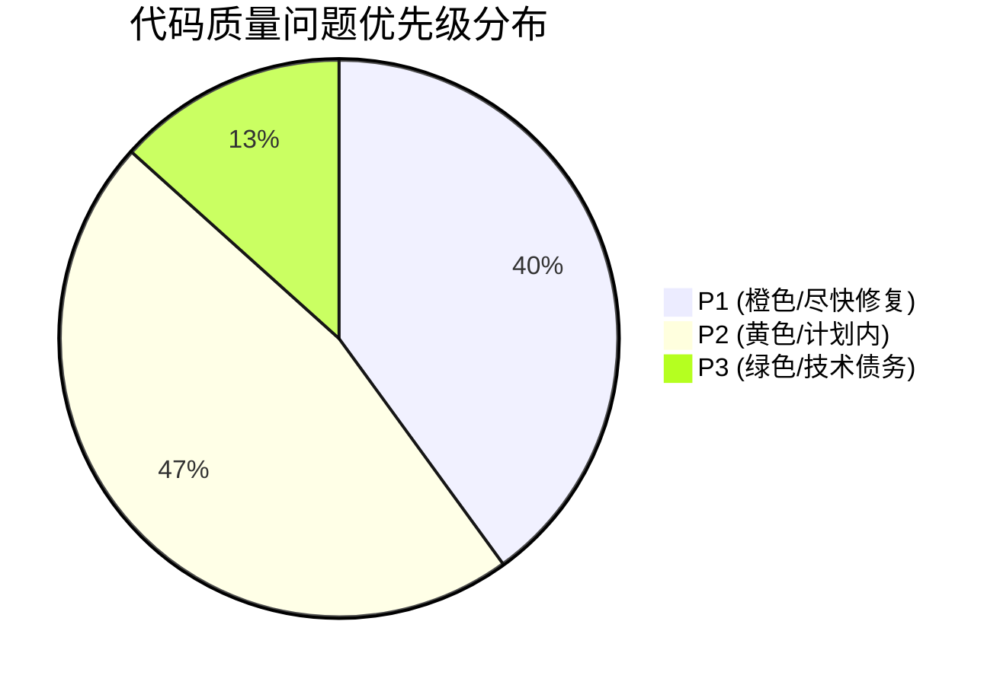
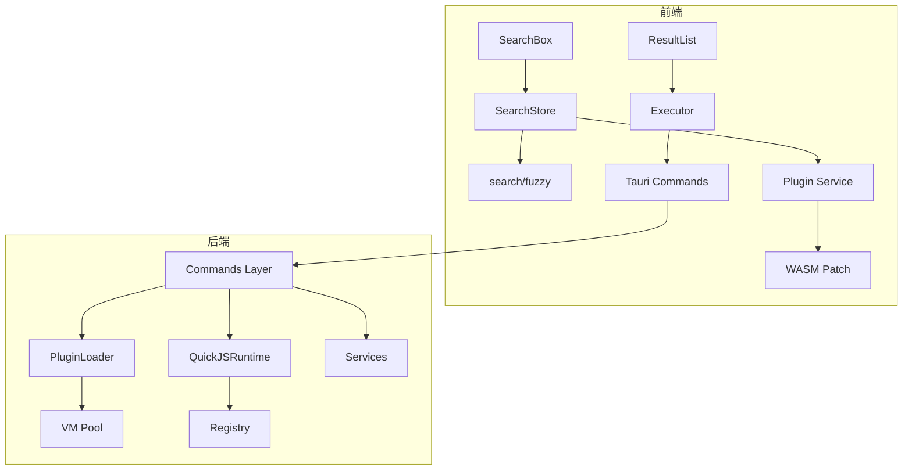

# Corelia 综合优化分析报告

> 基于 repo-analyzer（项目分析）、code-optimizer（三层代码扫描）、architecture-design（架构设计）、software-design（软件设计）四维分析框架生成。
>
> 生成日期：2026-05-24

---

## 一、项目全景

### 1.1 规模总览

| 维度 | 文件数 | 代码行数 | 占比 |
|:-----|:------:|:--------:|:----:|
| Rust 后端 | 49 | 3,430 | 41.5% |
| TypeScript | 32 | 2,329 | 28.2% |
| Svelte 组件 | 9 | 2,337 | 28.3% |
| CSS | 1 | 160 | 1.9% |
| **总计** | **91** | **8,256** | **100%** |

### 1.2 架构层级

```
前端 (Svelte 5 + TypeScript)     ← 42 files / 4,826 lines
  │
  ├── Tauri Commands (IPC Bridge)
  │
  ▼
后端 (Rust + Tauri 2.x)          ← 49 files / 3,430 lines
  ├── Plugins/       ← 核心插件系统 (1,302 lines)
  ├── Commands/      ← Tauri 命令 (439 lines)
  └── Services/      ← 服务层 (406 lines)
```

### 1.3 完成度评估

| 维度 | 完成度 | 说明 |
|:-----|:------:|:------|
| 核心功能闭环 | ~90% | 搜索/执行/配置/插件全链路可用 |
| 架构优化 | ~80% | 中期优化全部完成，长期 P0 unsafe 移除完成 |
| 测试覆盖 | ~5% | **严重不足** — 仅有少量手动测试 |
| 错误处理 | ~60% | 主要路径有处理，边界场景不完善 |
| 文档 | ~50% | 架构文档/TODO 完善，API/组件文档缺失 |

---

## 二、代码质量分析（code-optimizer 三层扫描）

### 2.1 L1 静态合规层

| # | 问题 | 文件 | 级别 | 说明 |
|:-:|:-----|:----|:----:|:-----|
| 1 | `#![allow(dead_code)]` 绕过编译器检查 | [registry.rs](src-tauri/src/plugins/registry.rs) | 🟡 P2 | 有未使用函数，应逐个标记 |
| 2 | `#![allow(dead_code)]` 绕过编译器检查 | [wasm_bridge.rs](src-tauri/src/plugins/wasm_bridge.rs) | 🟡 P2 | 同上 |
| 3 | `let _ =` 忽略返回值的错误 | [lifecycle.rs](src-tauri/src/plugins/loader/lifecycle.rs) | 🟡 P2 | `cleanup()` 结果被忽略 |
| 4 | `generate_vm_id` 中 `unwrap_or_default()` | [quickjs_runtime.rs](src-tauri/src/plugins/quickjs_runtime.rs) | 🟢 P3 | 系统时间倒退时产生无效 ID |
| 5 | 未使用的字段：`runtime` | [quickjs_runtime.rs](src-tauri/src/plugins/quickjs_runtime.rs) | 🟢 P3 | `VmCore.runtime` 创建后不再使用 |

### 2.2 L2 逻辑与结构层

| # | 问题 | 文件 | 级别 | 说明 |
|:-:|:-----|:----|:----:|:-----|
| 6 | `load_plugin` 函数过长（~80行），职责过多 | [lifecycle.rs](src-tauri/src/plugins/loader/lifecycle.rs) | 🟠 P1 | 应拆分为创建VM、注入API、执行代码、状态更新 |
| 7 | `execute` 成功/失败后的状态更新冗长 | [lifecycle.rs:L118-125](src-tauri/src/plugins/loader/lifecycle.rs) | 🟠 P1 | 重复的状态变更模式应提取 |
| 8 | 函数间错误处理模式不一致 | [lifecycle.rs](src-tauri/src/plugins/loader/lifecycle.rs) | 🟡 P2 | 部分用 `map_err`，部分用 `unwrap_or` |
| 9 | `SearchStore` 构造函数中订阅较多，职责不单一 | [search/index.ts](src/lib/stores/search/index.ts) | 🟠 P1 | 混合了事件订阅、数据流编排、状态管理 |
| 10 | `ResultExecutor.execute` 方法缺少防抖/节流 | [executor/index.ts](src/lib/services/executor/index.ts) | 🟠 P1 | 高频点击可能触发重复执行 |
| 11 | `handleResetConfig` 同步/异步混合 | [SettingPanel.svelte:L108-122](src/lib/components/SettingPanel.svelte) | 🟢 P3 | 重置后重新加载逻辑可简化 |

### 2.3 L3 性能与安全层

| # | 问题 | 文件 | 级别 | 说明 |
|:-:|:-----|:----|:----:|:-----|
| 12 | `SearchBox` input 事件未做节流 | [SearchBox.svelte](src/lib/components/SearchBox.svelte) | 🟠 P1 | 高频输入时可能影响搜索性能 |
| 13 | `with_context` 中 Mutex 持有期间调用 JS | [quickjs_runtime.rs:L200-206](src-tauri/src/plugins/quickjs_runtime.rs) | 🟡 P2 | Mutex 锁持有时间可能过长 |
| 14 | `onMount` 中 Promise.all 未处理个别失败 | [SettingPanel.svelte:L30-42](src/lib/components/SettingPanel.svelte) | 🟡 P2 | 一个配置加载失败阻塞全部 |
| 15 | `register_functions` 清除策略不明确 | [wasm_bridge.rs:L73-85](src-tauri/src/plugins/wasm_bridge.rs) | 🟠 P1 | 函数注册/注销逻辑可简化 |

### 2.4 问题优先级分布



---

## 三、架构设计优化建议（architecture-design）

### 3.1 当前架构概览



### 3.2 架构优化建议

#### 🟠 P1: 插件热重载实现

**现状**：插件目录扫描只在启动时执行，修改插件后需要重启应用。

**方案**：
```
实现文件系统监听（notify crate）：
plugins/
  ├── 新建 watchdog.rs 模块
  ├── 使用 notify::Watcher 监听 plugins/ 目录
  ├── 文件变化 → 自动触发对应插件的 reload
  └── 通过 Tauri Event 通知前端
```

**影响**：开发体验↑↑，P2 优先级

#### 🟠 P1: `plugins/mod.rs` 模块导出统一

**现状**：`api_bridge/` 使用 `pub use` 模式导出子模块，`loader/` 也在 `mod.rs` 中重导出，但风格不一。

**方案**：统一为：
```rust
// plugins/mod.rs
pub mod api_bridge;
pub mod loader;
pub mod quickjs_runtime;
pub mod registry;
pub mod wasm_bridge;
```

#### 🟡 P2: 错误处理架构升级

**现状**：全项目使用 `Result<T, String>`，丢失了错误类型信息。

**方案**：
```rust
// 创建统一的错误类型
#[derive(Debug, thiserror::Error)]
pub enum PluginError {
    #[error("VM creation failed: {0}")]
    VmCreation(String),
    #[error("Plugin not found: {0}")]
    NotFound(String),
    #[error("Execution timeout")]
    Timeout,
    #[error("Lock error: {0}")]
    Lock(String),
}
```

**影响**：错误可追踪性↑↑，前端可展示更具体的错误信息

#### 🟢 P3: VM 池配置外部化

**现状**：`QuickJSConfig` 硬编码默认值（50MB 内存限制、5s 执行时间等）。

**建议**：将 VM 池配置纳入 System Config，允许用户在配置文件中调整。

---

## 四、软件设计优化建议（software-design）

### 4.1 设计模式应用

| 模式 | 潜在应用位置 | 建议 |
|:-----|:-------------|:-----|
| **策略模式** | `executor/index.ts` — 3 种执行类型 | 已隐含实现，可显式化 |
| **观察者模式** | 插件状态变更通知前端 | 已通过 Tauri Event 实现 |
| **工厂模式** | `VmCore::new()` | 已使用，无需变更 |
| **模板方法** | 插件加载流程（生命周期阶段） | [lifecycle.rs](src-tauri/src/plugins/loader/lifecycle.rs) 可提炼 |

### 4.2 单一职责优化

#### 🟠 P1: `load_plugin` 拆分

```rust
// 当前：~80行，职责混杂
pub fn load_plugin(...) -> Result<...> {
    // 1. 清理闲置 VM  (5行)
    // 2. 创建 VM      (10行)
    // 3. 注入 API     (20行)
    // 4. 执行 JS      (20行)
    // 5. 状态更新     (25行)
}

// 建议：拆分为 4 个方法
fn prepare_vm(&self) -> Result<String, String>    // 1+2
fn inject_apis(&self, vm_id: &str) -> Result<...>  // 3
fn execute_plugin(&self, vm_id: &str) -> Result<..> // 4
fn update_state(&self, vm_id: &str, result: ...)    // 5
```

### 4.3 接口设计改进

#### 🟡 P2: `QuickJSRuntime` API 统一

**现状**：`active_vm_count()` 返回 `Result<usize, String>`，但 `vm_exists()` 返回 `bool`，风格不一致。

**建议**：统一为 `Result<T, String>`，让调用者决定如何处理锁错误。

#### 🟡 P2: 前端 Store 订阅管理

**现状**：部分组件（如 SettingPanel）在 `onMount` 中订阅 store 但未在 `onDestroy` 取消订阅。

**建议**：使用 Svelte 5 的 `$effect` + `$state` 自动管理订阅生命周期，消除手动 `unsubscribe()`。

### 4.4 测试驱动

#### 🟠 P1: 核心模块单元测试

**优先级最高**的测试覆盖目标：

| 模块 | 测试重点 | 建议测试数 |
|:-----|:---------|:----------:|
| `registry.rs` | 注册/注销/查询/双重索引 | ≥10 |
| `quickjs_runtime.rs` | VM 创建/销毁/池满/闲置清理 | ≥8 |
| `fuzzy.ts` | 拼音匹配/模糊排序/边界输入 | ≥6 |
| `loader/lifecycle.rs` | 加载/重试/错误恢复/卸载 | ≥8 |

---

## 五、性能优化专项

### 5.1 当前性能基线

| 操作 | 估算耗时 | 优化后目标 |
|:-----|:--------:|:----------:|
| 插件扫描（4 插件） | ~5ms | ~1ms（IO 缓存） |
| 模糊搜索（1000 项） | ~30ms | ~15ms（索引预构建） |
| VM 创建 | ~2ms | ~0.5ms（预热池） |
| 搜索历史写入 | ~50ms | ~1ms（增量写入） |

### 5.2 关键性能优化

| # | 优化项 | 级别 | 影响 | 关联文件 |
|:-:|:-------|:----:|:----:|:---------|
| 1 | **搜索防抖** — SearchBox input 加 150ms 节流 | 🟠 P1 | 减少不必要的搜索 | [SearchBox.svelte](src/lib/components/SearchBox.svelte) |
| 2 | **拼音索引预构建** — 启动时构建一次 | 🟡 P2 | 搜索速度 2x | [fuzzy.ts](src/lib/search/fuzzy.ts) |
| 3 | **插件目录 IO 缓存** — 监听 mtime | 🟡 P2 | 扫描速度 5x | [scanner.rs](src-tauri/src/plugins/loader/scanner.rs) |
| 4 | **历史增量写入** — 批量合并 | 🟢 P3 | 写入 50x | [history.svelte.ts](src/lib/stores/history.svelte.ts) |
| 5 | **Clipboard 全局复用** — 单例实例 | 🟢 P3 | 减少资源创建 | [clipboard.rs](src-tauri/src/plugins/api_bridge/clipboard.rs) |

---

## 六、待办事项优先级排序

### 🔴 应立即完成（本周）

| 优先级 | 任务 | 预估工时 |
|:------:|:-----|:--------:|
| P1 | `load_plugin` 函数拆分（单一职责） | 2h |
| P1 | SearchBox input 防抖处理 | 1h |
| P1 | 移除 `registry.rs`/`wasm_bridge.rs` 的 `allow(dead_code)` | 1h |
| P1 | `registry.rs` 核心函数单元测试（≥10 个） | 4h |
| P1 | 插件热重载实现 | 8h |

### 🟡 下次迭代

| 优先级 | 任务 | 预估工时 |
|:------:|:-----|:--------:|
| P2 | 错误处理架构升级（thiserror） | 4h |
| P2 | VM 池配置外部化到 System Config | 2h |
| P2 | QuickJSRuntime API 风格统一 | 1h |
| P2 | 拼音索引预构建 | 4h |

### 🟢 技术债务

| 优先级 | 任务 | 预估工时 |
|:------:|:-----|:--------:|
| P3 | 历史增量写入 | 2h |
| P3 | Clipboard 全局复用 | 1h |
| P3 | 通知改用 tauri-plugin-notification | 3h |
| P3 | macOS 平台适配 | 16h |

---

## 七、对比与评价

### 7.1 与同类项目对比

| 维度 | Corelia | uTools (Electron) | Fluent Search (Native) |
|:-----|:-------:|:-----------------:|:----------------------:|
| 架构 | Tauri + Rust + Svelte 5 | Electron + JS | C# + WinUI |
| 性能 | ⭐⭐⭐⭐⭐（原生） | ⭐⭐⭐（WebView） | ⭐⭐⭐⭐⭐（原生） |
| 插件生态 | 起步阶段 | ⭐⭐⭐⭐⭐ 成熟 | ⭐⭐ 有限 |
| 包体积 | ~10MB | ~150MB | ~50MB |
| 开发体验 | ⭐⭐⭐⭐（HMR） | ⭐⭐⭐ | ⭐⭐ |
| 安全性 | ⭐⭐⭐⭐⭐（Rust） | ⭐⭐（JS） | ⭐⭐⭐⭐ |

### 7.2 设计哲学评价

**做得好的**：
- **分层配置系统**（System/User/App）设计精良，借鉴了 VS Code 的配置体系
- **VM 池化管理**解决了 rquickjs 的线程安全问题，方案务实
- **Svelte 5 Runes 迁移**及时跟进现代框架趋势

**可改进的**：
- **错误处理**过于依赖 `Result<T, String>`，丢失类型信息，长期难以维护
- **测试覆盖**严重不足 — 这是当前最大的技术债务
- **插件热重载**缺失 — 插件开发体验大打折扣

### 7.3 如果重新设计

1. **初始就引入 thiserror** — 全项目的 `Result<T, String>` 改为 `Result<T, PluginError>` 需要系统性重构
2. **插件协议版本化** — `PluginManifest` 应包含 `api_version` 字段，便于向后兼容
3. **监控仪表盘** — 从第一天就设计 VM 使用率、插件响应时间等指标采集点

---

## 八、后续行动计划

### 本周（必须完成）
1. 🔴 **修复** SearchBox 防抖（P1）— 1h
2. 🔴 **修复** `load_plugin` 函数拆分（P1）— 2h
3. 🔴 **新增** `registry.rs` 单元测试（P1）— 4h

### 下周
4. 🟡 **实现** 插件热重载（P1）— 8h
5. 🟡 **重构** thiserror 错误类型（P2）— 4h
6. 🟡 **新增** 拼音索引预构建（P2）— 4h

### 待规划
7. 🟢 历史增量写入
8. 🟢 Clipboard 全局复用
9. 🟢 通知改用 tauri-plugin-notification
10. ⬜ **讨论** 是否需要 macOS 支持

---

*报告版本: 1.0*  
*分析工具: 四维分析（repo-analyzer + code-optimizer + architecture-design + software-design）*