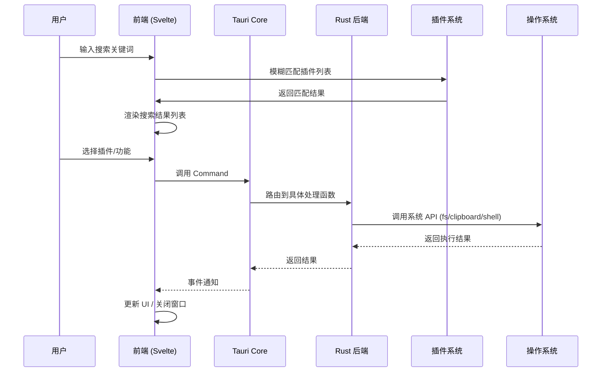
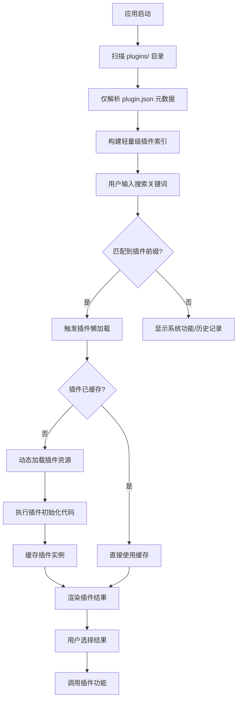

# Corelia 系统架构设计

## 概述

Corelia 是一款面向桌面端的效率工具，定位为类似 uTools、Listary、Alfred 的**快速启动器 + 插件平台**。本文档描述 Corelia 的系统架构设计。

---

## 系统架构

### 整体架构

```
┌─────────────────────────────────────────────────────────────────────┐
│                         Corelia 架构分层图                           │
├─────────────────────────────────────────────────────────────────────┤
│                                                                     │
│   ┌─────────────────────────────────────────────────────────────┐  │
│   │                        用户交互层                            │  │
│   │                                                              │  │
│   │   ┌─────────────────┐    ┌─────────────────┐               │  │
│   │   │   搜索框 UI     │    │   设置面板 UI    │               │  │
│   │   └─────────────────┘    └─────────────────┘               │  │
│   │                                                              │  │
│   │   ┌─────────────────┐    ┌─────────────────┐               │  │
│   │   │   结果列表 UI   │    │  Onboarding UI  │               │  │
│   │   └─────────────────┘    └─────────────────┘               │  │
│   │                                                              │  │
│   └─────────────────────────────────────────────────────────────┘  │
│                                  │                                   │
│                                  ▼                                   │
│   ┌─────────────────────────────────────────────────────────────┐  │
│   │                      Svelte 5 前端层                          │  │
│   │                                                              │  │
│   │   ┌───────────────┐  ┌───────────────┐  ┌───────────────┐  │  │
│   │   │  SearchEngine │  │ PluginManager │  │ ThemeManager  │  │  │
│   │   └───────────────┘  └───────────────┘  └───────────────┘  │  │
│   │                                                              │  │
│   │   ┌───────────────┐  ┌───────────────┐  ┌───────────────┐  │  │
│   │   │  TauriBridge  │  │ QuickJSRunner │  │  WasmLoader   │  │  │
│   │   └───────────────┘  └───────────────┘  └───────────────┘  │  │
│   │                                                              │  │
│   └─────────────────────────────────────────────────────────────┘  │
│                                  │                                   │
│                                  ▼                                   │
│   ┌─────────────────────────────────────────────────────────────┐  │
│   │                    Tauri Core (Rust)                        │  │
│   │                                                              │  │
│   │   ┌───────────────┐  ┌───────────────┐  ┌───────────────┐  │  │
│   │   │ WindowManager │  │ShortcutManager│  │DataStore      │  │  │
│   │   └───────────────┘  └───────────────┘  └───────────────┘  │  │
│   │                                                              │  │
│   │   ┌───────────────┐  ┌───────────────┐  ┌───────────────┐  │  │
│   │   │ClipboardService│ │ ShellService  │  │PluginLoader   │  │  │
│   │   └───────────────┘  └───────────────┘  └───────────────┘  │  │
│   │                                                              │  │
│   └─────────────────────────────────────────────────────────────┘  │
│                                  │                                   │
│                                  ▼                                   │
│   ┌─────────────────────────────────────────────────────────────┐  │
│   │                      操作系统层                              │  │
│   │                                                              │  │
│   │   ┌───────────────┐  ┌───────────────┐  ┌───────────────┐  │  │
│   │   │   文件系统     │  │   剪贴板       │  │   快捷键       │  │  │
│   │   └───────────────┘  └───────────────┘  └───────────────┘  │  │
│   │                                                              │  │
│   └─────────────────────────────────────────────────────────────┘  │
│                                                                     │
└─────────────────────────────────────────────────────────────────────┘
```

### 架构分层说明

| 层级 | 说明 | 技术选型 |
|------|------|----------|
| 用户交互层 | 负责用户可见的 UI 组件 | Svelte 5 Components |
| 前端业务层 | 负责搜索、插件管理、主题等业务逻辑 | Svelte 5 + TypeScript |
| 前端服务层 | 负责与 Tauri/Rust 通信、WASM 加载等 | Tauri API + wasm-pack |
| Tauri Core | 负责系统级 API 调用、窗口管理、插件加载 | Rust + Tauri 2.x |
| 操作系统层 | 操作系统提供的底层能力 | Windows/macOS/Linux |

---

## 插件系统架构

### 三层插件架构

Corelia 采用三层插件架构，支持不同复杂度的插件场景：

```
┌─────────────────────────────────────────────────────────────┐
│                    Corelia 插件生态                          │
├─────────────────────────────────────────────────────────────┤
│                                                             │
│   ┌─────────────────────────────────────────────────────┐  │
│   │              插件应用层 (Plugin Application)           │  │
│   │                                                       │  │
│   │  ┌─────────────────┐     ┌─────────────────────┐   │  │
│   │  │   QuickJS 插件   │     │    Webview 插件      │   │  │
│   │  │                 │     │                      │   │  │
│   │  │ • 轻量快速       │     │ • Vue/React/Svelte  │   │  │
│   │  │ • JSON 配置驱动  │     │ • 自定义复杂 UI      │   │  │
│   │  │ • 标准模板       │     │ • HTML/CSS/JS 完整包 │   │  │
│   │  │                 │     │                      │   │  │
│   │  │  懒加载 ✅       │     │  懒加载 ✅           │   │  │
│   │  └─────────────────┘     └─────────────────────┘   │  │
│   └─────────────────────────────────────────────────────┘  │
│                              │                              │
│                              ▼                              │
│   ┌─────────────────────────────────────────────────────┐  │
│   │              WASM 补丁层 (WASM Patches)                │  │
│   │                                                       │  │
│   │   ┌──────────┐  ┌──────────┐  ┌──────────┐        │  │
│   │   │   AI     │  │  Crypto  │  │  Base64  │  ...   │  │
│   │   │ 补丁-v1   │  │ 补丁-v1   │  │  补丁-v1  │        │  │
│   │   └──────────┘  └──────────┘  └──────────┘        │  │
│   │                                                       │  │
│   │   按需加载 ✅  •  版本兼容检查  •  缓存复用          │  │
│   └─────────────────────────────────────────────────────┘  │
│                              │                              │
│                              ▼                              │
│   ┌─────────────────────────────────────────────────────┐  │
│   │              Rust 核心 API 层 (常驻内存)                 │  │
│   │   crypto • network • payment • fs • clipboard        │  │
│   │   shell • window • db • shortcut                     │  │
│   └─────────────────────────────────────────────────────┘  │
│                                                             │
└─────────────────────────────────────────────────────────────┘
```

### 插件类型对比

| 特性 | QuickJS 插件 | Webview 插件 | WASM 补丁 |
|------|-------------|--------------|-----------|
| **加载方式** | 懒加载，首次匹配前缀时实例化 QuickJS VM | 懒加载，创建独立 Webview 加载 HTML | 插件依赖时自动加载，支持缓存复用 |
| **响应时间** | ~7ms | ~200-350ms（首次），<50ms（缓存复用） | ~200-400ms（首次编译），<10ms（调用） |
| **内存占用** | ~1-2MB/实例 | ~30-50MB/实例 | ~5-20MB/实例 |
| **适用场景** | 简单列表、命令聚合、数据转换 | 复杂表单、数据可视化、第三方集成 | AI API、加密算法、图像处理 |

---

## 插件运行时设计

### QuickJS 与 Webview 统一架构

**决策**：QuickJS 和 Webview **统一架构设计**，共享通信机制

```
┌─────────────────────────────────────────────────────────────┐
│                    插件运行时层                              │
├─────────────────────────────────────────────────────────────┤
│                                                             │
│   ┌─────────────────┐         ┌─────────────────────┐    │
│   │   QuickJS 插件   │         │    Webview 插件      │    │
│   │                 │         │                      │    │
│   │  • JSON 配置驱动 │         │  • Vue/React/Svelte │    │
│   │  • 7ms 响应     │         │  • iframe 嵌入       │    │
│   │                 │         │                      │    │
│   └────────┬────────┘         └──────────┬───────────┘    │
│            │                              │                │
│            └──────────┬───────────────────┘                │
│                       ▼                                     │
│            ┌─────────────────────┐                         │
│            │   Plugin Bridge     │                         │
│            │   (Tauri Event)     │                         │
│            └──────────┬──────────┘                         │
│                       │                                     │
│                       ▼                                     │
│   ┌─────────────────────────────────────────────────────┐  │
│   │              Rust Core (WASM 补丁 / System API)     │  │
│   └─────────────────────────────────────────────────────┘  │
│                                                             │
└─────────────────────────────────────────────────────────────┘
```

### 插件 API 兼容性策略

**决策**：选择 **B 方案 - 兼容 + 扩展**

```
┌─────────────────────────────────────────────────────────────┐
│                    插件 API 层                              │
├─────────────────────────────────────────────────────────────┤
│                                                             │
│   ┌─────────────────────────────────────────────────────┐  │
│   │              window.utools（兼容）                   │  │
│   │   dbStorage / clipboard / shell / createBrowserWindow │  │
│   └─────────────────────────────────────────────────────┘  │
│                            │                               │
│                            ▼                               │
│   ┌─────────────────────────────────────────────────────┐  │
│   │          window.corelia（扩展）                     │  │
│   │   wasm.patch() / sync.config() / ai.chat()          │  │
│   └─────────────────────────────────────────────────────┘  │
│                                                             │
└─────────────────────────────────────────────────────────────┘
```

---

## 数据流设计

### 核心数据流



### 插件懒加载流程



---

## 模块设计

### 核心模块

| 模块 | 职责 | 关键技术 |
|------|------|----------|
| **WindowManager** | 窗口创建、显示/隐藏、置顶 | Tauri Window API |
| **ShortcutManager** | 全局快捷键注册与响应 | `tauri-plugin-global-shortcut` |
| **PluginLoader** | 插件扫描、加载、卸载 | 动态 import, Webview |
| **SearchEngine** | 模糊匹配、结果排序 | `fuzzysort` / `tiny-fuzzy` |
| **CommandBus** | 前端与 Rust 通信 | Tauri Command + Event |
| **DataStore** | 用户配置、插件数据存储 | Tauri Store Plugin |
| **ClipboardService** | 剪贴板读写 | `tauri-plugin-clipboard` |
| **ShellService** | Shell 命令执行 | `tauri-plugin-shell` |

### 前端模块

| 模块 | 职责 | 文件位置 |
|------|------|----------|
| **SearchBox** | 搜索输入框组件 | `src/lib/components/SearchBox.svelte` |
| **ResultList** | 搜索结果列表组件 | `src/lib/components/ResultList.svelte` |
| **SettingPanel** | 设置面板组件 | `src/lib/components/SettingPanel.svelte` |
| **searchStore** | 搜索状态管理 | `src/lib/stores/search.ts` |
| **pluginsStore** | 插件状态管理 | `src/lib/stores/plugins.ts` |
| **tauriService** | Tauri API 封装 | `src/lib/services/tauri.ts` |
| **quickjsVM** | QuickJS VM 管理 | `src/lib/quickjs/vm.ts` |
| **wasmLoader** | WASM 补丁加载 | `src/lib/services/wasm.ts` |

### Rust 模块

| 模块 | 职责 | 文件位置 |
|------|------|----------|
| **WindowManager** | 窗口管理 | `src-tauri/src/commands/window.rs` |
| **ShortcutCommands** | 快捷键命令 | `src-tauri/src/commands/shortcut.rs` |
| **FsCommands** | 文件操作命令 | `src-tauri/src/commands/fs.rs` |
| **ClipboardCommands** | 剪贴板命令 | `src-tauri/src/commands/clipboard.rs` |
| **ShellCommands** | Shell 执行命令 | `src-tauri/src/commands/shell.rs` |
| **PluginLoader** | 插件加载器 | `src-tauri/src/plugins/loader.rs` |
| **WasmPool** | WASM 实例池 | `src-tauri/src/patches/pool.rs` |

---

## 目录结构

```
corelia/
├── src/                          # 前端源码
│   ├── lib/
│   │   ├── components/           # UI 组件
│   │   │   ├── SearchBox.svelte
│   │   │   ├── ResultList.svelte
│   │   │   └── SettingPanel.svelte
│   │   ├── stores/                # 状态管理
│   │   │   ├── search.ts
│   │   │   └── plugins.ts
│   │   ├── services/              # 服务层
│   │   │   ├── tauri.ts           # Tauri API 封装
│   │   │   ├── search.ts          # 搜索逻辑
│   │   │   └── wasm.ts            # WASM 补丁加载
│   │   ├── quickjs/               # QuickJS 运行时
│   │   │   ├── vm.ts              # QuickJS VM 管理
│   │   │   └── templates/         # 标准模板
│   │   └── utils/                 # 工具函数
│   │       └── fuzzy.ts           # 模糊匹配
│   └── routes/
│       ├── +page.svelte           # 主界面
│       └── settings/              # 设置页面
├── src-tauri/                     # Rust 后端
│   ├── src/
│   │   ├── main.rs                # 入口
│   │   ├── lib.rs                 # 库入口
│   │   ├── commands/              # Tauri Commands
│   │   │   ├── mod.rs
│   │   │   ├── fs.rs              # 文件操作
│   │   │   ├── clipboard.rs       # 剪贴板
│   │   │   ├── shell.rs           # Shell 执行
│   │   │   ├── wasm.rs            # WASM 补丁管理
│   │   │   └── plugin.rs          # 插件管理
│   │   ├── plugins/               # 插件系统
│   │   │   ├── mod.rs
│   │   │   ├── loader.rs          # 插件加载器
│   │   │   ├── registry.rs        # 插件注册表
│   │   │   └── quickjs.rs         # QuickJS 集成
│   │   ├── patches/               # WASM 补丁
│   │   │   ├── mod.rs
│   │   │   └── pool.rs            # WASM 实例池
│   │   └── utils/                 # 工具函数
│   └── Cargo.toml
├── plugins/                       # 插件目录
│   ├── sample-quickjs/            # QuickJS 插件示例
│   │   └── plugin.json
│   ├── sample-webview/             # Webview 插件示例
│   │   ├── plugin.json
│   │   └── index.html
│   └── ...
├── patches/                       # WASM 补丁目录
│   ├── ai-v1/
│   │   ├── patch.json
│   │   └── ai.wasm
│   └── crypto-v1/
│       ├── patch.json
│       └── crypto.wasm
└── wiki/                         # 项目文档
    ├── SRS.md                    # 功能需求规格说明书
    ├── ROADMAP.md                # 项目路线图
    └── reference/                 # 参考文档
```

---

## 技术栈

### 前端技术栈

| 技术 | 版本 | 用途 |
|------|------|------|
| Svelte | 5.x | UI 框架 |
| SvelteKit | 2.x | 应用框架 |
| TypeScript | 5.x | 类型安全 |
| Vite | 5.x | 构建工具 |
| Bun | 1.x | 运行时、包管理 |
| tiny-fuzzy | latest | 模糊搜索 |

### 后端技术栈

| 技术 | 版本 | 用途 |
|------|------|------|
| Rust | 1.75+ | 系统编程 |
| Tauri | 2.x | 桌面框架 |
| QuickJS | latest | JS 引擎 |
| wasm-pack | latest | WASM 编译 |
| wasm-bindgen | latest | WASM FFI |

### 插件技术栈

| 技术 | 用途 |
|------|------|
| JSON | 插件配置 |
| JavaScript/TypeScript | QuickJS 插件开发 |
| HTML/CSS/JS | Webview 插件开发 |
| Rust + WASM | WASM 补丁开发 |

---

## 性能模型

### 整体性能模型

```
启动时间: O(扫描) + O(解析JSON)       ← 极轻量
搜索响应: O(n) 模糊匹配                ← 毫秒级
插件加载: O(插件类型) + O(依赖WASM)    ← 按需
内存占用: 固定开销 + 动态插件内存       ← 可控
```

### 性能指标

| 指标 | 目标值 |
|------|--------|
| 冷启动时间 | < 2 秒 |
| 窗口唤起延迟 | < 100ms |
| 搜索响应时间 | < 50ms（1000 条数据）|
| 内存占用（空闲） | < 100MB |
| QuickJS 插件加载 | < 10ms |
| Webview 插件加载 | < 500ms |

### 与竞品对比

| 指标 | uTools | ZTools | Corelia (预期) |
|------|--------|--------|----------------|
| 冷启动 | ~1s | ~1.2s | ~0.5-1s |
| 搜索响应 | <20ms | <20ms | <20ms |
| 插件加载 | ~300ms | ~300ms | QuickJS: ~7ms<br>Webview: ~200ms |
| 内存占用 | ~150MB | ~180MB | ~40MB (空载)<br>~100MB (单插件) |

---

## 安全性设计

### 插件沙箱隔离

| 安全措施 | 说明 |
|----------|------|
| 插件沙箱化 | 限制文件系统/网络访问 |
| Tauri allowlist | 通过 allowlist 控制 API 调用 |
| 插件签名校验 | 可选机制（P2 延后） |

### 数据安全

| 安全措施 | 说明 |
|----------|------|
| 敏感数据加密 | 加密存储用户敏感信息 |
| 网络请求授权 | 插件网络请求需用户授权 |
| 插件数据隔离 | 每个插件独立存储空间 |

---

## 跨平台支持

### 平台支持路线图

```
Phase 1（MVP）: Windows 10/11 x64
    │
    ▼
Phase 2 (v1.0): macOS 11+ (Intel + Apple Silicon)
    │
    ▼
Phase 3 (v1.x): Linux (Ubuntu 20.04+, Fedora 35+)
```

### 平台差异处理

| 功能 | Windows | macOS | Linux |
|------|---------|-------|-------|
| 全局快捷键 | ✅ | ✅ | ✅ |
| 系统托盘 | ✅ | ✅ | ✅ |
| 窗口置顶 | ✅ | ✅ | ✅ |
| 毛玻璃效果 | ✅ (DWM) | ✅ (Vibrancy) | ⚠️ (部分) |

---

## 相关文档

- [SRS 功能需求规格说明书](SRS.md)
- [ROADMAP 项目路线图](ROADMAP.md)
- [项目问题讨论记录](problem/)
