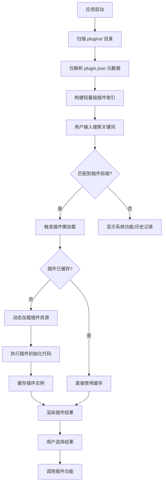
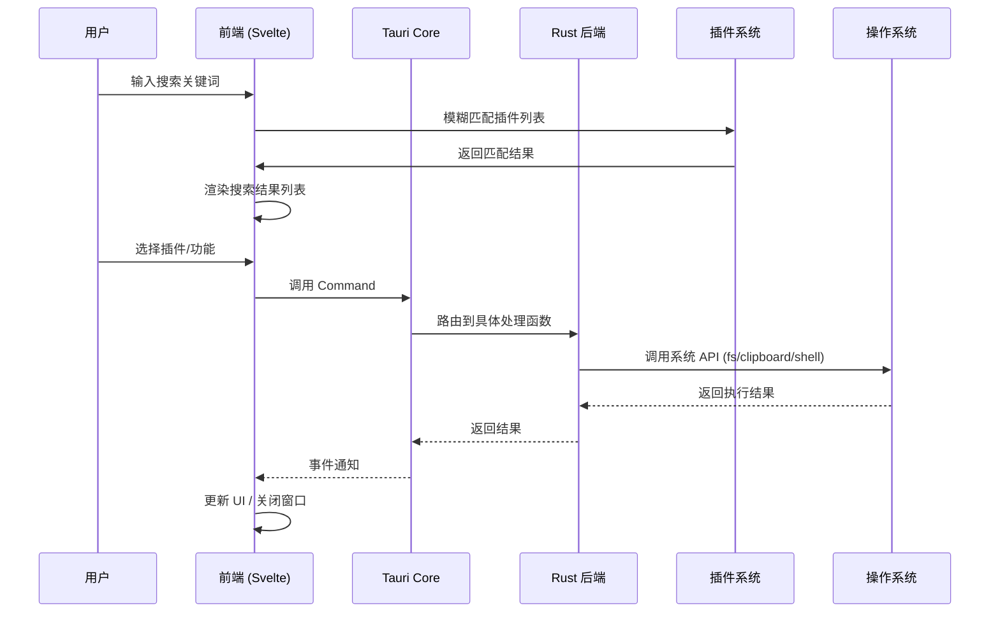
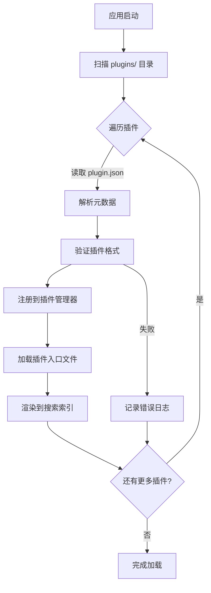

# 功能需求规格说明书 (SRS)

## 1. 项目概述

### 1.1 项目背景

Corelia 是一款面向桌面端的效率工具，定位为类似 uTools、Listary、Alfred 的**快速启动器 + 插件平台**。用户通过全局快捷键唤起搜索框，快速搜索并执行系统功能、插件功能或第三方工具。

### 1.2 项目目标

构建一个**轻量、安全、可扩展**的桌面效率工具平台，具备：

- **快速唤起**：全局快捷键毫秒级响应
- **模糊搜索**：输入即匹配，支持插件和系统功能
- **插件生态**：支持用户自行开发、加载第三方插件
- **系统集成**：深度整合文件系统、剪贴板、Shell 等系统能力

### 1.3 技术栈

| 层级 | 技术选型 | 说明 |
|------|----------|------|
| 框架 | Tauri 2.x | 轻量、安全、原生体验 |
| 前端 | Svelte 5 + SvelteKit | 响应式 UI、高性能 |
| 后端 | Rust | 系统级能力、高性能 |
| 构建 | Vite + Bun | 快速开发、热更新 |

---

## 2. 功能需求

### 2.1 全局唤起与主界面

#### 2.1.1 全局快捷键

| 需求编号 | 功能描述 | 优先级 | 备注 |
|----------|----------|--------|------|
| F-001 | 全局快捷键监听，支持 `Alt + Space` 唤起主窗口 | P0 | 失去焦点时也能响应 |
| F-002 | 支持自定义快捷键，用户可配置唤起键位 | P1 | 通过设置界面修改 |
| F-003 | 快捷键冲突检测，避免与系统/应用冲突 | P2 | 提示用户冲突 |

#### 2.1.2 窗口特性

| 需求编号 | 功能描述 | 优先级 | 备注 |
|----------|----------|--------|------|
| F-010 | 无边框窗口，无原生标题栏 | P0 |  |
| F-011 | 透明背景 + 圆角设计 | P0 | 参考 macOS/Windows 11 风格 |
| F-012 | 毛玻璃效果 (Acrylic/Vibrancy) | P1 | 需 Tauri 2.x 支持 |
| F-013 | 窗口置顶显示，不抢占焦点 | P0 |  |
| F-014 | 点击窗口外部区域自动隐藏 | P1 |  |

#### 2.1.3 主界面布局

| 需求编号 | 功能描述 | 优先级 | 备注 |
|----------|----------|--------|------|
| F-020 | 顶部搜索输入框，聚焦自动唤起键盘 | P0 |  |
| F-021 | 搜索结果列表，支持键盘上下导航 | P0 |  |
| F-022 | 结果项显示：图标 + 名称 + 描述 | P1 |  |
| F-023 | 支持鼠标悬停高亮、点击选中 | P0 |  |
| F-024 | 结果分类展示（插件/系统功能/历史记录） | P1 |  |

### 2.2 插件系统

#### 2.2.1 插件定义

| 需求编号 | 功能描述 | 优先级 | 备注 |
|----------|----------|--------|------|
| F-030 | 插件 JSON 元数据格式定义 | P0 | 包含名称、图标、前缀、入口文件 |
| F-031 | 插件前缀匹配，如 `ip` 触发 IP 查询插件 | P0 |  |
| F-032 | 插件图标显示，支持本地/远程图片 | P1 |  |
| F-033 | 插件版本管理，支持语义化版本 | P2 |  |

#### 2.2.2 插件加载

| 需求编号 | 功能描述 | 优先级 | 备注 |
|----------|----------|--------|------|
| F-040 | 动态加载插件目录 (`plugins/`) 下的插件 | P0 | 启动时扫描 |
| F-041 | 插件热重载，修改插件后无需重启应用 | P1 | 监听文件变化 |
| F-042 | 插件加载失败隔离，单个插件崩溃不影响主程序 | P0 |  |
| F-043 | 插件依赖声明与加载顺序控制 | P2 |  |

#### 2.2.3 插件懒加载模式

当用户安装大量插件时，启动时加载所有插件会导致性能问题。引入懒加载模式，只在用户真正使用时才完整加载插件代码和资源。

| 需求编号 | 功能描述 | 优先级 | 备注 |
|----------|----------|--------|------|
| F-044 | 插件基础信息预加载 | P0 | 启动时仅加载插件名称、图标、前缀等元数据 |
| F-045 | 插件懒加载触发条件 | P0 | 用户输入匹配到插件前缀时触发完整加载 |
| F-046 | 插件代码按需加载 | P0 | 仅加载插件的入口 JS/CSS/HTML 文件 |
| F-047 | 插件缓存机制 | P1 | 已加载的插件缓存在内存中，避免重复加载 |
| F-048 | 插件预加载策略 | P2 | 根据用户使用频率智能预加载常用插件 |
| F-049 | 懒加载状态管理 | P1 | 跟踪插件的加载/卸载/缓存状态 |
| F-049a | 插件内存管理 | P1 | 当插件数量过多时，自动释放不常用插件的内存 |

**懒加载流程设计**：



**懒加载状态机**：

| 状态 | 说明 | 触发条件 |
|------|------|----------|
| `MetaLoaded` | 仅元数据已加载 | 应用启动 |
| `Loading` | 正在加载完整插件 | 用户输入匹配到前缀 |
| `Ready` | 插件已就绪 | 资源加载完成 |
| `Cached` | 插件已缓存 | 加载完成后自动进入 |
| `Unloaded` | 插件已卸载 | 内存压力或手动卸载 |

#### 2.2.4 插件运行时

| 需求编号 | 功能描述 | 优先级 | 备注 |
|----------|----------|--------|------|
| F-050 | 插件在独立 Webview/iframe 中运行 | P0 | 隔离环境 |
| F-051 | 插件沙箱化，限制文件系统/网络访问 | P0 | 通过 Tauri allowlist 控制 |
| F-052 | 插件 API 模拟层 (`window.utools`) | P0 | 兼容 uTools 插件 |
| F-053 | 插件与主程序双向通信机制 | P0 | 通过 Tauri Event |

#### 2.2.5 插件管理

| 需求编号 | 功能描述 | 优先级 | 备注 |
|----------|----------|--------|------|
| F-060 | 插件市场/应用商店界面 | P2 | 展示可用插件 |
| F-061 | 插件安装/卸载功能 | P1 |  |
| F-062 | 插件启用/禁用开关 | P1 |  |
| F-063 | 插件数据持久化存储 | P1 | 每个插件独立存储空间 |

### 2.3 系统交互能力

#### 2.3.1 文件系统

| 需求编号 | 功能描述 | 优先级 | 备注 |
|----------|----------|--------|------|
| F-070 | 读取文件内容（文本/JSON） | P0 | 通过 Tauri Command |
| F-071 | 写入文件内容 | P0 |  |
| F-072 | 打开指定文件夹 | P0 | 调用系统文件管理器 |
| F-073 | 创建文件快捷方式/符号链接 | P1 |  |
| F-074 | 文件夹遍历与索引构建 | P1 | 用于本地文件搜索 |

#### 2.3.2 剪贴板

| 需求编号 | 功能描述 | 优先级 | 备注 |
|----------|----------|--------|------|
| F-080 | 读取剪贴板文本内容 | P0 |  |
| F-081 | 写入剪贴板文本内容 | P0 |  |
| F-082 | 读取剪贴板图片 | P1 | Base64 编码返回 |
| F-083 | 读取剪贴板文件路径 | P1 | 获取文件列表 |

#### 2.3.3 Shell 执行

| 需求编号 | 功能描述 | 优先级 | 备注 |
|----------|----------|--------|------|
| F-090 | 打开系统默认浏览器访问 URL | P0 |  |
| F-091 | 打开系统终端 | P0 | cmd/powershell/Windows Terminal |
| F-092 | 执行命令行脚本并获取输出 | P1 |  |
| F-093 | 打开指定应用/文件 | P0 |  |
| F-094 | 自定义 Shell 命令配置 | P2 |  |

#### 2.3.4 窗口管理

| 需求编号 | 功能描述 | 优先级 | 备注 |
|----------|----------|--------|------|
| F-100 | 控制主窗口显示/隐藏 | P0 |  |
| F-101 | 窗口置顶/取消置顶 | P0 |  |
| F-102 | 窗口位置/尺寸记忆 | P1 | 记住上次位置 |
| F-103 | 多显示器支持 | P1 | 在当前激活的显示器显示 |

### 2.4 数据管理与持久化

#### 2.4.1 用户配置

| 需求编号 | 功能描述 | 优先级 | 备注 |
|----------|----------|--------|------|
| F-110 | 快捷键配置保存 | P0 |  |
| F-111 | 主题配置（深色/浅色/跟随系统） | P1 |  |
| F-112 | 窗口透明度配置 | P2 |  |
| F-113 | 插件启用状态记忆 | P0 |  |
| F-114 | 搜索历史记录 | P1 | 最近搜索项 |

#### 2.4.2 插件数据

| 需求编号 | 功能描述 | 优先级 | 备注 |
|----------|----------|--------|------|
| F-120 | 插件私有数据存储目录 | P0 | `data/{plugin_id}/` |
| F-121 | 插件配置读写接口 | P0 |  |
| F-122 | 插件缓存管理 | P1 | 自动清理过期缓存 |

#### 2.4.3 索引与搜索

| 需求编号 | 功能描述 | 优先级 | 备注 |
|----------|----------|--------|------|
| F-130 | 本地文件索引构建 | P2 | 后台线程遍历 |
| F-131 | 模糊匹配搜索算法 | P0 | 前端 `tiny-fuzzy` |
| F-132 | 搜索结果排序（权重/频率/时间） | P1 |  |
| F-133 | 搜索结果高亮显示 | P1 | 匹配字符加亮 |

### 2.5 用户交互

#### 2.5.1 搜索体验

| 需求编号 | 功能描述 | 优先级 | 备注 |
|----------|----------|--------|------|
| F-140 | 输入即搜，毫秒级响应 | P0 |  |
| F-141 | 模糊匹配（支持拼音、首字母） | P1 |  |
| F-142 | 自动补全建议 | P2 |  |
| F-143 | 空结果提示 | P0 |  |

#### 2.5.2 键盘导航

| 需求编号 | 功能描述 | 优先级 | 备注 |
|----------|----------|--------|------|
| F-150 | 上下键选择结果项 | P0 |  |
| F-151 | Enter 键执行选中项 | P0 |  |
| F-152 | Esc 键关闭窗口 | P0 |  |
| F-153 | Tab 键切换分类 | P2 |  |
| F-154 | Ctrl+数字快速选择第 N 个结果 | P2 |  |

### 2.6 设置界面

| 需求编号 | 功能描述 | 优先级 | 备注 |
|----------|----------|--------|------|
| F-160 | 快捷键设置面板 | P1 |  |
| F-161 | 主题切换（深色/浅色/系统） | P1 |  |
| F-162 | 插件管理入口 | P1 |  |
| F-163 | 关于页面（版本、作者） | P2 |  |
| F-164 | 开机自启动开关 | P1 |  |

---

## 3. 非功能需求

### 3.1 性能需求

| 需求编号 | 指标 | 目标值 |
|----------|------|--------|
| NF-001 | 冷启动时间 | < 2 秒 |
| NF-002 | 窗口唤起延迟 | < 100ms |
| NF-003 | 搜索响应时间 | < 50ms（1000 条数据） |
| NF-004 | 内存占用（空闲） | < 100MB |
| NF-005 | 插件加载时间 | < 500ms |

### 3.2 安全性需求

| 需求编号 | 要求 |
|----------|------|
| NF-010 | 插件沙箱隔离，禁止危险 API 调用 |
| NF-011 | 网络请求需用户授权 |
| NF-012 | 敏感数据加密存储 |
| NF-013 | 插件签名校验（可选） |

### 3.3 兼容性需求

| 需求编号 | 要求 |
|----------|------|
| NF-020 | Windows 10/11 64-bit |
| NF-021 | macOS 11+ (后续版本) |
| NF-022 | 屏幕缩放适配 (100%-200%) |

---

## 4. 数据流设计

### 4.1 核心数据流



### 4.2 插件加载流程



---

## 5. 模块设计

### 5.1 核心模块

| 模块 | 职责 | 关键技术 |
|------|------|----------|
| **WindowManager** | 窗口创建、显示/隐藏、置顶 | Tauri Window API |
| **ShortcutManager** | 全局快捷键注册与响应 | `tauri-plugin-global-shortcut` |
| **PluginLoader** | 插件扫描、加载、卸载 | 动态 import, Webview |
| **SearchEngine** | 模糊匹配、结果排序 | `fuzzysort` / `tiny-fuzzy` |
| **CommandBus** | 前端与 Rust 通信 | Tauri Command + Event |
| **DataStore** | 用户配置、插件数据存储 | Tauri Store Plugin |
| **ClipboardService** | 剪贴板读写 | `tauri-plugin-clipboard` |
| **ShellService** | Shell 命令执行 | `tauri-plugin-shell` |

### 5.2 目录结构

```
corelia/
├── src/                          # 前端源码
│   ├── lib/
│   │   ├── components/           # UI 组件
│   │   │   ├── SearchBox.svelte
│   │   │   ├── ResultList.svelte
│   │   │   └── SettingPanel.svelte
│   │   ├── stores/                # 状态管理
│   │   │   ├── search.ts
│   │   │   └── plugins.ts
│   │   ├── services/              # 服务层
│   │   │   ├── tauri.ts           # Tauri API 封装
│   │   │   └── search.ts          # 搜索逻辑
│   │   └── utils/                 # 工具函数
│   │       └── fuzzy.ts           # 模糊匹配
│   └── routes/
│       ├── +page.svelte           # 主界面
│       └── settings/              # 设置页面
├── src-tauri/                     # Rust 后端
│   ├── src/
│   │   ├── main.rs                # 入口
│   │   ├── lib.rs                 # 库入口
│   │   ├── commands/              # Tauri Commands
│   │   │   ├── mod.rs
│   │   │   ├── fs.rs              # 文件操作
│   │   │   ├── clipboard.rs       # 剪贴板
│   │   │   └── shell.rs           # Shell 执行
│   │   ├── plugins/               # 插件管理
│   │   │   ├── mod.rs
│   │   │   └── loader.rs
│   │   └── utils/                 # 工具函数
│   └── Cargo.toml
├── plugins/                       # 插件目录
│   ├── sample/                    # 示例插件
│   │   ├── plugin.json
│   │   ├── index.html
│   │   └── icon.png
│   └── ...
└── wiki/                         # 项目文档
    └── SRS.md                    # 本文档
```

---

## 6. 验收标准

### 6.1 MVP 验收清单

| 阶段 | 验收项 | 完成标准 |
|------|--------|----------|
| Phase 1 | 窗口唤起 | `Alt + Space` 能在任意界面唤起窗口 |
| Phase 1 | 搜索输入 | 输入文字即时显示搜索结果 |
| Phase 1 | 功能执行 | 选择结果项能正确执行对应功能 |
| Phase 2 | 插件加载 | 能在 `plugins/` 目录加载自定义插件 |
| Phase 2 | 插件隔离 | 插件崩溃不影响主程序 |
| Phase 3 | 系统集成 | 文件读写、剪贴板、Shell 执行正常工作 |
| Phase 3 | 数据持久化 | 用户配置关闭后不丢失 |

### 6.2 质量门禁

- [ ] 单元测试覆盖率 > 60%
- [ ] 无 Rust `unsafe` 代码（除 FFI 必要处）
- [ ] 前端无 ESLint 警告
- [ ] Windows x64 构建产物 < 15MB

---

## 7. 术语表

| 术语 | 定义 |
|------|------|
| **效率工具** | 帮助用户快速完成日常任务的桌面应用 |
| **全局快捷键** | 在应用未获得焦点时也能响应的键盘快捷键 |
| **插件系统** | 可扩展的功能模块，允许第三方开发者添加新功能 |
| **沙箱隔离** | 将插件运行在受限环境中，防止影响主程序 |
| **模糊匹配** | 不完全匹配也能找到结果的搜索算法 |
| **Webview** | 嵌入在原生应用中的网页渲染组件 |

---

*文档版本: 1.0*  
*创建日期: 2026-03-05*  
*状态: Draft → Review*
