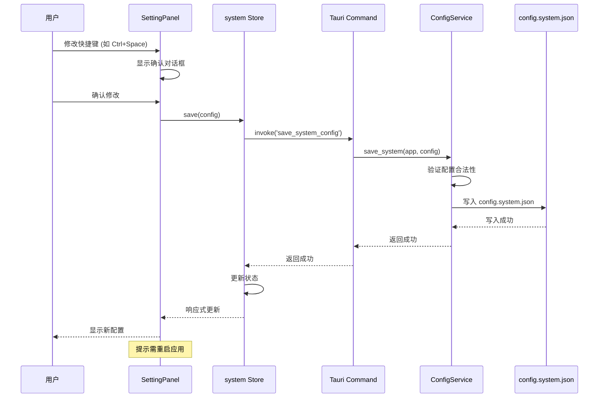
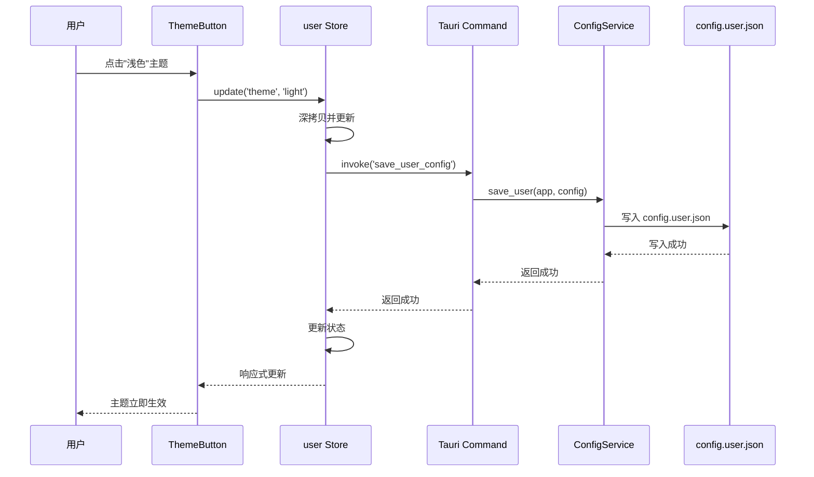
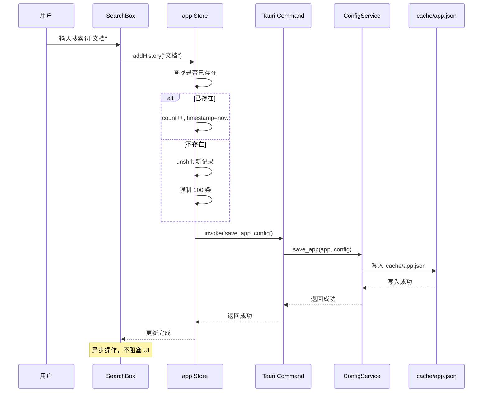
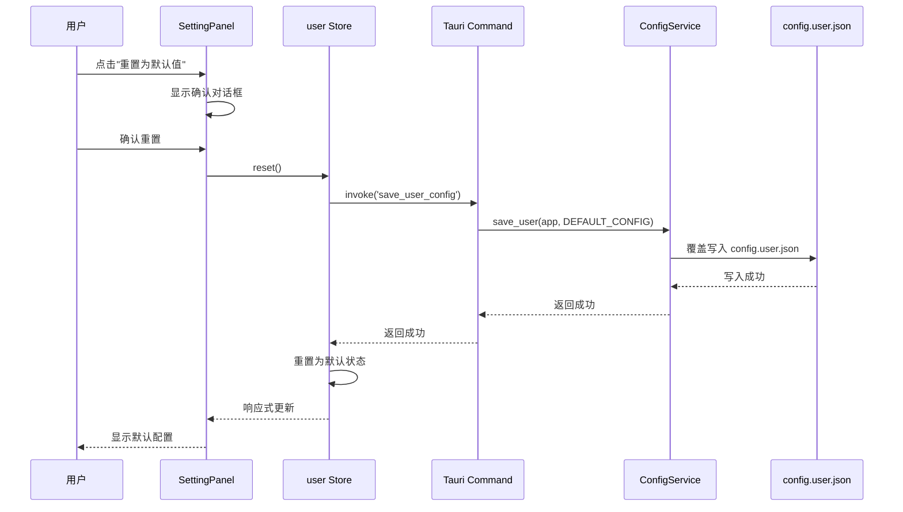
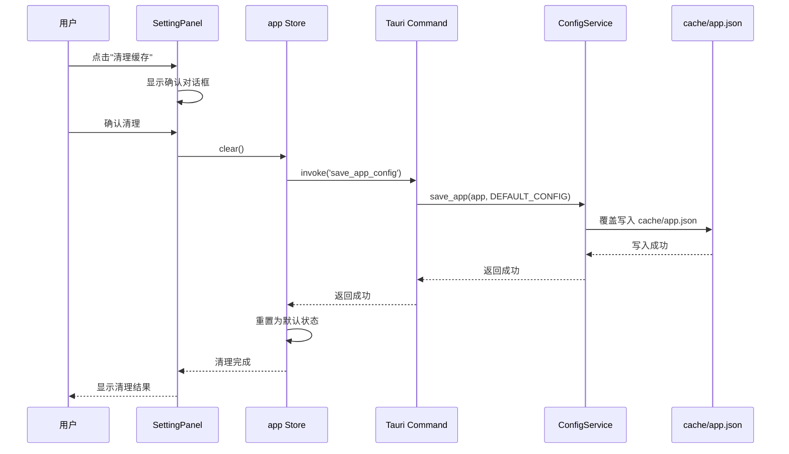

# Corelia 系统配置管理设计

## 概述

本文档描述 Corelia 的系统配置管理与设置功能的设计与实现。

---

## 配置系统架构

### 配置分层设计

Corelia 采用**三层配置架构**,按配置的重要性和修改频率分层管理:

```
┌─────────────────────────────────────────────────────────────────┐
│                    Corelia 配置分层架构                          │
├─────────────────────────────────────────────────────────────────┤
│                                                                 │
│  ┌──────────────────────────────────────────────────────────┐  │
│  │  第一层：系统级配置 (System Config)                       │  │
│  │  ======================================================== │  │
│  │  特征：                                                   │  │
│  │  • 仅用户手动修改，不自动变更                             │  │
│  │  • 影响应用核心行为                                       │  │
│  │  • 修改频率低，稳定性高                                   │  │
│  │  • 不轻易重置，需用户确认                                 │  │
│  │                                                          │  │
│  │  包含：                                                   │  │
│  │  • 快捷键配置 (shortcut.summon)                          │  │
│  │  • 开机自启动 (startup.enabled)                          │  │
│  │  • 语言设置 (locale)                                      │  │
│  │  • 数据目录路径 (dataPath)                                │  │
│  └──────────────────────────────────────────────────────────┘  │
│                              │                                   │
│                              ▼                                   │
│  ┌──────────────────────────────────────────────────────────┐  │
│  │  第二层：用户级配置 (User Config)                         │  │
│  │  ======================================================== │  │
│  │  特征：                                                   │  │
│  │  • 用户可随时修改                                         │  │
│  │  • 影响 UI/UX 表现                                         │  │
│  │  • 修改频率中等                                           │  │
│  │  • 可安全重置为默认值                                     │  │
│  │                                                          │  │
│  │  包含：                                                   │  │
│  │  • 主题设置 (theme)                                       │  │
│  │  • 行为偏好 (behavior.autoHide, autoHideDelay)           │  │
│  │  • 窗口位置/尺寸 (window.bounds)                          │  │
│  │  • 搜索偏好 (search.defaultCategory)                     │  │
│  └──────────────────────────────────────────────────────────┘  │
│                              │                                   │
│                              ▼                                   │
│  ┌──────────────────────────────────────────────────────────┐  │
│  │  第三层：应用级配置 (App Config)                          │  │
│  │  ======================================================== │  │
│  │  特征：                                                   │  │
│  │  • 应用自动生成/维护                                      │  │
│  │  • 运行时状态记录                                         │  │
│  │  • 修改频率高                                             │  │
│  │  • 可随时清理/重建                                        │  │
│  │                                                          │  │
│  │  包含：                                                   │  │
│  │  • 搜索历史 (searchHistory)                               │  │
│  │  • 插件缓存 (plugins.cache)                               │  │
│  │  • 上次运行状态 (lastState)                               │  │
│  │  • 使用统计 (usageStats)                                  │  │
│  └──────────────────────────────────────────────────────────┘  │
│                                                                 │
└─────────────────────────────────────────────────────────────────┘
```

### 配置分层说明

| 层级 | 名称 | 修改方式 | 重置策略 | 存储位置 |
|------|------|----------|----------|----------|
| **L1** | 系统级配置 | 仅手动 | 不自动重置 | `$APPDATA/morningstart.corelia/config.system.json` |
| **L2** | 用户级配置 | 手动/自动 | 可安全重置 | `$APPDATA/morningstart.corelia/config.user.json` |
| **L3** | 应用级配置 | 自动生成 | 可随时清理 | `$APPDATA/morningstart.corelia/cache/app.json` |

### 存储目录结构

```
%APPDATA%/morningstart.corelia/
├── config.system.json          # L1 系统级配置
├── config.user.json            # L2 用户级配置
├── logs/                       # 日志目录
│   └── corelia.log
└── cache/                      # 缓存目录
    ├── app.json                # L3 应用级配置
    ├── plugins/                # 插件缓存
    │   └── {plugin_id}/
    └── thumbnails/             # 缩略图缓存
```

**跨平台路径**:

| 平台 | 路径 |
|------|------|
| **Windows** | `%APPDATA%\morningstart.corelia\` |
| **macOS** | `~/Library/Application Support/morningstart.corelia/` |
| **Linux** | `~/.config/morningstart.corelia/` |

**Tauri 路径 API**:

```rust
use tauri::api::path::app_data_dir;

// 获取应用数据目录
let app_data = app_data_dir(&app.config());
// Windows: C:\Users\{user}\AppData\Roaming\morningstart.corelia
```

### 整体架构

```
┌─────────────────────────────────────────────────────────────────────┐
│                    Corelia 配置系统架构                              │
├─────────────────────────────────────────────────────────────────────┤
│                                                                     │
│   ┌─────────────────────────────────────────────────────────────┐  │
│   │                      用户界面层                              │  │
│   │                                                              │  │
│   │   ┌──────────────────────────────────────────────────────┐ │  │
│   │   │              SettingPanel.svelte                     │ │  │
│   │   │  • 快捷键设置 (ShortcutRecorder)                     │ │  │
│   │   │  • 主题切换 (深色/浅色/跟随系统)                      │ │  │
│   │   │  • 行为配置 (自动隐藏/延迟)                           │ │  │
│   │   │  • 开机自启动开关                                    │ │  │
│   │   └──────────────────────────────────────────────────────┘ │  │
│   │                                                             │  │
│   └─────────────────────────────────────────────────────────────┘  │
│                              │                                       │
│                              ▼                                       │
│   ┌─────────────────────────────────────────────────────────────┐  │
│   │                    前端状态管理层                            │  │
│   │                                                              │  │
│   │   ┌─────────────────┐         ┌─────────────────────┐      │  │
│   │   │  settings Store │         │   theme Store       │      │  │
│   │   │  • load()       │         │   • set()           │      │  │
│   │   │  • save()       │         │   • get()           │      │  │
│   │   │  • reset()      │         │   • subscribe()     │      │  │
│   │   │  • get()        │         │                     │      │  │
│   │   └─────────────────┘         └─────────────────────┘      │  │
│   │                                                             │  │
│   │   ┌─────────────────┐         ┌─────────────────────┐      │  │
│   │   │ startupService  │         │  shortcutService    │      │  │
│   │   │  • enable()     │         │  • register()       │      │  │
│   │   │  • disable()    │         │  • unregisterAll()  │      │  │
│   │   │  • isEnabled()  │         │  • getCurrent()     │      │  │
│   │   └─────────────────┘         └─────────────────────┘      │  │
│   │                                                             │  │
│   └─────────────────────────────────────────────────────────────┘  │
│                              │                                       │
│                              ▼                                       │
│   ┌─────────────────────────────────────────────────────────────┐  │
│   │                   Tauri Command 层                          │  │
│   │                                                              │  │
│   │   ┌─────────────────┐         ┌─────────────────────┐      │  │
│   │   │ load_settings   │         │  save_settings      │      │  │
│   │   │ save_to_store   │         │  delete_from_store  │      │  │
│   │   │ load_from_store │         │  ...                │      │  │
│   │   └─────────────────┘         └─────────────────────┘      │  │
│   │                                                             │  │
│   └─────────────────────────────────────────────────────────────┘  │
│                              │                                       │
│                              ▼                                       │
│   ┌─────────────────────────────────────────────────────────────┐  │
│   │                   Rust 服务层                               │  │
│   │                                                              │  │
│   │   ┌──────────────────────────────────────────────────────┐ │  │
│   │   │              StoreService                            │ │  │
│   │   │  • save() / load() / delete()                        │ │  │
│   │   │  • load_settings() / save_settings()                 │ │  │
│   │   │  (基于 tauri-plugin-store)                           │ │  │
│   │   └──────────────────────────────────────────────────────┘ │  │
│   │                                                             │  │
│   └─────────────────────────────────────────────────────────────┘  │
│                              │                                       │
│                              ▼                                       │
│   ┌─────────────────────────────────────────────────────────────┐  │
│   │                   文件存储层                                │  │
│   │                                                              │  │
│   │   ┌─────────────────┐  ┌─────────────────┐                │  │
│   │   │ config.system   │  │  config.user    │                │  │
│   │   │ (系统级配置)    │  │  (用户级配置)   │                │  │
│   │   └─────────────────┘  └─────────────────┘                │  │
│   │   ┌─────────────────┐  ┌─────────────────┐                │  │
│   │   │ cache.app       │  │  plugins.cache  │                │  │
│   │   │ (应用级配置)    │  │  (插件缓存)     │                │  │
│   │   └─────────────────┘  └─────────────────┘                │  │
│   │                                                             │  │
│   └─────────────────────────────────────────────────────────────┘  │
│                                                                     │
└─────────────────────────────────────────────────────────────────────┘
```

### 架构分层说明

| 层级 | 职责 | 技术选型 |
|------|------|----------|
| 用户界面层 | 提供用户可见的设置界面 | Svelte 5 Components |
| 前端状态管理层 | 管理配置状态、提供 API 封装 | Svelte Stores + Services |
| Tauri Command 层 | 前后端通信桥梁 | Tauri Commands |
| Rust 服务层 | 封装存储逻辑、提供默认值 | Rust + tauri-plugin-store |
| 文件存储层 | 持久化存储配置文件 | JSON 文件 |

---

## 配置数据结构

### L1: 系统级配置 (SystemConfig)

**特征**: 仅用户手动修改，影响应用核心行为，不轻易重置

```typescript
export interface SystemConfig {
  // 快捷键配置
  shortcut: {
    summon: string;  // 唤起快捷键，默认 "Alt+Space"
  };
  
  // 启动配置
  startup: {
    enabled: boolean;        // 是否启用开机自启动
    minimizeToTray: boolean; // 是否最小化到系统托盘
  };
  
  // 高级配置
  advanced: {
    dataPath?: string;       // 自定义数据目录（可选）
    locale?: string;         // 语言设置（可选，默认跟随系统）
    debugMode: boolean;      // 调试模式（默认 false）
  };
}
```

**默认值**:

```typescript
const DEFAULT_SYSTEM_CONFIG: SystemConfig = {
  shortcut: {
    summon: 'Alt+Space'
  },
  startup: {
    enabled: false,
    minimizeToTray: true
  },
  advanced: {
    debugMode: false
  }
};
```

**存储文件**: `App Data / config.system.json`

---

### L2: 用户级配置 (UserConfig)

**特征**: 用户可随时修改，影响 UI/UX 表现，可安全重置

```typescript
export interface UserConfig {
  // 主题配置
  theme: 'dark' | 'light' | 'system';
  
  // 行为偏好
  behavior: {
    autoHide: boolean;       // 是否启用失焦自动隐藏
    autoHideDelay: number;   // 自动隐藏延迟（毫秒）
  };
  
  // 窗口配置
  window: {
    width: number;           // 窗口宽度
    height: number;          // 窗口高度
    x?: number;              // 窗口 X 坐标（可选）
    y?: number;              // 窗口 Y 坐标（可选）
  };
  
  // 搜索偏好
  search: {
    defaultCategory: 'all' | 'plugins' | 'system'; // 默认搜索分类
    maxResults: number;      // 最大结果数
  };
}
```

**默认值**:

```typescript
const DEFAULT_USER_CONFIG: UserConfig = {
  theme: 'dark',
  behavior: {
    autoHide: true,
    autoHideDelay: 3000
  },
  window: {
    width: 600,
    height: 400
  },
  search: {
    defaultCategory: 'all',
    maxResults: 20
  }
};
```

**存储文件**: `App Data / config.user.json`

---

### L3: 应用级配置 (AppConfig)

**特征**: 应用自动生成/维护，运行时状态记录，可随时清理

```typescript
export interface AppConfig {
  // 搜索历史
  searchHistory: Array<{
    query: string;
    timestamp: number;
    count: number;  // 使用次数
  }>;
  
  // 插件缓存
  plugins: {
    cache: Record<string, {
      version: string;
      lastUsed: number;
      loadTime: number;  // 加载耗时（ms）
    }>;
    enabled: string[];   // 启用的插件 ID 列表
  };
  
  // 运行状态
  runtime: {
    lastState: {
      lastQuery?: string;
      selectedPlugin?: string;
    };
    usageStats: {
      launchCount: number;
      totalUsageTime: number;  // 总使用时长（秒）
    };
  };
}
```

**默认值**:

```typescript
const DEFAULT_APP_CONFIG: AppConfig = {
  searchHistory: [],
  plugins: {
    cache: {},
    enabled: []
  },
  runtime: {
    lastState: {},
    usageStats: {
      launchCount: 0,
      totalUsageTime: 0
    }
  }
};
```

**存储文件**: `App Data / cache/app.json`

---

### 配置文件示例

**config.system.json**:

```json
{
  "shortcut": {
    "summon": "Ctrl+Space"
  },
  "startup": {
    "enabled": true,
    "minimizeToTray": true
  },
  "advanced": {
    "debugMode": false
  }
}
```

**config.user.json**:

```json
{
  "theme": "light",
  "behavior": {
    "autoHide": true,
    "autoHideDelay": 5000
  },
  "window": {
    "width": 700,
    "height": 450
  },
  "search": {
    "defaultCategory": "all",
    "maxResults": 20
  }
}
```

**cache/app.json**:

```json
{
  "searchHistory": [
    { "query": "文档", "timestamp": 1712304000000, "count": 5 },
    { "query": "计算器", "timestamp": 1712303000000, "count": 3 }
  ],
  "plugins": {
    "cache": {
      "sample-quickjs": {
        "version": "1.0.0",
        "lastUsed": 1712304000000,
        "loadTime": 7
      }
    },
    "enabled": ["sample-quickjs", "clipboard-enhanced"]
  },
  "runtime": {
    "lastState": {
      "lastQuery": "文档"
    },
    "usageStats": {
      "launchCount": 120,
      "totalUsageTime": 3600
    }
  }
}
```

---

## 核心模块设计

### 前端模块

#### 1. 分层 Stores

##### SystemStore (`src/lib/stores/system.ts`)

**职责**: 管理系统级配置，仅允许手动修改

**核心方法**:

| 方法 | 参数 | 返回值 | 说明 |
|------|------|--------|------|
| `load()` | - | `Promise<void>` | 从后端加载系统配置 |
| `save(config)` | `SystemConfig` | `Promise<void>` | 保存系统配置 |
| `reset()` | - | `Promise<void>` | ⚠️ 不支持（需用户确认） |
| `get<T>(path)` | `string` | `T` | 获取配置值 |

**实现要点**:

- 不提供自动重置功能
- 修改时需二次确认
- 关键配置（如快捷键）修改后需立即生效

```typescript
import { writable } from 'svelte/store';
import { invoke } from '@tauri-apps/api/core';

export interface SystemConfig {
  shortcut: { summon: string };
  startup: { enabled: boolean; minimizeToTray: boolean };
  advanced: { debugMode: boolean };
}

function createSystemStore() {
  const { subscribe, set, update } = writable<SystemConfig>(DEFAULT_SYSTEM_CONFIG);

  return {
    subscribe,

    async load(): Promise<void> {
      const config = await invoke<SystemConfig>('load_system_config');
      set(structuredClone(config));
    },

    async save(config: SystemConfig): Promise<void> {
      // 关键配置修改需确认
      const confirmed = confirm('修改系统配置可能需要重启应用，确定继续？');
      if (!confirmed) return;
      
      await invoke('save_system_config', { config: structuredClone(config) });
    },

    // 不提供 reset() 方法，避免误操作
  };
}

export const system = createSystemStore();
```

---

##### UserStore (`src/lib/stores/user.ts`)

**职责**: 管理用户级配置，支持快速修改和重置

**核心方法**:

| 方法 | 参数 | 返回值 | 说明 |
|------|------|--------|------|
| `load()` | - | `Promise<void>` | 从后端加载用户配置 |
| `save(config)` | `UserConfig` | `Promise<void>` | 保存用户配置 |
| `reset()` | - | `Promise<void>` | 重置为默认值 |
| `get<T>(path)` | `string` | `T` | 获取配置值 |
| `update(path, value)` | `string, T` | `Promise<void>` | 更新单个配置项 |

**实现要点**:

- 支持部分更新（无需提供完整配置）
- 可安全重置
- 实时生效

```typescript
import { writable } from 'svelte/store';
import { invoke } from '@tauri-apps/api/core';

export interface UserConfig {
  theme: 'dark' | 'light' | 'system';
  behavior: { autoHide: boolean; autoHideDelay: number };
  window: { width: number; height: number };
  search: { defaultCategory: string; maxResults: number };
}

function createUserStore() {
  const { subscribe, set } = writable<UserConfig>(DEFAULT_USER_CONFIG);

  return {
    subscribe,

    async load(): Promise<void> {
      const config = await invoke<UserConfig>('load_user_config');
      set(structuredClone(config));
    },

    async save(config: UserConfig): Promise<void> {
      await invoke('save_user_config', { config: structuredClone(config) });
    },

    async reset(): Promise<void> {
      set(structuredClone(DEFAULT_USER_CONFIG));
      await invoke('save_user_config', { config: DEFAULT_USER_CONFIG });
    },

    async update(path: string, value: unknown): Promise<void> {
      let config: UserConfig;
      subscribe(c => { config = c; })();
      
      // 深拷贝并更新
      const newConfig = structuredClone(config);
      const keys = path.split('.');
      let current: any = newConfig;
      for (let i = 0; i < keys.length - 1; i++) {
        current = current[keys[i]];
      }
      current[keys.at(-1)!] = value;
      
      set(newConfig);
      await this.save(newConfig);
    }
  };
}

export const user = createUserStore();
```

---

##### AppStore (`src/lib/stores/app.ts`)

**职责**: 管理应用级配置，自动维护运行时状态

**核心方法**:

| 方法 | 参数 | 返回值 | 说明 |
|------|------|--------|------|
| `load()` | - | `Promise<void>` | 加载应用配置 |
| `save(config)` | `AppConfig` | `Promise<void>` | 保存应用配置 |
| `clear()` | - | `Promise<void>` | 清理所有缓存数据 |
| `addHistory(query)` | `string` | `Promise<void>` | 添加搜索历史 |
| `updatePluginCache(id, data)` | `string, object` | `Promise<void>` | 更新插件缓存 |

**实现要点**:

- 自动清理过期数据
- 支持批量操作
- 不影响用户配置

```typescript
import { writable } from 'svelte/store';
import { invoke } from '@tauri-apps/api/core';

export interface AppConfig {
  searchHistory: Array<{ query: string; timestamp: number; count: number }>;
  plugins: { cache: Record<string, any>; enabled: string[] };
  runtime: { lastState: any; usageStats: any };
}

function createAppStore() {
  const { subscribe, set } = writable<AppConfig>(DEFAULT_APP_CONFIG);

  return {
    subscribe,

    async load(): Promise<void> {
      const config = await invoke<AppConfig>('load_app_config');
      set(structuredClone(config));
    },

    async save(config: AppConfig): Promise<void> {
      await invoke('save_app_config', { config: structuredClone(config) });
    },

    async clear(): Promise<void> {
      set(structuredClone(DEFAULT_APP_CONFIG));
      await invoke('save_app_config', { config: DEFAULT_APP_CONFIG });
    },

    async addHistory(query: string): Promise<void> {
      let config: AppConfig;
      subscribe(c => { config = c; })();
      
      // 查找是否已存在
      const existing = config.searchHistory.find(h => h.query === query);
      if (existing) {
        existing.count++;
        existing.timestamp = Date.now();
      } else {
        config.searchHistory.unshift({
          query,
          timestamp: Date.now(),
          count: 1
        });
        // 限制历史记录数量
        if (config.searchHistory.length > 100) {
          config.searchHistory = config.searchHistory.slice(0, 100);
        }
      }
      
      set(config);
      await this.save(config);
    },

    async updatePluginCache(pluginId: string, data: any): Promise<void> {
      let config: AppConfig;
      subscribe(c => { config = c; })();
      
      config.plugins.cache[pluginId] = {
        ...data,
        lastUsed: Date.now()
      };
      
      set(config);
      await this.save(config);
    }
  };
}

export const app = createAppStore();
```

#### 2. Theme Store (`src/lib/stores/theme.ts`)

**职责**: 管理主题状态，支持深色/浅色/跟随系统切换

**核心功能**:

- 主题状态管理
- 系统主题变化监听
- CSS 变量动态更新

#### 3. StartupService (`src/lib/services/startup.ts`)

**职责**: 封装开机自启动功能

**核心方法**:

| 方法 | 参数 | 返回值 | 说明 |
|------|------|--------|------|
| `enable()` | - | `Promise<void>` | 启用开机自启动 |
| `disable()` | - | `Promise<void>` | 禁用开机自启动 |
| `isEnabled()` | - | `Promise<bool>` | 查询自启动状态 |

#### 4. ShortcutService (`src/lib/services/shortcut.ts`)

**职责**: 封装快捷键管理功能

**核心方法**:

| 方法 | 参数 | 返回值 | 说明 |
|------|------|--------|------|
| `register(shortcut)` | `string` | `Promise<void>` | 注册快捷键 |
| `unregisterAll()` | - | `Promise<void>` | 注销所有快捷键 |
| `getCurrent()` | - | `Promise<string>` | 获取当前快捷键 |

### 后端模块

#### 1. ConfigService (`src-tauri/src/services/config_service.rs`)

**职责**: 封装三层配置的管理操作，首次启动时自动创建配置目录和文件

**首次启动流程**:

```rust
//! 应用启动时初始化配置目录
//! 
//! 路径：$APPDATA/morningstart.corelia/

use std::fs;
use std::path::PathBuf;
use tauri::api::path::app_data_dir;

/// 初始化配置目录结构
pub fn init_config_directory(app: &tauri::AppHandle) -> Result<PathBuf, String> {
    // 获取应用数据目录
    let app_data = app_data_dir(&app.config())
        .ok_or("无法获取应用数据目录")?;
    
    let base_dir = app_data.join("morningstart.corelia");
    let cache_dir = base_dir.join("cache");
    let logs_dir = base_dir.join("logs");
    
    // 创建目录结构
    fs::create_dir_all(&base_dir)
        .map_err(|e| format!("无法创建配置目录：{}", e))?;
    fs::create_dir_all(&cache_dir)
        .map_err(|e| format!("无法创建缓存目录：{}", e))?;
    fs::create_dir_all(&logs_dir)
        .map_err(|e| format!("无法创建日志目录：{}", e))?;
    
    // 检查是否需要创建默认配置文件
    let system_config = base_dir.join("config.system.json");
    let user_config = base_dir.join("config.user.json");
    let app_cache = cache_dir.join("app.json");
    
    // 创建默认系统配置（如果不存在）
    if !system_config.exists() {
        let default_config = serde_json::json!({
            "config": {
                "shortcut": { "summon": "Alt+Space" },
                "startup": { "enabled": false, "minimizeToTray": true },
                "advanced": { "debugMode": false }
            }
        });
        fs::write(&system_config, serde_json::to_string_pretty(&default_config)?)
            .map_err(|e| format!("无法创建系统配置文件：{}", e))?;
    }
    
    // 创建默认用户配置（如果不存在）
    if !user_config.exists() {
        let default_config = serde_json::json!({
            "config": {
                "theme": "dark",
                "behavior": { "autoHide": true, "autoHideDelay": 3000 },
                "window": { "width": 600, "height": 400 },
                "search": { "defaultCategory": "all", "maxResults": 20 }
            }
        });
        fs::write(&user_config, serde_json::to_string_pretty(&default_config)?)
            .map_err(|e| format!("无法创建用户配置文件：{}", e))?;
    }
    
    // 创建默认应用缓存（如果不存在）
    if !app_cache.exists() {
        let default_config = serde_json::json!({
            "config": {
                "searchHistory": [],
                "plugins": { "cache": {}, "enabled": [] },
                "runtime": { "lastState": {}, "usageStats": { "launchCount": 0, "totalUsageTime": 0 } }
            }
        });
        fs::write(&app_cache, serde_json::to_string_pretty(&default_config)?)
            .map_err(|e| format!("无法创建应用缓存：{}", e))?;
    }
    
    Ok(base_dir)
}
```

**在 Tauri setup 中调用**:

```rust
// src-tauri/src/main.rs
fn main() {
    tauri::Builder::default()
        .setup(|app| {
            // 初始化配置目录
            let config_dir = config_service::init_config_directory(&app.handle())?;
            println!("配置目录：{:?}", config_dir);
            
            // 初始化其他服务...
            Ok(())
        })
        .run(tauri::generate_context!())
        .expect("error while running tauri application");
}
```

**核心方法**:

| 方法 | 参数 | 返回值 | 说明 |
|------|------|--------|------|
| `load_system()` | `&AppHandle` | `Result<Value, String>` | 加载系统级配置 |
| `save_system(config)` | `Value` | `Result<(), String>` | 保存系统级配置 |
| `load_user()` | `&AppHandle` | `Result<Value, String>` | 加载用户级配置 |
| `save_user(config)` | `Value` | `Result<(), String>` | 保存用户级配置 |
| `reset_user()` | - | `Result<(), String>` | 重置用户级配置 |
| `load_app()` | `&AppHandle` | `Result<Value, String>` | 加载应用级配置 |
| `save_app(config)` | `Value` | `Result<(), String>` | 保存应用级配置 |
| `clear_app()` | - | `Result<(), String>` | 清理应用级配置 |

**实现要点**:

- 分层存储，独立管理
- 系统级配置需二次确认
- 应用级配置支持自动清理

**代码示例**:

```rust
//! 配置服务模块
//! 
//! 封装三层配置的管理操作
//! 
//! 存储路径：$APPDATA/morningstart.corelia/
//! - config.system.json  (系统级配置)
//! - config.user.json    (用户级配置)
//! - cache/app.json      (应用级配置)

use serde_json::Value;
use tauri_plugin_store::StoreExt;

pub struct ConfigService;

impl ConfigService {
    // ==================== 系统级配置 ====================
    
    /// 加载系统级配置
    /// 
    /// 文件位置：$APPDATA/morningstart.corelia/config.system.json
    pub fn load_system(app: &tauri::AppHandle) -> Result<Value, String> {
        let store = app.store("morningstart.corelia/config.system.json")
            .map_err(|e| format!("无法打开系统配置文件：{}", e))?;
        
        match store.get("config") {
            Some(v) => Ok(v.clone()),
            None => {
                // 首次启动，创建默认配置
                let default_config = Self::default_system_config();
                Self::save_system(app, default_config.clone())?;
                Ok(default_config)
            }
        }
    }
    
    /// 保存系统级配置
    pub fn save_system(app: &tauri::AppHandle, config: Value) -> Result<(), String> {
        // 验证配置
        Self::validate_system_config(&config)?;
        
        let store = app.store("morningstart.corelia/config.system.json")
            .map_err(|e| format!("无法保存系统配置：{}", e))?;
        store.set("config", config);
        store.save().map_err(|e| format!("保存系统配置失败：{}", e))
    }
    
    fn default_system_config() -> Value {
        serde_json::json!({
            "shortcut": { "summon": "Alt+Space" },
            "startup": { "enabled": false, "minimizeToTray": true },
            "advanced": { "debugMode": false }
        })
    }
    
    fn validate_system_config(config: &Value) -> Result<(), String> {
        // 验证必填字段
        let obj = config.as_object()
            .ok_or("系统配置必须是对象")?;
        
        // 验证快捷键
        if let Some(shortcut) = obj.get("shortcut") {
            let summon = shortcut.get("summon")
                .and_then(|s| s.as_str())
                .ok_or("shortcut.summon 必须是字符串")?;
            
            if summon.is_empty() {
                return Err("快捷键不能为空".to_string());
            }
        }
        
        Ok(())
    }
    
    // ==================== 用户级配置 ====================
    
    /// 加载用户级配置
    /// 
    /// 文件位置：$APPDATA/morningstart.corelia/config.user.json
    pub fn load_user(app: &tauri::AppHandle) -> Result<Value, String> {
        let store = app.store("morningstart.corelia/config.user.json")
            .map_err(|e| format!("无法打开用户配置文件：{}", e))?;
        
        match store.get("config") {
            Some(v) => Ok(v.clone()),
            None => {
                // 首次启动，创建默认配置
                let default_config = Self::default_user_config();
                Self::save_user(app, default_config.clone())?;
                Ok(default_config)
            }
        }
    }
    
    /// 保存用户级配置
    pub fn save_user(app: &tauri::AppHandle, config: Value) -> Result<(), String> {
        let store = app.store("morningstart.corelia/config.user.json")
            .map_err(|e| format!("无法保存用户配置：{}", e))?;
        store.set("config", config);
        store.save().map_err(|e| format!("保存用户配置失败：{}", e))
    }
    
    /// 重置用户级配置为默认值
    pub fn reset_user(app: &tauri::AppHandle) -> Result<(), String> {
        let store = app.store("morningstart.corelia/config.user.json")
            .map_err(|e| format!("无法重置用户配置：{}", e))?;
        store.set("config", Self::default_user_config());
        store.save().map_err(|e| format!("重置用户配置失败：{}", e))
    }
    
    fn default_user_config() -> Value {
        serde_json::json!({
            "theme": "dark",
            "behavior": { "autoHide": true, "autoHideDelay": 3000 },
            "window": { "width": 600, "height": 400 },
            "search": { "defaultCategory": "all", "maxResults": 20 }
        })
    }
    
    // ==================== 应用级配置 ====================
    
    /// 加载应用级配置
    /// 
    /// 文件位置：$APPDATA/morningstart.corelia/cache/app.json
    pub fn load_app(app: &tauri::AppHandle) -> Result<Value, String> {
        let store = app.store("morningstart.corelia/cache/app.json")
            .map_err(|e| format!("无法打开应用缓存：{}", e))?;
        
        match store.get("config") {
            Some(v) => Ok(v.clone()),
            None => {
                let default_config = Self::default_app_config();
                Self::save_app(app, default_config.clone())?;
                Ok(default_config)
            }
        }
    }
    
    /// 保存应用级配置
    pub fn save_app(app: &tauri::AppHandle, config: Value) -> Result<(), String> {
        let store = app.store("morningstart.corelia/cache/app.json")
            .map_err(|e| format!("无法保存应用缓存：{}", e))?;
        store.set("config", config);
        store.save().map_err(|e| format!("保存应用缓存失败：{}", e))
    }
    
    /// 清理应用级配置
    pub fn clear_app(app: &tauri::AppHandle) -> Result<(), String> {
        let store = app.store("morningstart.corelia/cache/app.json")
            .map_err(|e| format!("无法清理应用缓存：{}", e))?;
        store.set("config", Self::default_app_config());
        store.save().map_err(|e| format!("清理应用缓存失败：{}", e))
    }
    
    fn default_app_config() -> Value {
        serde_json::json!({
            "searchHistory": [],
            "plugins": { "cache": {}, "enabled": [] },
            "runtime": { "lastState": {}, "usageStats": { "launchCount": 0, "totalUsageTime": 0 } }
        })
    }
}
```

#### 2. Commands 模块 (`src-tauri/src/commands/`)

**文件结构**:

```
src-tauri/src/commands/
├── mod.rs                  # 模块导出
├── config/                 # 配置相关命令
│   ├── mod.rs
│   ├── system.rs           # 系统级配置命令
│   ├── user.rs             # 用户级配置命令
│   └── app.rs              # 应用级配置命令
├── shortcut.rs             # 快捷键相关命令
└── autostart.rs            # 自启动相关命令
```

**核心 Commands**:

##### 配置相关 Commands

```rust
// config/system.rs - 系统级配置
#[tauri::command]
async fn load_system_config(app: AppHandle) -> Result<Value, String> {
    ConfigService::load_system(&app)
}

#[tauri::command]
async fn save_system_config(app: AppHandle, config: Value) -> Result<(), String> {
    ConfigService::save_system(&app, config)
}

// config/user.rs - 用户级配置
#[tauri::command]
async fn load_user_config(app: AppHandle) -> Result<Value, String> {
    ConfigService::load_user(&app)
}

#[tauri::command]
async fn save_user_config(app: AppHandle, config: Value) -> Result<(), String> {
    ConfigService::save_user(&app, config)
}

#[tauri::command]
async fn reset_user_config(app: AppHandle) -> Result<(), String> {
    ConfigService::reset_user(&app)
}

// config/app.rs - 应用级配置
#[tauri::command]
async fn load_app_config(app: AppHandle) -> Result<Value, String> {
    ConfigService::load_app(&app)
}

#[tauri::command]
async fn save_app_config(app: AppHandle, config: Value) -> Result<(), String> {
    ConfigService::save_app(&app, config)
}

#[tauri::command]
async fn clear_app_config(app: AppHandle) -> Result<(), String> {
    ConfigService::clear_app(&app)
}
```

##### 快捷键相关 Commands

```rust
// shortcut.rs
#[tauri::command]
async fn register_custom_shortcut(shortcut: String, action: String) -> Result<(), String>

#[tauri::command]
async fn unregister_all_shortcuts() -> Result<(), String>

#[tauri::command]
async fn get_current_shortcut() -> Result<String, String>
```

##### 自启动相关 Commands

```rust
// autostart.rs
#[tauri::command]
async fn enable_autostart(app: AppHandle) -> Result<(), String>

#[tauri::command]
async fn disable_autostart(app: AppHandle) -> Result<(), String>

#[tauri::command]
async fn is_autostart_enabled(app: AppHandle) -> Result<bool, String>
```

### UI 组件模块

#### SettingPanel (`src/lib/components/SettingPanel.svelte`)

**职责**: 提供完整的设置界面

**功能分区**:

1. **快捷键设置区**
   - ShortcutRecorder 组件
   - 实时快捷键录制
   - 冲突检测提示

2. **主题设置区**
   - 三个主题切换按钮（深色/浅色/跟随系统）
   - 实时预览效果

3. **行为设置区**
   - 失焦自动隐藏开关
   - 自动隐藏延迟配置

4. **启动设置区**
   - 开机自启动开关
   - 最小化到托盘开关

**UI 布局**:

```
┌─────────────────────────────────────┐
│  设置                          [×]  │
├─────────────────────────────────────┤
│                                     │
│  快捷键                              │
│  ┌─────────────────────────────┐   │
│  │  唤起窗口  [Ctrl+Space]     │   │
│  └─────────────────────────────┘   │
│                                     │
│  主题                                │
│  ┌──────┐ ┌──────┐ ┌──────────┐   │
│  │ 深色 │ │ 浅色 │ │跟随系统  │   │
│  └──────┘ └──────┘ └──────────┘   │
│                                     │
│  行为                                │
│  ┌─────────────────────────────┐   │
│  │  失焦自动隐藏      [✓]      │   │
│  │  开机自启动        [✓]      │   │
│  └─────────────────────────────┘   │
│                                     │
└─────────────────────────────────────┘
```

---

## 数据流设计

### L1 系统级配置修改流程



---

### L2 用户级配置修改流程 (如切换主题)



---

### L3 应用级配置自动更新流程 (如添加搜索历史)



---

### 配置重置流程 (仅 L2 用户级)



---

### 应用缓存清理流程



---

## 配置项详解

### L1 系统级配置项

#### shortcut.summon - 唤起快捷键

**类型**: `string`

**默认值**: `"Alt+Space"`

**修改方式**: 仅手动（通过 ShortcutRecorder 组件）

**重置策略**: ⚠️ 需用户确认

**说明**:

- 支持修饰键组合：`Ctrl`, `Alt`, `Shift`, `Meta`
- 支持字母键：`A-Z`
- 支持功能键：`F1-F12`, `Space`, `Escape`, 等

**格式示例**:

- `Alt+Space`
- `Ctrl+Shift+P`
- `Meta+K`

**注意事项**:

- 避免使用系统保留快捷键（如 `Alt+F4`, `Ctrl+C`）
- 修改后需重启应用生效
- 支持清空（不设置快捷键）

---

#### startup.enabled - 开机自启动

**类型**: `boolean`

**默认值**: `false`

**修改方式**: 手动（设置面板开关）

**技术实现**:

- 使用 `tauri-plugin-autostart` 实现跨平台自启动
- Windows: 注册表 `HKEY_CURRENT_USER\Software\Microsoft\Windows\CurrentVersion\Run`
- macOS: Launch Agent
- Linux: `.desktop` 文件

---

#### advanced.debugMode - 调试模式

**类型**: `boolean`

**默认值**: `false`

**说明**:

- 启用后输出详细日志
- 开发时使用，生产环境建议关闭

---

### L2 用户级配置项

#### theme - 主题设置

**类型**: `'dark' | 'light' | 'system'`

**默认值**: `'dark'`

**修改方式**: 手动（主题切换按钮）

**重置策略**: ✅ 可安全重置

**说明**:

- `dark`: 强制使用深色主题
- `light`: 强制使用浅色主题
- `system`: 跟随系统主题自动切换

**CSS 变量示例**:

```css
/* 深色主题 */
:root[data-theme="dark"] {
  --bg-color: #1a1a1a;
  --text-color: #ffffff;
  --accent-color: #0078d4;
}

/* 浅色主题 */
:root[data-theme="light"] {
  --bg-color: #ffffff;
  --text-color: #1a1a1a;
  --accent-color: #0066cc;
}
```

---

#### behavior.autoHide - 失焦自动隐藏

**类型**: `boolean`

**默认值**: `true`

**说明**:

- 启用后窗口失去焦点自动隐藏
- 配合 `autoHideDelay` 使用

---

#### behavior.autoHideDelay - 自动隐藏延迟

**类型**: `number` (毫秒)

**默认值**: `3000`

**说明**:

- 窗口失焦后延迟隐藏的时间
- 给用户一定时间返回，避免误操作
- 建议范围：1000-10000ms

---

#### window.width / window.height - 窗口尺寸

**类型**: `number`

**默认值**: `{ width: 600, height: 400 }`

**说明**:

- 应用会自动记忆窗口尺寸
- 最小尺寸限制：400x300
- 最大尺寸限制：1200x800

---

#### search.defaultCategory - 默认搜索分类

**类型**: `'all' | 'plugins' | 'system'`

**默认值**: `'all'`

**说明**:

- `all`: 搜索所有结果
- `plugins`: 仅搜索插件
- `system`: 仅搜索系统功能

---

### L3 应用级配置项（自动维护）

#### searchHistory - 搜索历史

**类型**: `Array<{ query: string, timestamp: number, count: number }>`

**默认值**: `[]`

**维护方式**: 自动

**清理策略**:

- 最多保留 100 条记录
- 可手动清空

---

#### plugins.cache - 插件缓存

**类型**: `Record<string, { version, lastUsed, loadTime }>`

**默认值**: `{}`

**维护方式**: 自动

**说明**:

- 记录每个插件的版本、最后使用时间、加载耗时
- 用于性能分析和智能预加载

---

#### runtime.usageStats - 使用统计

**类型**: `{ launchCount: number, totalUsageTime: number }`

**默认值**: `{ launchCount: 0, totalUsageTime: 0 }`

**维护方式**: 自动

**说明**:

- `launchCount`: 应用启动次数
- `totalUsageTime`: 总使用时长（秒）
- 用于产品改进分析

---

## 扩展性设计

### 未来配置项扩展

**搜索相关配置**:

```typescript
search: {
  historySize: number;        // 搜索历史数量
  enableSuggestions: boolean; // 启用搜索建议
  enableHighlight: boolean;   // 启用结果高亮
}
```

**插件相关配置**:

```typescript
plugins: {
  autoUpdate: boolean;        // 插件自动更新
  trustedSources: string[];   // 可信插件源
  sandboxMode: boolean;       // 沙箱模式
}
```

**性能相关配置**:

```typescript
performance: {
  maxCachedPlugins: number;   // 最大缓存插件数
  enablePreload: boolean;     // 启用预加载
  memoryThreshold: number;    // 内存阈值（MB）
}
```

### 配置导入导出

**设计思路**:

```typescript
interface ConfigExport {
  version: string;
  exportedAt: string;
  settings: Settings;
  plugins: Record<string, any>;
}

// 导出配置
async function exportConfig(): Promise<Blob> {
  const config: ConfigExport = {
    version: APP_VERSION,
    exportedAt: new Date().toISOString(),
    settings: settings.get(),
    plugins: await plugins.export()
  };
  return new Blob([JSON.stringify(config, null, 2)]);
}

// 导入配置
async function importConfig(blob: Blob): Promise<void> {
  const config: ConfigExport = JSON.parse(await blob.text());
  await settings.save(config.settings);
  await plugins.import(config.plugins);
}
```

### 云端同步（未来）

**设计思路**:

```typescript
interface SyncConfig {
  enabled: boolean;
  provider: 'github' | 'google' | 'custom';
  lastSyncedAt?: string;
}

// 同步配置到云端
async function syncToCloud(): Promise<void> {
  if (!syncConfig.enabled) return;
  
  const localSettings = await settings.get();
  const remoteSettings = await cloudProvider.download();
  
  // 冲突解决策略
  const merged = resolveConflict(localSettings, remoteSettings);
  
  await cloudProvider.upload(merged);
  await settings.save(merged);
}
```

---

## 安全性设计

### 配置验证

**前端验证**:

```typescript
function validateSettings(settings: unknown): settings is Settings {
  if (typeof settings !== 'object' || settings === null) return false;
  
  const s = settings as Record<string, unknown>;
  
  // 验证 theme
  if (!['dark', 'light', 'system'].includes(s.theme as string)) {
    return false;
  }
  
  // 验证 shortcut
  if (typeof s.shortcut?.summon !== 'string') {
    return false;
  }
  
  // 验证 behavior
  if (typeof s.behavior?.autoHide !== 'boolean' ||
      typeof s.behavior?.autoHideDelay !== 'number') {
    return false;
  }
  
  return true;
}
```

**后端验证**:

```rust
fn validate_settings(settings: &Value) -> Result<(), String> {
    // 验证必填字段
    let obj = settings.as_object()
        .ok_or("Settings must be an object")?;
    
    // 验证 theme
    if let Some(theme) = obj.get("theme") {
        let theme_str = theme.as_str()
            .ok_or("theme must be a string")?;
        if !["dark", "light", "system"].contains(&theme_str) {
            return Err("Invalid theme value".to_string());
        }
    }
    
    // 验证 shortcut
    if let Some(shortcut) = obj.get("shortcut") {
        let summon = shortcut.get("summon")
            .and_then(|s| s.as_str())
            .ok_or("shortcut.summon must be a string")?;
        
        if summon.is_empty() {
            return Err("Shortcut cannot be empty".to_string());
        }
    }
    
    Ok(())
}
```

### 敏感数据保护

**设计原则**:

- 不存储敏感信息（如密码、API Key）
- 如需存储，使用系统密钥链（Keychain/Keyring）
- 配置文件权限设置为仅用户可读写

**未来扩展**:

```rust
// 使用系统密钥链存储敏感数据
use keyring::Entry;

fn store_api_key(service: &str, key: &str) -> Result<(), Error> {
    let entry = Entry::new("corelia", service)?;
    entry.set_password(key)?;
    Ok(())
}

fn retrieve_api_key(service: &str) -> Result<String, Error> {
    let entry = Entry::new("corelia", service)?;
    entry.get_password()
}
```

---

## 测试策略

### 单元测试

**Settings Store 测试**:

```typescript
import { describe, it, expect, beforeEach } from 'vitest';
import { settings } from '$lib/stores/settings';

describe('settings store', () => {
  beforeEach(async () => {
    await settings.reset();
  });

  it('should load default settings', async () => {
    await settings.load();
    const theme = settings.get('theme');
    expect(theme).toBe('dark');
  });

  it('should save settings', async () => {
    const newSettings = {
      theme: 'light' as const,
      shortcut: { summon: 'Ctrl+Space' },
      behavior: { autoHide: false, autoHideDelay: 5000 },
      startup: { enabled: true, minimizeToTray: false }
    };
    await settings.save(newSettings);
    expect(settings.get('theme')).toBe('light');
  });

  it('should reset to default settings', async () => {
    await settings.save({
      theme: 'light' as const,
      shortcut: { summon: 'Ctrl+Space' },
      behavior: { autoHide: false, autoHideDelay: 5000 },
      startup: { enabled: true, minimizeToTray: false }
    });
    await settings.reset();
    expect(settings.get('theme')).toBe('dark');
  });
});
```

**Rust 服务测试**:

```rust
#[cfg(test)]
mod tests {
    use super::*;
    use serde_json::json;

    #[test]
    fn test_load_settings_default() {
        let app = create_test_app();
        let settings = StoreService::load_settings(&app).unwrap();
        
        assert_eq!(settings["theme"], "dark");
        assert_eq!(settings["shortcut"]["summon"], "Alt+Space");
    }

    #[test]
    fn test_save_and_load_settings() {
        let app = create_test_app();
        let new_settings = json!({
            "theme": "light",
            "shortcut": { "summon": "Ctrl+Space" }
        });
        
        StoreService::save_settings(&app, new_settings.clone()).unwrap();
        let loaded = StoreService::load_settings(&app).unwrap();
        
        assert_eq!(loaded["theme"], "light");
        assert_eq!(loaded["shortcut"]["summon"], "Ctrl+Space");
    }
}
```

### 集成测试

**配置保存加载集成测试**:

```typescript
import { test, expect } from '@playwright/test';

test('settings persistence', async ({ page }) => {
  // 打开设置面板
  await page.click('[data-testid="settings-button"]');
  
  // 切换主题
  await page.click('[data-testid="theme-light"]');
  
  // 关闭设置面板
  await page.click('[data-testid="close-settings"]');
  
  // 重新打开设置面板
  await page.click('[data-testid="settings-button"]');
  
  // 验证主题已保存
  const activeTheme = await page.locator('[data-testid="theme-light"]');
  await expect(activeTheme).toHaveClass(/active/);
});
```

---

## 验收标准

### 功能验收

| 验收项 | 验收标准 | 状态 |
|--------|----------|------|
| 主题切换 | 能正常切换深色/浅色/跟随系统，实时生效 | ✅ |
| 快捷键设置 | 能自定义唤起快捷键，注册成功 | ✅ |
| 自动隐藏 | 失焦后按设定延迟自动隐藏 | ✅ |
| 开机自启动 | 开关能正常启用/禁用自启动 | ✅ |
| 配置持久化 | 关闭应用后重新打开，配置不丢失 | ✅ |
| 默认值加载 | 首次使用时加载默认配置 | ✅ |

### 性能验收

| 指标 | 目标值 | 实测值 |
|------|--------|--------|
| 配置加载时间 | < 100ms | - |
| 配置保存时间 | < 50ms | - |
| 快捷键注册延迟 | < 200ms | - |

### 兼容性验收

| 平台 | 状态 |
|------|------|
| Windows 10/11 | ✅ |
| macOS 11+ | ⏳ 待适配 |
| Linux | ⏳ 待适配 |

---

## 相关文档

- [SRS 功能需求规格说明书](SRS.md) - 2.6 设置界面
- [ARCHITECTURE 系统架构设计](ARCHITECTURE.md) - 数据流设计
- [MVP-ECOSYSTEM 规格说明书](../docs/spec/mvp/mvp-ecosystem/MVP-ECOSYSTEM-SPEC.md) - ECO-01 持久化存储

---

## 变更记录

| 版本 | 时间 | 变更内容 | 变更人 |
|------|------|----------|--------|
| v1.1 | 2026-04-05 | 重构为三层配置架构（系统级/用户级/应用级） | Corelia Team |
| v1.0 | 2026-04-05 | 初稿创建 | Corelia Team |

---

**最后更新**: 2026-04-05
